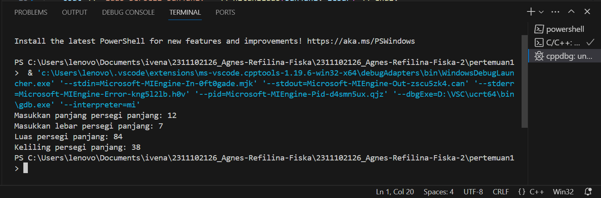
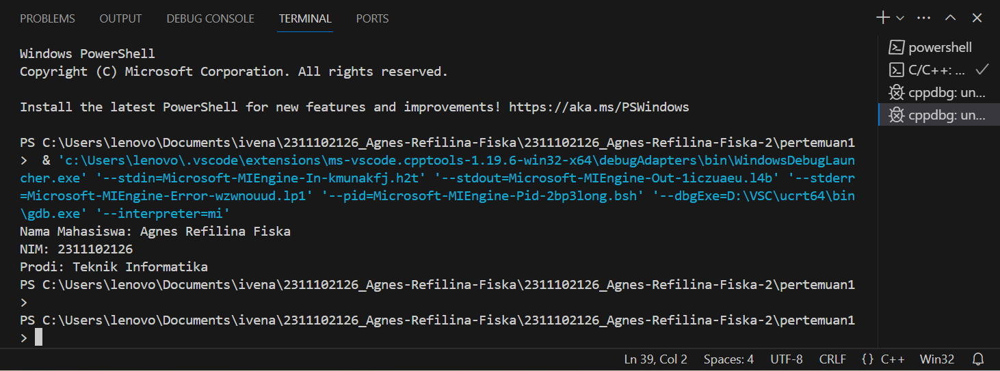
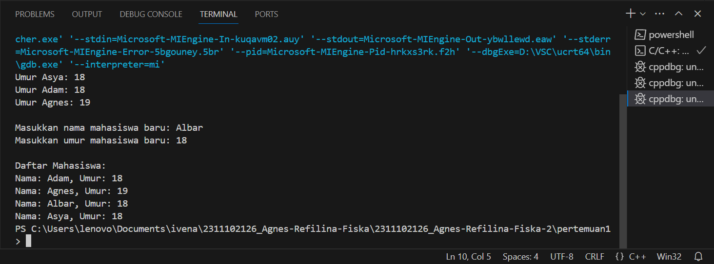

# <h1 align="center">Laporan Praktikum Modul Tipe Data</h1>
<p align="center">Agnes Refilina Fiska-2311102126</p>

## Dasar Teori

Tipe data adalah suatu konsep konsep yang di gunakan untuk menyimpan dan mengelola nilai atau informasi , Setiap tipe data memiliki karakteristik sendiri, seperti rentang nilainya, ukuran di dalam memori, dan operasi yang dapat dilakukan terhadap nilai-nilai tersebut. Berikut ini merupakan macam-macam tipe data serta penjelasannya yang terdapat pada C++:

1. Tipe Data Primitif
    Tipe data primitif adalah tipe data dasar yang tersedia dalam bahasa pemrograman dan merupakan bagian integral dari bahasa itu sendiri. Tipe data primitif secara langsung didukung oleh bahasa pemrograman dan biasanya direpresentasikan secara langsung dalam bentuk yang dikenali oleh mesin komputer. Contoh tipe data primitif:

    - Integer : menyimpan bilangan bulat, seperti -1, 0, atau 100
    - Floating Point : menyimpan bilangan dengan koma, seperti 3.14 atau 0.5
    - Karakter : menyimpan karakter tunggal, seperti 'A' atau 'b'
    - String : menyimpan teks, bisa berupa kalimat atau kombinasi karakter
    - Boolean : menyimpan nilai true    (benar) atau false (salah)

 2. Tipe Data Abstrak
    Tipe Data Abstrak merupakan tipe data yang dibentuk oleh programmer itu sendiri. Pada tipe data abstrak bisa berisi banyak tipe data, jadi nilainya bisa lebih dari satu dan beragam tipe data.

3. Tipe Data Koleksi
   Tipe Data Koleksi adalah jenis tipe data dalam pemrograman yang digunakan untuk menyimpan kumpulan nilai atau objek. Tipe data koleksi memungkinkan programmer untuk mengelompokkan data dengan cara yang terstruktur sehingga mudah diakses, dimanipulasi, dan dikelola dalam program, Contoh pengumpulan data:

   - Array: Array adalah tipe data koleksi yang menyimpan sejumlah elemen dengan tipe data yang sama.   Elemen-elemen ini disusun dalam urutan tertentu dan dapat diakses menggunakan indeks numerik. Ukuran array biasanya tetap, artinya jumlah elemennya ditentukan saat deklarasi
   - Map (Dictionary, Associative Array): Map adalah tipe data koleksi yang menyimpan pasangan kunci-nilai (key-value pairs). Setiap kunci dalam map bersifat unik dan terhubung dengan satu nilai tertentu. Map memungkinkan pengaksesan nilai berdasarkan kunci, serta penambahan, penghapusan, dan pembaruan pasangan kunci-nilai.
   - Vector (vector mirip seperti array yang memiliki kemampuan untuk menyimpan data dalam bentuk elemen-elemen yang alokasi memorinya dilakukan secara otomatis dan bersebelahan)


## Guided 

### 1. [Tipe Data Primitif]
```C++
#include <iostream>
#include <iomanip>

using namespace std;

// Tipe Data Primitif by Agnes

int main(){
    char op;
    float num1, num2;

    cout << "Enter operator (+, -, *, /): ";
    cin >> op;

    cout << "Enter two operands: ";
    cin >> num1 >> num2;

    switch (op)
    {
    case '+':
        cout << "Result: " << num1 + num2 << endl;
        break;
    case '-':
        cout << "Result: " << num1 - num2 << endl;
        break;
    case '*':
        cout << "Result: " << num1 * num2 << endl;
        break;
    case '/':
        if (num2 == 0) {
            cout << "Result: " << fixed << setprecision(2) << num1 / num2 << endl;
        } else {
            cout << "Error!: Division by zero" << endl;
        }
        break;

    default:
        cout << "Error! operator is not correct" << endl;
        break;
    }
    return 0;
}
```
Pertama, kita mendeklarasikan variabel op, num1, dan num2 yang akan digunakan untuk menyimpan operator dan dua nomor yang dimasukkan oleh pengguna. Kedua, program meminta pengguna untuk memasukan operator dan dua bilangan menggunakan fungsi input/output standar pada cin dan cout. Ketiga, didalam program menggunakan statement switch untuk menentukan operasi yang akan dilakukan berdasarkan operator yang dimasukan pengguna. Jika operator memasukan tanda (+) maka hasilnya penjumlahan bilangan 1 dan 1, jika (-) maka pengurangan, jika(*) maka perkalian, dan jika (/) maka pembagian. Program diakhiri dengan return 0 yakni untuk mengembalikan nilai o dan selesai.

### 2. [Tipe Data Abstrak]
```C++
#include <stdio.h>
#include <string.h>

// Struct
struct Mahasiswa
{
    char name[50];
    char address[50];
    int age;
};

// Tipe Data Abstrak by Agnes

int main() {
    // Menggunakan Struct
    struct Mahasiswa mhs1, mhs2;

    // Mengisi nilai ke struct
    strcpy(mhs1.name, "Dian");
    strcpy(mhs1.address, "Mataram");
    mhs1.age = 22;
    strcpy(mhs2.name, "Bambang");
    strcpy(mhs2.address, "Surabaya");
    mhs2.age = 23;

    // Mencetak isi dari struct
    printf("## Mahasiswa 1 ##\n");
    printf("Nama: %s\n", mhs1.name);
    printf("Alamat: %s\n", mhs1.address);
    printf("Umur: %d\n", mhs1.age);
    printf("\n");
    printf("## Mahasiswa 2 ##\n");
    printf("Nama: %s\n", mhs2.name);
    printf("Alamat: %s\n", mhs2.address);
    printf("Umur: %d\n", mhs2.age);

    return 0;
}
```
Kode di atas digunakan untuk mencetak isi dari struct. Struct merupakan salah satu contoh dari tipe data abstrak. Pada kode di atas terdapat sebuah struct Mahasiswa. Pada struct Mahasiswa ini, terdapat 3 nilai, yaitu char name dengan ukuran 50, char address dengan ukuran 50 juga, dan int age. Lalu pada int main, diisi nilai dan dideklarasikan struct Mahasiswa dengan 2 objek, yaitu mhs1 dengan nama Dian dan mhs2 dengan nama Bambang

### 3. [Tipe Pengumpulan Data]
```C++
#include <iostream>
#include <array>
using namespace std;

// Tipe Data Koleksi by Agnes

int main() {
    // Deklarasi dan inisialisasi array
    int nilai[5];
    nilai[0] = 23;
    nilai[1] = 50;
    nilai[2] = 34;
    nilai[3] = 78;
    nilai[4] = 90;

    // Mencetak array dengan tab
    cout << "Isi array pertama : " << nilai[0] << endl;
    cout << "Isi array kedua : " << nilai[1] << endl;
    cout << "Isi array ketiga : " << nilai[2] << endl;
    cout << "Isi array keempat : " << nilai[3] << endl;
    cout << "Isi array kelima : " << nilai[4] << endl;

    return 0;
}
```
Pertama, Program membuat array nilai dengan ukuran 5. Kedua, Program diisi dengan nilai pada setiap elemen array menggunakan indeks. Ketiga, Program tersebut akan mencetak isi dari setiap elemen array menggunakan perulangan for. Dan yang terakhir adalah Output program ini akan mencetak isi dari setiap elemen array yang telah diisi nilainya pada tahap sebelumnya.

## Unguided 

### 1. [Buatlah program menggunakan tipe data primitif minimal dua fungsi dan bebas. Menampilkan program, menjelaskan program tersebut dan mengambil kesimpulan dari materi tipe data primitif!]

```C++
/*
oleh Agnes Refilina Fiska - 2311102126
*/

 #include <iostream>
using namespace std;

// Deklarasi fungsi-fungsi
double hitungLuas(double panjang, double lebar);
double hitungKeliling(double panjang, double lebar);

int main() {
    double panjang, lebar;

    // Meminta input panjang dan lebar dari pengguna
    cout << "Masukkan panjang persegi panjang: ";
    cin >> panjang;
    cout << "Masukkan lebar persegi panjang: ";
    cin >> lebar;

    // Menghitung dan menampilkan luas persegi panjang
    cout << "Luas persegi panjang: " << hitungLuas(panjang, lebar) << endl;

    // Menghitung dan menampilkan keliling persegi panjang
    cout << "Keliling persegi panjang: " << hitungKeliling(panjang, lebar) << endl;

    return 0;
}

// Definisi fungsi untuk menghitung luas persegi panjang
double hitungLuas(double panjang, double lebar) {
    return panjang * lebar;
}

// Definisi fungsi untuk menghitung keliling persegi panjang
double hitungKeliling(double panjang, double lebar) {
    return 2 * (panjang + lebar);
}
```
#### Output:


Program ini meminta pengguna untuk memasukkan panjang dan lebar persegi panjang.
Setelah mendapatkan input, program menghitung luas persegi panjang dengan menggunakan fungsi hitungLuas dan keliling persegi panjang dengan menggunakan fungsi hitungKeliling.
Hasil perhitungan kemudian ditampilkan ke pengguna.

Kesimpulan dari Materi Tipe Data Primitif:
1. Tipe data primitif dalam program C++, seperti double, digunakan untuk menyimpan data yang sederhana seperti bilangan bulat dan bilangan riil.
2. Dalam program ini, tipe data primitif double digunakan untuk menyimpan nilai panjang dan lebar persegi panjang.
3. Melalui program ini, kita melihat bagaimana tipe data primitif digunakan dalam konteks perhitungan matematis sederhana.
4. Dengan menggunakan tipe data primitif yang sesuai, kita dapat melakukan operasi matematis seperti penjumlahan, perkalian, dan pembagian dengan tepat dan akurat.
5. Penggunaan tipe data primitif yang tepat juga memungkinkan kita untuk mendapatkan hasil yang akurat dalam perhitungan yang dilakukan dalam program.

### 2. [menjelaskan fungsi dari class dan struct secara detail dan berikan contoh programnya!]

```C++
/*
oleh Agnes Refilina Fiska - 2311102126
*/

// Contoh Program Sturuct dan Class
#include <iostream>
using namespace std;

class Mahasiswa {
    private:
        string nama;
        long long nim; // Menggunakan long long untuk menampung NIM yang besar
        string prodi;
    public:
        void setNama(string nama) {
            this->nama = nama;
        }
        void setNim(long long nim) { // Mengubah tipe data parameter menjadi long long
            this->nim = nim;
        }
        void setProdi(string prodi) {
            this->prodi = prodi;
        }
        string getNama() {
            return nama;
        }
        long long getNim() { // Mengembalikan tipe data long long
            return nim;
        }
        string getProdi() {
            return prodi;
        }
};

int main() {
    Mahasiswa mhs;
    mhs.setNama("Agnes Refilina Fiska");
    mhs.setNim(2311102126LL); // LL menandakan bahwa angka ini adalah long long
    mhs.setProdi("Teknik Informatika");
    cout << "Nama Mahasiswa: " << mhs.getNama() << endl;
    cout << "NIM: " << mhs.getNim() << endl;
    cout << "Prodi: " << mhs.getProdi() << endl;
    return 0;
}
```
#### Output:


Program ini menggunakan tipe data abstrak dengan menggunakan kelas ,  Di dalam kelas tersebut, terdapat beberapa elemen data, yaitu (nama), (NIM), dan (prodi), Program ini menggunakan konstruktor untuk membuat objek dengan tipe data. Setelah itu, program mengisi nilai ke elemen data menggunakan fungsi,Setelah itu, program pencetakan isi data menggunakan fungsi untuk menampilkan informasi mahasiswa, yaitu nama, NIM, dan prodi. dengan mengunakan 'cout'

- Fungsi dari Class dan Structure
  Kelas dan struktur adalah fitur yang tersedia dalam bahasa pemrograman C++ yang digunakan untuk membuat tipe data baru yang dapat berisi data dan fungsi terkait. Meskipun keduanya digunakan untuk tujuan yang sama, ada beberapa perbedaan antara kelas dan struktur yang perlu dipahami. Kelas adalah tipe data yang memungkinkan pengguna untuk mendefinisikan variabel dan fungsi dalam entitas terkait. Secara default, semua anggota kelas (variabel dan fungsi) bersifat pribadi, artinya mereka hanya dapat digunakan di dalam kelas itu sendiri. Namun, kita dapat menentukan item mana yang bersifat publik atau dilindungi. Pengguna dapat membuat class dan membuat objek darinya. Setiap objek dalam kelas memiliki keadaan dan perilaku yang berbeda. 


### 3. [Buat dan jelaskan program menggunakan fungsi map dan jelaskan perbedaan array dengan map!!]

```C++
/*
oleh Agnes Refilina Fiska - 2311102126
*/

// Contoh Program Fungsi Map
#include <iostream>
#include <map>

using namespace std;

int main() {
    map<string, int> umurMahasiswa;

    // Menambahkan data ke dalam map
    umurMahasiswa["Asya"] = 18;
    umurMahasiswa["Adam"] = 18;
    umurMahasiswa["Agnes"] = 19;

    // Menampilkan umur mahasiswa
    cout << "Umur Asya: " << umurMahasiswa["Asya"] << endl;
    cout << "Umur Adam: " << umurMahasiswa["Adam"] << endl;
    cout << "Umur Agnes: " << umurMahasiswa["Agnes"] << endl;

    // Meminta input dari pengguna untuk menambahkan data mahasiswa baru
    string nama;
    int umur;
    cout << "\nMasukkan nama mahasiswa baru: ";
    cin >> nama;
    cout << "Masukkan umur mahasiswa baru: ";
    cin >> umur;

    // Menambahkan data mahasiswa baru ke dalam map
    umurMahasiswa[nama] = umur;

    // Menampilkan daftar mahasiswa beserta umur mereka
    cout << "\nDaftar Mahasiswa:\n";
    for (const auto& pair : umurMahasiswa) {
        cout << "Nama: " << pair.first << ", Umur: " << pair.second << endl;
    }
    
    return 0;
}

```
#### Output:


Kode di atas digunakan untuk mencetak teks "ini adalah file code guided praktikan" ke layar menggunakan function cout untuk mengeksekusi nya.

Perbedaan array dan map ialah:
•	Data pada array dapat diakses secara numerik, sedangkan pada ma data diakses menggunakan key.
•	Tipe data pada array elemennya harus sama, sedangkan pada map tipe data key dan value dapat berbeda.
•	Akses elemen pada array lebih cepat karena tidak butuh pencarian sedangkan map memerlukan waktu   karena pencarian menggunakan key.
•	Dalam map ia mengurutkan elemen dengan key dalam urutan yang menaik atau ascending
•	Array sering digunakan untuk menyimpan data teratur, sedangkan map lebih menyimpan data yang terkait dengan key yang berbeda-beda.


## Kesimpulan
Tipe data pada C++ digunakan untuk menentukan jenis nilai yang akan disimpan dalam variabel. Memahami tipe data dengan baik membantu kita sebagai programmer dalam menulis program yang lebih efisien, akurat, dan mudah dibaca serta di pahami.

## Referensi
[1] I. Holm, Narrator, and J. Fullerton-Smith, Producer, How to Build a Human [DVD]. London: BBC; 2002.