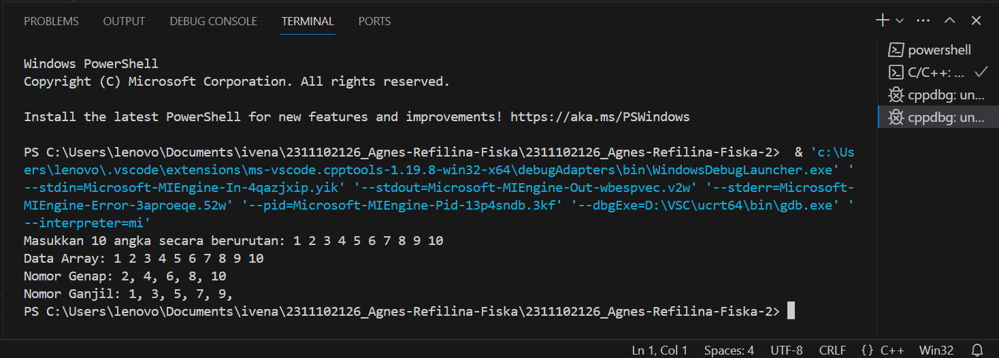
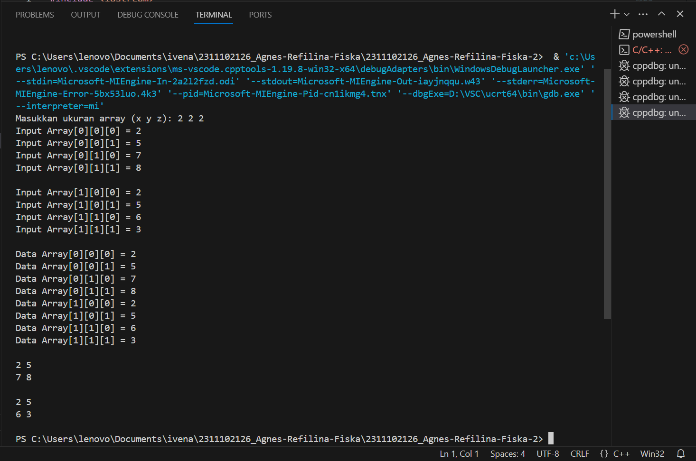
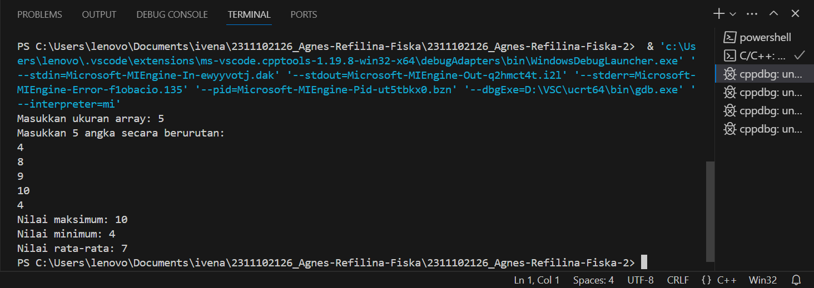

# <h1 align="center">Laporan Praktikum Modul Tipe Data</h1>
<p align="center">Agnes Refilina Fiska - 2311102126 </p>

## Dasar Teori

Array adalah sebuah data yang terdiri dari beberapa elemen yang sama dengan tipe data yang sama. Array dapat didefinisikan dengan berbagai dimensi, dimana setiap dimensi menyimpan elemen array yang berbeda. Array banyak digunakan untuk menyimpan data tabular, seperti data berbeda-beda untuk setiap baris atau kolom.

Array dapat digolongkan menjadi:
a. Array dimensi satu (1D)
b. Array dimensi dua (2D)
c. Array dimensi banyak (3D, 4D, dan lainnya)

Pendeklarasian array diawali dengan penyebutan tipe data diikuti nama variabel array, diikuti jumlah elemen. Jika array hendak diberi nilai awal, nilai-nilai awal dituliskan dalam inisialisasi. Jika inisialisasi kurang dari jumlah elemen array, sisanya akan diinisialisasikan dengan nol.

Elemen array diakses dengan menyebutkan indeks posisi elemen tersebut dalam array. Elemen pertama array memiliki indeks 0.

Dikarenakan berfokus kepada array multidimensi, array multidimensi sendiri terdiri dari indeks representatif indeks yang mewakili baris dan kolom. Indeks di sebelah kiri adalah ukurannya jumlah baris dalam tabel, sedangkan indeks yang tepat adalah ukurannya jumlah kolom dalam tabel. Untuk array tiga dimensi, index berikutnya adalah indeks yang mewakili kolom dan baris yang diukur kembali atau sesuatu.

## Guided 

### 1. [Program Input Array 3 Dimensi]

```C++
#include <iostream>
using namespace std;

// PROGRAM INPUT ARRAY 3 DIMENSI by Agnes
int main()
{
   // Deklarasi array
   int arr[2][3][3];
   // Input elemen 
   for (int x = 0; x < 2; x++) 
   { 
     for (int y = 0; y < 3; y++) 
     { 
        for (int z = 0; z < 3; z++) 
        { 
            cout << "Input Array[" << x << "][" << y << "][" << z << "] = "; 
            cin >> arr[x][y][z]; 
            } 
        } 
        cout << endl;
}
   // Output Array 
   for (int x = 0; x < 2; x++)  
   { 
    for (int y = 0; y < 3; y++) 
    { 
        for (int z = 0; z < 3; z++) 
        { 
            cout << "Data Array[" << x << "][" << y << "][" << z << "] = " << arr[x][y][z] << endl; 
            } 
         } 
     } 
            cout << endl;
   // Tampilan array 
   for (int x = 0; x < 2; x++) 
   { 
    for (int y = 0; y < 3; y++) 
    { 
        for (int z = 0; z < 3; z++) 
        { 
            cout << arr[x][y][z] << ends; 
            } 
            cout << endl; 
            } 
            cout << endl; 
            } 
    }
```
Pertama, pada program telah dideklarasikan array tiga dimensi dengan tipe data integer ukuran masing-masing dimensi 2, 3, 3. Kemudian, program melakukan input elemen array dengan tiga pengulangan for. Perulangan pertama akan mengakses elemen pada dimensi pertama begitu seterusnya sampai dengan dimensi ketiga. Selama perulangan, program akan menampilkan input array [x][y][z] dan meminta pengguna untuk memasukkan nilai elemen array yang kemudian disimpan ke array di indeks yang sesuai. Setelah itu, cetak array menggunakan tiga loop for yang mirip dengan loop fase input. Selama perulangan, program menampilkan pesan "Data Array[x][y][z] =" dan nilai elemen array pada indeks yang sesuai. Terakhir, program akan menampilkan tabel dengan tiga loop yang mirip dengan loop input dan output. Selama perulangan, program hanya menampilkan nilai elemen array pada indeks yang sesuai tanpa pesan tambahan.

### 2. [Program Mencari Nilai Maksimal pada Array]

```C++
#include <iostream>
using namespace std;
// Program Mencari Nilai Maksimal pada Array by Agnes
int main()
{ 
    int maks, a, i = 1, lokasi; 
    cout << "Masukkan panjang array: "; 
    cin >> a; 
    int array[a]; 
    cout << "Masukkan " << a << " angka\n"; 
    for (i = 0; i < a; i++) 
    { 
        cout << "Array ke-" << (i) << ": "; 
        cin >> array[i]; 
     } 
        maks = array[0]; 
        for (i = 0; i < a; i++) 
        { 
            if (array[i] > maks) 
            { 
                maks = array[i]; 
                lokasi = i; 
            } 
        } 
            cout << "Nilai maksimum adalah " << maks << " berada di Array ke " << lokasi << endl;
}
```
Pertama, program akan meminta pengguna untuk memasukan panjang array dan menyimpan input pada variabel a. Setelah itu, program akan membuat arrau dengan panjang a dengan menggunakan deklarasi array dinamis. Selanjutnya, program akan meminta pengguna untuk memasukan nilai di setiap elemen array dan menggunakan pengulangan for untuk meminta input nilai sebanyak a. Setelah semua nilai elemen array dimasukkan, program akan mencari nilai maksimum dari bilangan yang telah dimasukkan menggunakan pengulangan for. Program akan membandingkan nilai array pada indeks ke-I dengan nilai maksimum pada variabel maksimum. Setelah nilai maksimum diperoleh


## Unguided 

### 1. [Soal]

```C++
/*
oleh Agnes Refilina Fiska - 2311102126
*/
#include <iostream>
#include <vector>

using namespace std;

int main() {
    vector<int> numbers;
    int num;

    // Meminta pengguna untuk memasukkan data array
    cout << "Masukkan 10 angka secara berurutan: ";
    for (int i = 0; i < 10; ++i) {
        cin >> num;
        numbers.push_back(num);
    }

    // Menampilkan data array
    cout << "Data Array: ";
    for (int i = 0; i < numbers.size(); ++i) {
        cout << numbers[i];
        if (i != numbers.size() - 1)
            cout << " ";
    }
    cout << endl;

    // Menampilkan nomor genap
    cout << "Nomor Genap: ";
    for (int i = 0; i < numbers.size(); ++i) {
        if (numbers[i] % 2 == 0) {
            cout << numbers[i];
            if (i != numbers.size() - 1)
                cout << ", ";
        }
    }
    cout << endl;

    // Menampilkan nomor ganjil
    cout << "Nomor Ganjil: ";
    for (int i = 0; i < numbers.size(); ++i) {
        if (numbers[i] % 2 != 0) {
            cout << numbers[i];
            if (i != numbers.size() - 1)
                cout << ", ";
        }
    }
    cout << endl;

    return 0;
}
```
#### Output:


Program ini adalah program C++ yang menggunakan vector untuk menyimpan 10 angka yang dimasukkan oleh pengguna. Program meminta pengguna untuk memasukkan data array secara berurutan, kemudian menampilkan data array yang telah disimpan dalam vector. Selanjutnya, program menampilkan nomor genap dan nomor ganjil yang ada dalam data array tersebut.

### 2. [Buatlah program Input array tiga dimensi (seperti pada guided) tetapi jumlah atau ukuran elemennya diinputkan oleh user!]

```C++
/*
oleh Agnes Refilina Fiska - 2311102126
*/
#include <iostream>
using namespace std;

int main() {
    int x_size, y_size, z_size;

    // Meminta pengguna untuk memasukkan ukuran array
    cout << "Masukkan ukuran array (x y z): ";
    cin >> x_size >> y_size >> z_size;

    // Deklarasi array
    int arr[x_size][y_size][z_size];

    // Input elemen
    for (int x = 0; x < x_size; x++) {
        for (int y = 0; y < y_size; y++) {
            for (int z = 0; z < z_size; z++) {
                cout << "Input Array[" << x << "][" << y << "][" << z << "] = ";
                cin >> arr[x][y][z];
            }
        }
        cout << endl;
    }

    // Output Array
    for (int x = 0; x < x_size; x++) {
        for (int y = 0; y < y_size; y++) {
            for (int z = 0; z < z_size; z++) {
                cout << "Data Array[" << x << "][" << y << "][" << z << "] = " << arr[x][y][z] << endl;
            }
        }
    }
    cout << endl;

    // Tampilan array
    for (int x = 0; x < x_size; x++) {
        for (int y = 0; y < y_size; y++) {
            for (int z = 0; z < z_size; z++) {
                cout << arr[x][y][z] << " ";
            }
            cout << endl;
        }
        cout << endl;
    }

    return 0;
}

```
#### Output:


Program ini adalah program C++ yang memiliki tiga dimensi. Program meminta pengguna untuk memasukkan ukuran array (x, y, z) dan kemudian menginput elemen array. Setelah itu, program menampilkan data array yang telah disimpan dalam array 3 dimensi. Selanjutnya, program menampilkan array dengan format yang lebih rinci.

### 3. [Buatlah program menu untuk mencari nilai Maksimum, Minimum dan Nilai rata – rata dari suatu array dengan input yang dimasukan oleh user!]

```C++
/*
oleh Agnes Refilina Fiska - 2311102126
*/
#include <iostream>
#include <vector>
#include <algorithm>
#include <numeric>

using namespace std;

int main() {
    int size;
    cout << "Masukkan ukuran array: ";
    cin >> size;

    // Membuat vector untuk menyimpan elemen-elemen array
    vector<int> arr(size);

    // Meminta pengguna untuk memasukkan elemen-elemen array
    cout << "Masukkan " << size << " angka secara berurutan:\n";
    for (int i = 0; i < size; ++i) {
        cin >> arr[i];
    }

    // Mencari nilai maksimum dan minimum dari array
    int max_val = *max_element(arr.begin(), arr.end());
    int min_val = *min_element(arr.begin(), arr.end());

    // Mencari nilai rata-rata dari array
    double avg_val = accumulate(arr.begin(), arr.end(), 0.0) / size;

    // Menampilkan hasil
    cout << "Nilai maksimum: " << max_val << endl;
    cout << "Nilai minimum: " << min_val << endl;
    cout << "Nilai rata-rata: " << avg_val << endl;

    return 0;
}
```
#### Output:


Program ini adalah program C++ yang menggunakan vector untuk menyimpan elemen-elemen array. Program meminta pengguna untuk memasukkan ukuran array dan setiap elemen array. Setelah itu, program mencari nilai maksimum, minimum, dan rata-rata dari array. Hasilnya kemudian ditampilkan ke layar.

## Kesimpulan
Deklarasi array dimulai dengan tipe data, diikuti dengan nama variabel array, dan kemudian jumlah elemen. Jika array harus diberi nilai awal, nilai awal ditulis ke penginisialisasi. Jika initializer kurang dari jumlah elemen dalam array, sisanya diinisialisasi ke nol. Array multidimensi dalam C++ adalah struktur data yang digunakan untuk menyimpan elemen dalam bentuk tabel atau array dengan dua ukuran atau lebih. Array ini dapat digunakan untuk menyimpan data yang lebih kompleks seperti gambar, teks atau data multidimensi. array multidimensi sendiri terdiri dari indeks representatif indeks yang mewakili baris dan kolom. Indeks di sebelah kiri adalah ukurannya jumlah baris dalam tabel, sedangkan indeks yang tepat adalah ukurannya jumlah kolom dalam tabel. Untuk array tiga dimensi, index berikutnya adalah indeks yang mewakili kolom dan baris yang diukur kembali atau sesuatu. Pada laporan praktikum kali ini, kita dapat belajar mengenai pembuatan program menu array, menentukan bilangan ganjil genap serta membuat matriks dengan menggunakan array multidimensi.

## Referensi
[1] I. Holm, Narrator, and J. Fullerton-Smith, Producer, How to Build a Human [DVD]. London: BBC; 2002.