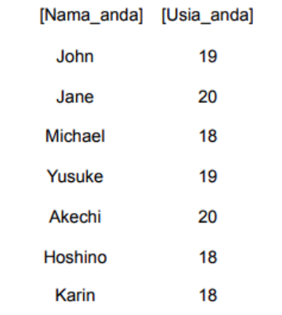
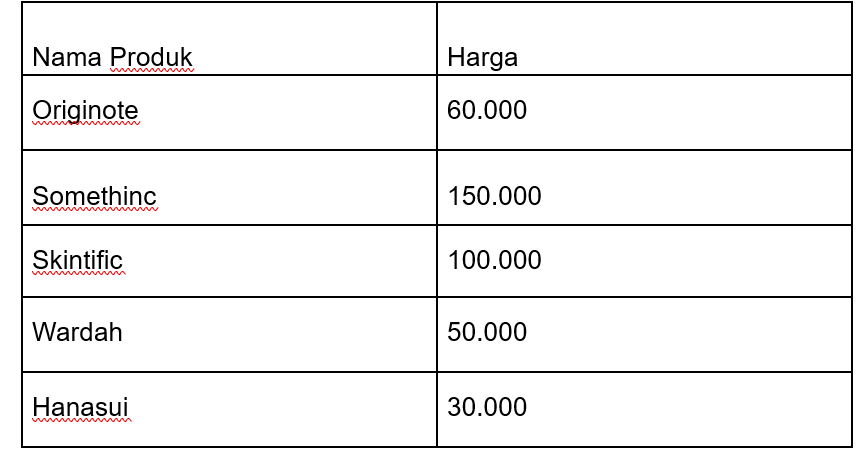
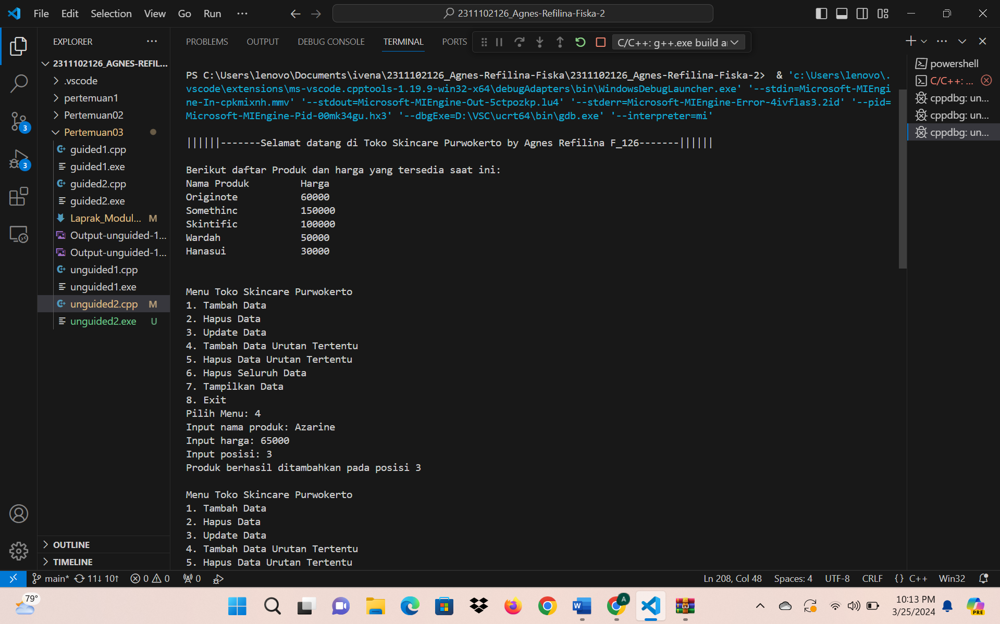

# <h1 align="center">Laporan Praktikum Modul 3 - Linked List</h1>
<p align="center">Agnes Refilina Fiska - 2311102126</p>

## Dasar Teori

A. Single Linked List 
 
Linked List adalah salah satu bentuk struktur data, berisi kumpulan data  (node) yang tersusun secara sekuensial, saling sambungmenyambung,  dinamis dan terbatas.  
-	Linked List sering disebut juga Senarai Berantai  
-	Linked List saling terhubung dengan bantuan variabel pointer  
-	Masing-masing data dalam Linked List disebut dengan node (simpul) yang  menempati alokasi memori secara dinamis dan biasanya berupa struct  yang terdiri dari beberapa field.  
 
Single Linked List adalah sebuah LINKED LIST yang menggunakan sebuah variabel pointer saja untuk menyimpan banyak data dengan metode LINKED LIST, suatu daftar isi yang saling berhubungan. 
Single Linked List adalah sekumpulan dari node yang saling terhubung dengan node lain melalui sebuah pointer. 
Single Linked List hanya memiliki satu arah dan tidak memiliki dua arah atau bulak balik, dua arah tersebut disebut dengan double linked list. 

Pada Implementasinya, Single Linked List terdapat dua variasi yaitu circular dan noncircular.

B.  Double Linked List

Double Linked List adalah jenis linked list yang terdiri dari node-node yang terhubung secara dinamis. Setiap node dalam Double Linked List terdiri dari tiga komponen: data, pointer ke node sebelumnya (prev), dan pointer ke node sesudahnya (next) Double Linked List dapat digunakan untuk menyimpan data yang dinamis dan tidak diketahui pada saat kompilasi, sehingga lebih efisien dalam melakukan operasi seperti penyisipan, penghapusan, dan pengubahan data
Double Linked List membutuhkan banyak method untuk mengoperasikannya, seperti menyisipkan simpul dan menghapus simpul Double Linked List dapat digunakan untuk menyimpan data yang tidak diketahui pada saat kompilasi

## Guided 

### 1. [Latihan Single Linked List]

```C++
#include <iostream>
using namespace std;

//PROGRAM SINGLE LINKED LIST NON-CIRCULAR

//Deklarasi Struct Node
struct Node{
    int data;
    Node *next;
};

Node *head;
Node *tail;

//Inisialisasi Node
void init(){
    head = NULL;
    tail = NULL;
}

// Pengecekan
bool isEmpty(){
    if (head == NULL)
        return true;
    else
        return false;
}

//Tambah Depan
void insertDepan(int nilai){
    //Buat Node baru
    Node *baru = new Node;
    baru->data = nilai;
    baru->next = NULL;
    if (isEmpty() == true){
        head = tail = baru;
        tail->next = NULL;
    }
    else{
        baru->next = head;
        head = baru;
    }
}

//Tambah Belakang
void insertBelakang(int nilai){
    //Buat Node baru
    Node *baru = new Node;
    baru->data = nilai;
    baru->next = NULL;
    if (isEmpty() == true){
        head = tail = baru;
        tail->next = NULL;
    }
    else{
        tail->next = baru;
        tail = baru;
    }
}

//Hitung Jumlah List
int hitungList(){
    Node *hitung;
    hitung = head;
    int jumlah = 0;
    while( hitung != NULL ){
        jumlah++;
        hitung = hitung->next;
    }
    return jumlah;
}

//Tambah Tengah
void insertTengah(int data, int posisi){
    if( posisi < 1 || posisi > hitungList() ){
        cout << "Posisi diluar jangkauan" << endl;
    }
    else if( posisi == 1){
        cout << "Posisi bukan posisi tengah" << endl;
    }
    else{
        Node *baru, *bantu;
        baru = new Node();
        baru->data = data;
        // tranversing
        bantu = head;
        int nomor = 1;
        while( nomor < posisi - 1 ){
            bantu = bantu->next;
            nomor++;
        }
        baru->next = bantu->next;
        bantu->next = baru;
    }
}

//Hapus Depan
void hapusDepan() {
    Node *hapus;
    if (isEmpty() == false){
        if (head->next != NULL){
            hapus = head;
            head = head->next;
            delete hapus;
        }
        else{
            head = tail = NULL;
        }
    }
    else{
        cout << "List kosong!" << endl;
    }
}

//Hapus Belakang
void hapusBelakang() {
    Node *hapus;
    Node *bantu;
    if (isEmpty() == false){
        if (head != tail){
            hapus = tail;
            bantu = head;
            while (bantu->next != tail){
                bantu = bantu->next;
            }
            tail = bantu;
            tail->next = NULL;
            delete hapus;
        }
        else{
            head = tail = NULL;
        }
    }
    else{
        cout << "List kosong!" << endl;
    }
}

//Hapus Tengah
void hapusTengah(int posisi){
    Node *hapus, *bantu, *bantu2;
    if( posisi < 1 || posisi > hitungList() ){
        cout << "Posisi di luar jangkauan" << endl;
    }
    else if( posisi == 1){
        cout << "Posisi bukan posisi tengah" << endl;
    }
    else{
        int nomor = 1;
        bantu = head;
        while( nomor <= posisi ){
            if( nomor == posisi-1 ){
                bantu2 = bantu;
            }
            if( nomor == posisi ){
                hapus = bantu;
            }
            bantu = bantu->next;
            nomor++;
        }
        bantu2->next = bantu;
        delete hapus;
    }
}

//Ubah Depan
void ubahDepan(int data){
    if (isEmpty() == false){
        head->data = data;
    }
    else{
        cout << "List masih kosong!" << endl;
    }
}

//Ubah Tengah
void ubahTengah(int data, int posisi){
    Node *bantu;
    if (isEmpty() == false){
        if( posisi < 1 || posisi > hitungList() ){
            cout << "Posisi di luar jangkauan" << endl;
        }
        else if( posisi == 1){
            cout << "Posisi bukan posisi tengah" << endl;
        }
        else{
            bantu = head;
            int nomor = 1;
            while (nomor < posisi){
                bantu = bantu->next;nomor++;
            }
            bantu->data = data;
        }
    }
    else{
        cout << "List masih kosong!" << endl;
    }
}

//Ubah Belakang
void ubahBelakang(int data){
    if (isEmpty() == false){
tail->data = data;
}
  else{
cout << "List masih kosong!" << endl;
  }
}
//Hapus List
void clearList(){
Node *bantu, *hapus;
bantu = head;
while (bantu != NULL){
hapus = bantu;bantu = bantu->next;
delete hapus;
}
head = tail = NULL;
cout << "List berhasil terhapus!" << endl;
}
//Tampilkan List
void tampil(){
Node *bantu;
bantu = head;
if (isEmpty() == false){
while (bantu != NULL){
cout << bantu->data << ends;
bantu = bantu->next;
}
cout << endl;
}
else{
cout << "List masih kosong!" << endl;
}
}
int main(){
init();
insertDepan(3);tampil();
insertBelakang(5);
tampil();
insertDepan(2);
tampil();
insertDepan(1);
tampil();
hapusDepan();
tampil();
hapusBelakang();
tampil();
insertTengah(7,2);
tampil();
hapusTengah(2);
tampil();
ubahDepan(1);
tampil();
ubahBelakang(8);
tampil();
ubahTengah(11, 2);
tampil();
return 0;
}
```
Program di atas adalah program C++ yang mengimplementasikan sebuah linked list single non-circular. Linked list ini digunakan untuk menyimpan data berupa bilangan bulat, yang terdiri dari nilai data dan pointer ke node berikutnya. Program ini memiliki beberapa fungsi untuk menangani operasi terhadap linked list, seperti menambah, menghapus, dan mengubah data pada linked list.

### 2. [Latihan Double Linked List Source ]

```C++
#include <iostream>
using namespace std;

class Node {
public:
    int data;
    Node* prev;
    Node* next;
};

class DoublyLinkedList {
public:
    Node* head;
    Node* tail;
    DoublyLinkedList() {
        head = nullptr;
        tail = nullptr;
    }
    void push(int data) {
        Node* newNode = new Node;
        newNode->data = data;
        newNode->prev = nullptr;
        newNode->next = head;
        if (head != nullptr) {
            head->prev = newNode;
        }
        else {
            tail = newNode;
        }
        head = newNode;
    }
    void pop() {
        if (head == nullptr) {
            return;
        }
        Node* temp = head;
        head = head->next;
        if (head != nullptr) {
            head->prev = nullptr;
        }
        else {
            tail = nullptr;
        }
        delete temp;
    }
    bool update(int oldData, int newData) {
        Node* current = head;
        while (current != nullptr) {
            if (current->data == oldData) {
                current->data = newData;
                return true;
            }
            current = current->next;
        }
        return false;
    }
    void deleteAll() {
        Node* current = head;
        while (current != nullptr) {
            Node* temp = current;
            current = current->next;
            delete temp;
        }
        head = nullptr;
        tail = nullptr;
    }
    void display() {
        Node* current = head;
        while (current != nullptr) {
            cout << current->data << " ";
            current = current->next;
        }
        cout << endl;
    }
};

int main() {
    DoublyLinkedList list;
    while (true) {
        cout << "1. Add data" << endl;
        cout << "2. Delete data" << endl;
        cout << "3. Update data" << endl;
        cout << "4. Clear data" << endl;
        cout << "5. Display data" << endl;
        cout << "6. Exit" << endl;
        int choice;
        cout << "Enter your choice: ";
        cin >> choice;
        switch (choice) {
            case 1: {
                int data;
                cout << "Enter data to add: ";
                cin >> data;
                list.push(data);
                break;
            }
            case 2: {
                list.pop();
                break;
            }
            case 3: {
                int oldData, newData;
                cout << "Enter old data: ";
                cin >> oldData;
                cout << "Enter new data: ";
                cin >> newData;
                bool updated = list.update(oldData, newData);
                if (!updated) {
                    cout << "Data not found" << endl;
                }
                break;
            }
            case 4: {
                list.deleteAll();
                break;
            }
            case 5: {
                list.display();
                break;
            }
            case 6: {
                return 0;
            }
            default: {
                cout << "Invalid choice" << endl;
                break;
            }
        }
    }
    return 0;
}
```
Program ini menggunakan class Node untuk menyimpan data, yang terdiri dari nilai data, pointer ke node yang berada sebelumnya, dan pointer ke node yang berada setelahnya. Class ini juga memiliki fungsi untuk menambah, menghapus, dan mengubah data pada linked list. Program ini juga menggunakan fungsi setw() dari library iomanip untuk memperoleh output yang lebih rapi.

## Unguided 

### 1. [Buatlah menu program Single Linked List Non-Circular untuk menyimpan Nama dan Usia siswa, dengan menggunakan inputan dari pengguna. Lakukan operasi berikut:
a. Masukkan data sesuai urutan berikut.(Gunakan masukkan depan, belakang atau tengah). Data pertama yang dimasukkan adalah nama dan usia anda.

ㅤb. Hapus data Akechi
ㅤc. Tambahkan data berikut diantara John dan Jane: "Futaba 18"
ㅤd. Tambahkan data berikut di awal: "Igor 20"
ㅤe. Ubah data Michael menjadi: "Reyn 18"
ㅤf. Tampilkan seluruh data]

```C++
#include <iostream>
#include <iomanip>
using namespace std;

//Deklarasi Struct Node
struct Node {
    string Name;
    int Age;
    Node* next;
};

Node* head;
Node* tail;

//Inisialisasi Node
void Initialize() {
    head = NULL;
    tail = NULL;
}

// Pengecekan
bool ItsEmpty() {
    if (head == NULL)
        return true;
    else
        return false;
}

//Tambah Depan
void InsertFront(string name, int age) {
    //Buat Node baru
    Node* baru = new Node;
    baru->Name = name;
    baru->Age = age;
    baru->next = NULL;

    if (ItsEmpty() == true) {
        head = tail = baru;
        tail->next = NULL;
    }
    else {
        baru->next = head;
        head = baru;
    }
}

//Tambah Belakang
void InsertBack(string name, int age) {
    //Buat Node baru
    Node* baru = new Node;
    baru->Name = name;
    baru->Age = age;
    baru->next = NULL;

    if (ItsEmpty() == true) {
        head = tail = baru;
        tail->next = NULL;
    }
    else {
        tail->next = baru;
        tail = baru;
    }
}

//Hitung Jumlah List
int CountList() {
    Node* hitung;
    hitung = head;
    int jumlah = 0;

    while (hitung != NULL) {
        jumlah++;
        hitung = hitung->next;
    }

    return jumlah;
}

//Tambah Tengah
void InsertMiddle(string name, int age, int posisi) {
    if (posisi < 1 || posisi > CountList()) {
        cout << "Heyyy, the position is out of range!" << endl;
    }
    else if (posisi == 1) {
        cout << "Wow, the position you input wasn't the middle." << endl;
    }
    else {
        Node* baru, * bantu;
        baru = new Node();
        baru->Name = name;
        baru->Age = age;

        // tranversing
        bantu = head;
        int nomor = 1;

        while (nomor < posisi - 1) {
            bantu = bantu->next;
            nomor++;
        }

        baru->next = bantu->next;
        bantu->next = baru;
    }
}

//Hapus Depan
void EraseFront() {
    Node* hapus;

    if (ItsEmpty() == false) {
        if (head->next != NULL) {
            hapus = head;
            head = head->next;
            delete hapus;
        }
        else {
            head = tail = NULL;
        }
    }
    else {
        cout << "ITS EMPTY!" << endl;
    }
}

//Hapus Belakang
void EraseBack() {
    Node* hapus;
    Node* bantu;

    if (ItsEmpty() == false) {
        if (head != tail) {
            hapus = tail;
            bantu = head;

            while (bantu->next != tail) {
                bantu = bantu->next;
            }

            tail = bantu;
            tail->next = NULL;
            delete hapus;
        }
        else {
            head = tail = NULL;
        }
    }
    else {
        cout << "ITS EMPTY!" << endl;
    }
}

//Hapus Tengah
void EraseMiddle(int posisi) {
    Node* hapus, * bantu, * bantu2;

    if (posisi < 1 || posisi > CountList()) {
        cout << "Heyyy, the position is out of range!" << endl;
    }
    else if (posisi == 1) {
        cout << "Wow, the position you input wasn't the middle." << endl;
    }
    else {
        int nomor = 1;
        bantu = head;

        while (nomor <= posisi) {
            if (nomor == posisi - 1) {
                bantu2 = bantu;
            }

            if (nomor == posisi) {
                hapus = bantu;
            }

            bantu = bantu->next;
            nomor++;
        }

        bantu2->next = bantu;
        delete hapus;
    }
}

//Ubah Depan
void ChangeFront(string name, int age) {
    if (ItsEmpty() == false) {
        head->Name = name;
        head->Age = age;
    }
    else {
        cout << "THERE'S NOTHING TO CHANGE!" << endl;
    }
}

//Ubah Tengah
void ChangeMiddle(string name, int age, int posisi) {
    Node* bantu;

    if (ItsEmpty() == false) {
        if (posisi < 1 || posisi > CountList()) {
            cout << "Heyyy, the position is out of range!" << endl;
        }
        else if (posisi == 1) {
            cout << "Wow, the position you input wasn't the middle." << endl;
        }
        else {
            bantu = head;
            int nomor = 1;

            while (nomor < posisi) {
                bantu = bantu->next;
                nomor++;
            }

            bantu->Name = name;
            bantu->Age = age;
        }
    }
    else {
        cout << "ITS EMPTY!" << endl;
    }
}

//Ubah Belakang
void ChangeBack(string name, int age) {
    if (ItsEmpty() == false) {
        tail->Name= name;
        tail->Age= age;
    }
    else {
        cout << "ITS EMPTY" << endl;
    }
}

//Hapus List
void EraseList() {
    Node* bantu, * hapus;
    bantu = head;

    while (bantu != NULL) {
        hapus = bantu;
        bantu = bantu->next;
        delete hapus;
    }

    head = tail = NULL;
    cout << "Hoorah! You erased EVERYTHING YOU WORKED HARD FOR!" << endl;
}

//Tampilkan List
void Reveal() {
    Node* bantu;
    bantu = head;

    cout << left << setw(15) << "-Nama-" << right << setw(4) << "-Usia-" << endl; // Supaya rapi

    if (ItsEmpty() == false) {
        while (bantu != NULL) {
            cout << left << setw(15) << bantu->Name << right << setw(4) << bantu->Age << endl; // Supaya lurus di output
            bantu = bantu->next;
        }

        cout << endl;
    }
    else {
        cout << "ITS EMPTY!" << endl;
    }
}

int main() {
    Initialize(); // Inisialisasi Linked List
    cout << "\n-=-=-= (A) WELCOME TO AGNES PROGRAM =-=-=-" << endl; // Menampilkan nama dan umur awal 
    InsertFront("Karin", 18);
    InsertFront("Hoshino", 18);
    InsertFront("Akechi", 20); 
    InsertFront("Yusuke", 19);
    InsertFront("Michael", 18);
    InsertFront("Jane", 20);
    InsertFront("John", 19);
    InsertFront("Agnes", 19);
    Reveal();

    // Menjawab poin b
    cout << "-=-=-= (B) Penghapusan data 'Akechi' =-=-=-" << endl;
    EraseMiddle(6);
    Reveal();

    // Menjawab poin c
    cout << "-=-=-= (C) Penambahan data 'Futaba (18)' diantara John & Jane =-=-=-" << endl;
    InsertMiddle("Futaba", 18, 3);
    Reveal();

    // Menjawab poin d
    cout << "-=-=-= (D) Penambahan data 'Igor (20)' di awal =-=-=-" << endl;
    InsertFront("Igor", 20);
    Reveal();

    // Menjawab poin e & f
    cout << "-=-=-= (E) Mengubah data 'Michael' menjadi 'Reyn (18)' =-=-=-" << endl;
    cout << "-=-=-= (F) Tampilan Akhir! =-=-=-" << endl;
    ChangeMiddle("Reyn", 18, 6);
    Reveal();
    
    return 0;
}
```
#### Output:

.png)

Program di atas merupakan program C++ yang mengimplementasikan sebuah linked list. Linked list ini digunakan untuk menyimpan data mahasiswa, yang terdiri dari nama dan usia. Program ini memiliki beberapa fungsi untuk menangani operasi terhadap linked list, seperti menambah, menghapus, dan mengubah data.

### 2. [Modifikasi Guided Double Linked List dilakukan dengan penambahan operasi untuk menambah data, menghapus, dan memperbarui di tengah / di urutan tertentu yang diminta. Selain itu, buatlah agar tampilannya menampilkan Nama Produk dan Harga. 
 
Kasus:
ㅤ1. Tambahkan produk Azarine dengan harga 65000 diantara Somethinc dan Skintific
ㅤ2. Hapus produk Wardah
ㅤ3. Update produk Hanasui menjadi Cleora dengan harga 55000
ㅤ4. Tampilkan menu, di mana tampilan akhirnya akan menjadi seperti dibawah ini:
Toko Skincare Purwokerto
1.	Tambah Data
2.	Hapus Data
3.	Update Data
4.	Tambah Data Urutan Tertentu
5.	Hapus Data Urutan Tertentu
6.	Hapus Seluruh Data
7.	Tampilkan Data
8.	Exit
Pada menu 7, tampilan akhirnya akan menjadi seperti dibawah
ini :
.png)

```C++
#include <iostream> // mengatur input output
#include <iomanip> // mengatur layout output
#include <string> // mengatur string

using namespace std; // menggunakan standar library

class Node { // Deklarasi Class Node untuk Double Linked List
public: // Deklarasi Public untuk Class Node agar bisa diakses di luar class Node
    string Nama_Produk; 
    int harga;
    Node* prev;
    Node* next;
};

class DoublyLinkedList { // Deklarasi Class DoublyLinkedList untuk Double Linked List
public: // Deklarasi Public untuk Class DoublyLinkedList agar bisa diakses di luar class DoublyLinkedList
    Node* head;
    Node* tail;
    DoublyLinkedList() {
        head = nullptr;
        tail = nullptr;
    }
 
    void tambah_produk_126(string Nama_Produk, int harga) { // Menambahkan produk ke dalam linked list di bagian atas
        Node* newNode = new Node;
        newNode->Nama_Produk = Nama_Produk; // Menambahkan nama produk ke dalam linked list
        newNode->harga = harga; // Menambahkan harga produk ke dalam linked list
        newNode->prev = nullptr; // Pointer prev menunjuk ke nullptr
        newNode->next = head; // Pointer next menunjuk ke head
        if (head != nullptr) {
            head->prev = newNode; // Pointer prev head menunjuk ke newNode jika head tidak nullptr
        }
        else {
            tail = newNode; // Tail menunjuk ke newNode jika head nullptr
        }
        head = newNode; // Head menunjuk ke newNode setelah newNode di tambahkan ke linked list
    }

    void hapus_produk_126() { // Menghapus produk teratas dari linked list
        if (head == nullptr) {
            return;
        }
        Node* temp = head;
        head = head->next;
        if (head != nullptr) {
            head->prev = nullptr;
        }
        else {
            tail = nullptr;
        }
        delete temp;
    }

    bool ubah_produk_126(string Nama_Produk_Lama, string Nama_Produk_Baru, int Harga_Baru) { // Mengubah data produk berdasarkan nama produk
        Node* current = head;
        while (current != nullptr) { // Looping selama current tidak nullptr
            if (current->Nama_Produk == Nama_Produk_Lama) { // Jika nama produk lama ditemukan di linked list maka lakukan perubahan data produk
                current->Nama_Produk = Nama_Produk_Baru; // Mengubah nama produk lama menjadi nama produk baru
                current->harga = Harga_Baru; // Mengubah harga produk lama menjadi harga produk baru
                return true;
            }
            current = current->next;
        }
        return false; // Mengembalikan false jika data produk tidak ditemukan
    }

    void sisipkan_posisi_tertentu_126(string Nama_Produk, int harga, int posisi) { // Menambahkan data produk pada posisi tertentu
        if (posisi < 1) {
            cout << "Posisi tidak ada" << endl;
            return;
        }
        Node* newNode = new Node;
        newNode->Nama_Produk = Nama_Produk;
        newNode->harga = harga;
        if (posisi == 1) { // Jika posisi adalah 1 maka tambahkan data produk di depan linked list
            newNode->next = head;
            newNode->prev = nullptr;
            if (head != nullptr) {
                head->prev = newNode;
            }
            else {
                tail = newNode;
            }
            head = newNode;
            return;
        }
        Node* current = head;
        for (int i = 1; i < posisi - 1 && current != nullptr; ++i) { // Looping sampai posisi sebelum posisi yang diinginkan (Posisi - 1)
            current = current->next;
        }
        if (current == nullptr) {
            cout << "Posisi tidak ada" << endl;
            return;
        }
        newNode->next = current->next;
        newNode->prev = current;
        if (current->next != nullptr) {
            current->next->prev = newNode; // Pointer prev node setelah current menunjuk ke newNode jika node setelah current tidak nullptr
        }
        else {
            tail = newNode;
        }
        current->next = newNode;
    }

    void hapus_posisi_tertentu_126(int posisi) { // Menghapus data produk pada posisi tertentu
        if (posisi < 1 || head == nullptr) { // Jika posisi kurang dari 1 atau head nullptr maka tampilkan pesan
            cout << "Posisi tidak ada atau list kosong" << endl;
            return;
        }
        Node* current = head;
        if (posisi == 1) {
            head = head->next;
            if (head != nullptr) {
                head->prev = nullptr;
            }
            else {
                tail = nullptr;
            }
            delete current;
            return;
        }
        for (int i = 1; current != nullptr && i < posisi; ++i) { // Looping sampai posisi yang diinginkan
            current = current->next;
        }
        if (current == nullptr) {
            cout << "Posisi tidak ada" << endl;
            return;
        }
        if (current->next != nullptr) {
            current->next->prev = current->prev;
        }
        else {
            tail = current->prev;
        }
        current->prev->next = current->next;
        delete current;
    }

    void hapus_semua_126() { // Menghapus semua data produk
        Node* current = head; // Pointer current menunjuk ke head
        while (current != nullptr) {
            Node* temp = current; // Pointer temp menunjuk ke current
            current = current->next; // Pointer current menunjuk ke node selanjutnya
            delete temp; // Menghapus node temp (node head sebelumnya)
        }
        head = nullptr;
        tail = nullptr;
    }

    void display_126() { // Menampilkan data produk
        Node* current = head;
        cout << "\nBerikut daftar Produk dan harga yang tersedia saat ini:" << endl;
        cout << left << setw(20) << "Nama Produk" << "Harga" << endl; // Menampilkan header tabel nama produk dan harga
        while (current != nullptr) {
            cout << left << setw(20) << current->Nama_Produk << current->harga << endl;  // Menampilkan produk dan harga dan meluruskan ke tabel
            current = current->next;
        }
        cout << endl;
    }
};

int main() {
    DoublyLinkedList list; // Deklarasi objek list dari class DoublyLinkedList
    
    list.tambah_produk_126("Hanasui", 30000);
    list.tambah_produk_126("Wardah", 50000);
    list.tambah_produk_126("Skintific", 100000);
    list.tambah_produk_126("Somethinc", 150000);
    list.tambah_produk_126("Originote", 60000);

    cout << "\n||||||-------Selamat datang di Toko Skincare Purwokerto by Agnes Refilina F_126-------||||||" << endl;
    list.display_126();

    while (true) { // Looping menu utama
        cout << "\nMenu Toko Skincare Purwokerto" << endl;
        cout << "1. Tambah Data" << endl;
        cout << "2. Hapus Data" << endl;
        cout << "3. Update Data" << endl;
        cout << "4. Tambah Data Urutan Tertentu" << endl;
        cout << "5. Hapus Data Urutan Tertentu" << endl;
        cout << "6. Hapus Seluruh Data" << endl;
        cout << "7. Tampilkan Data" << endl;
        cout << "8. Exit" << endl;
        int pilihan; // Deklarasi variabel pilihan
        cout << "Pilih Menu: ";
        cin >> pilihan; // Input pilihan menu
        switch (pilihan) { // Switch case untuk memilih menu
        case 1: {
            string Nama_Produk;
            int harga;
            cout << "Masukkan nama produk: ";
            cin >> Nama_Produk;
            cout << "Masukkan harga: ";
            cin >> harga;
            list.tambah_produk_126(Nama_Produk, harga); // Memanggil fungsi tambah_produk
            cout << "Produk berhasil ditambahkan teratas" << endl;
            break;
        }
        case 2: {
            list.hapus_produk_126(); // Memanggil fungsi hapus_produk
            cout << "Produk teratas berhasil dihapus" << endl;
            break;
        }
        case 3: { 
            string Nama_Produk_Lama, Nama_Produk_Baru;
            int Harga_Baru;
            cout << "Input nama produk lama: ";
            cin >> Nama_Produk_Lama;
            cout << "Input nama produk baru: ";
            cin >> Nama_Produk_Baru;
            cout << "Input harga baru: ";
            cin >> Harga_Baru;
            bool updated = list.ubah_produk_126(Nama_Produk_Lama, Nama_Produk_Baru, Harga_Baru); // Memanggil fungsi ubah_produk
            if (!updated) {
                cout << "Data produk tidak ditemukan" << endl;
            }
            else {
                cout << "Data produk berhasil diupdate" << endl;
            }
            break;
        }
        case 4: {
            string Nama_Produk;
            int harga, position;
            cout << "Input nama produk: ";
            cin >> Nama_Produk;
            cout << "Input harga: ";
            cin >> harga;
            cout << "Input posisi: ";
            cin >> position;
            list.sisipkan_posisi_tertentu_126(Nama_Produk, harga, position); // Memanggil fungsi sisipkan_posisi_tertentu
            cout << "Produk berhasil ditambahkan pada posisi " << position << endl;
            break;
        }
        case 5: {
            int position;
            cout << "Input posisi yang ingin dihapus: ";
            cin >> position;
            list.hapus_posisi_tertentu_126(position); // Memanggil fungsi hapus_posisi_tertentu

            break;
        }
        case 6: {
            list.hapus_semua_126(); // Memanggil fungsi hapus_semua
            break;
        }
        case 7: {
            list.display_126(); // Memanggil fungsi display
            break;
        }
        case 8: {
            return 0; // Exit program
        }
        default: {
            cout << "Input Invalid" << endl; 
            break;
        }
        }
    }
    return 0;
}
```
#### Output:

.png)
.png)

Program di atas adalah implementasi dari struktur data Doubly Linked List dalam bahasa C++. Program ini menciptakan sebuah toko skincare sederhana dengan beberapa fungsionalitas dasar seperti menambah, menghapus, mengubah, dan menampilkan data produk skincare.Setiap operasi dapat diakses melalui menu yang disediakan dalam sebuah loop utama. Ini adalah contoh implementasi dasar dari struktur data double linked list untuk aplikasi pengelolaan data produk dalam sebuah toko.

## Kesimpulan
Praktikum SINGLEANDDOUBLELINKEDLIST menunjukkan bahwa linked list adalah struktur data yang paling dasar yang terdiri dari sejumlah unsur-unsur yang terhubung secara dinamis. Linked list dapat berbentuk single linked list atau double linked list, berdasarkan kebutuhan aplikasi. Double linked list dapat digunakan untuk menyimpan data yang dinamis dan tidak diketahui pada saat kompilasi, sehingga lebih efisien dalam melakukan operasi seperti penyisipan, penghapusan, dan pengubahan data. Double linked list membutuhkan banyak method untuk mengoperasikannya, sehingga perlu diperhatikan dalam pengembangan aplikasi. Double linked list dapat digunakan untuk menyimpan data yang dinamis, sehingga lebih efektif dalam melakukan operasi data.

## Referensi
[1] Shofyann Hanief,et al., Konsep Algoritme dan Aplikasinya dalam Bahasa Pemrograman C++. Yogyakarta: Andi Publisher, 2020.
[2]Joseph Teguh Santoso, Struktur Data dan Algoritma (Bagian 1). Semarang: Yayasan Prima Agus Teknik, 2021. [2] Jurusan Teknik Elektro – Universitas Negeri Malang - 2016.
