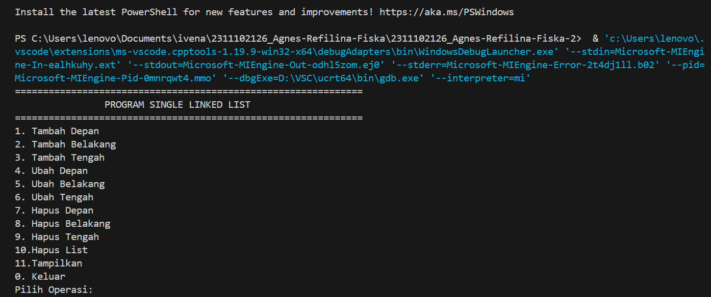
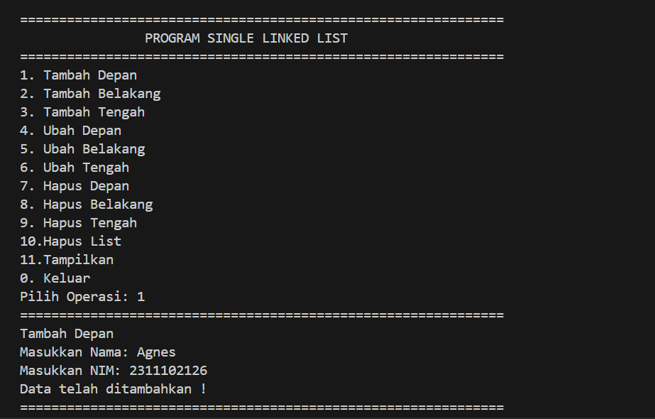
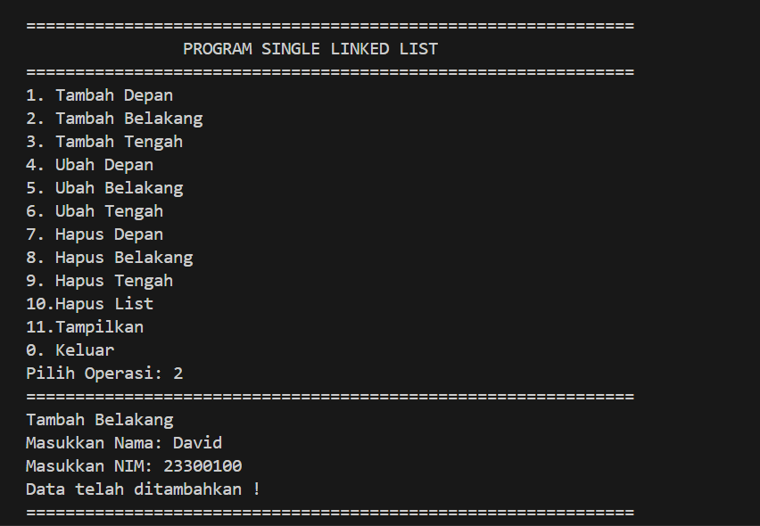
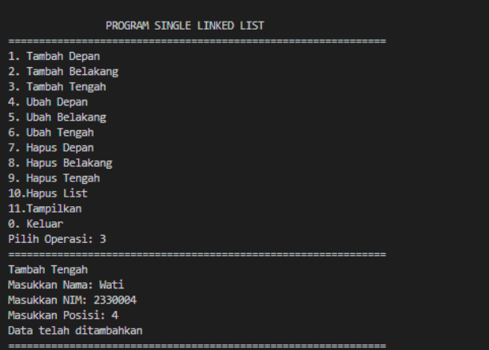
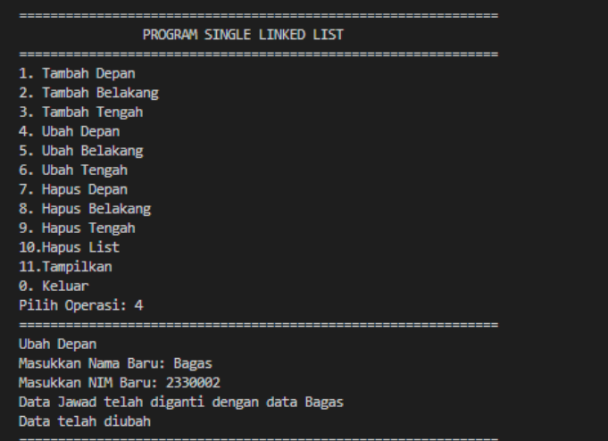
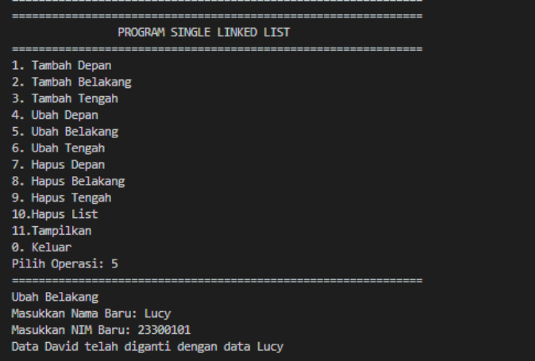
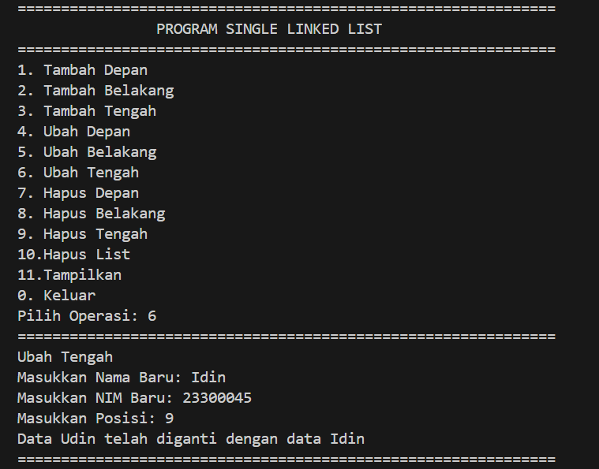
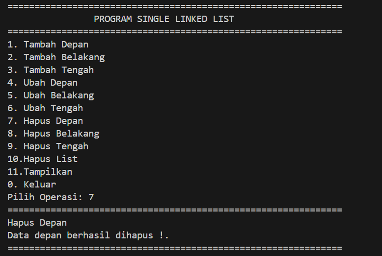
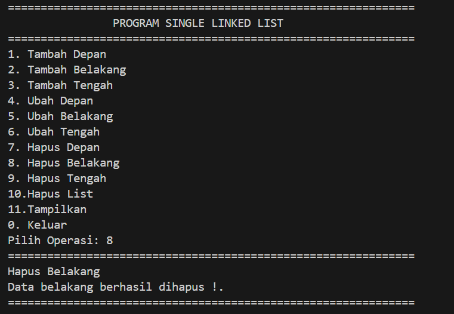
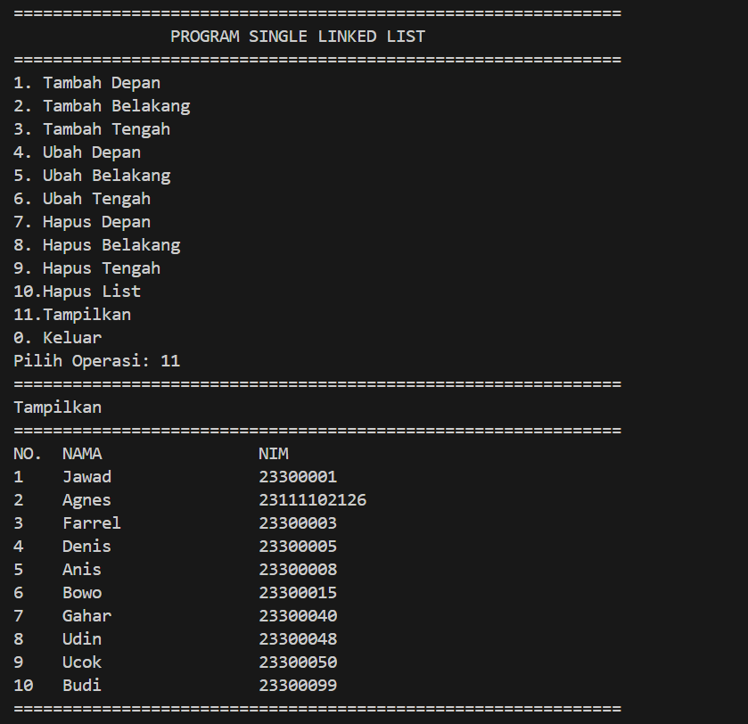

# <h1 align="center">Laporan Praktikum Modul 4 LINKED LIST CIRCULAR DAN NON CIRCULAR</h1>
<p align="center">Agnes Refilina Fiska - 2311102126 </p>

## Dasar Teori

1. Linked List Non Circular 
    Linked List Non-Circular, juga dikenal sebagai Linked List Linear, adalah struktur data di mana setiap simpul terhubung secara linear, dengan simpul terakhir menunjuk ke nilai null (atau nil dalam beberapa bahasa pemrograman). Ini berarti tidak ada simpul yang mengarah kembali ke simpul sebelumnya, membentuk jalur yang lurus dari awal hingga akhir.Linked list memiliki beberapa karakteristik yaitu :

Karakteristik
    - Struktur Data: Setiap simpul terdiri dari dua bagian, yaitu data dan referensi ke simpul berikutnya dalam urutan.
    - Referensi Terakhir ke Null: Simpul terakhir dalam linked list menunjuk ke nilai null, menandakan akhir dari linked list.
    - Traversal Linear: Traversal (penelusuran) linked list dimulai dari awal (head) dan terus berlanjut ke simpul berikutnya sampai mencapai simpul terakhir.
    - Tidak Ada Pengulangan: Setiap simpul hanya memiliki satu referensi maju ke simpul berikutnya. Tidak ada simpul yang mengarah kembali ke simpul sebelumnya.
    - Struktur Data Sederhana: Implementasi sederhana dibandingkan dengan linked list circular karena tidak ada perlunya menangani penghubungan kembali ke simpul awal.

2. Linked List Circular 
    Linked List Circular adalah struktur data di mana setiap simpul terhubung ke simpul berikutnya dalam urutan tertentu, dan simpul terakhir dalam linked list menghubungkan kembali ke simpul pertama, membentuk lingkaran. Ini berarti tidak ada simpul yang benar-benar terakhir, dan traversal dari simpul pertama akan terus berlanjut melalui semua simpul dalam lingkaran hingga kembali ke simpul pertama.

Karakteristik Linked List Circular:
    - Struktur Data: Setiap simpul memiliki dua bagian, yaitu data dan referensi ke simpul berikutnya dalam urutan.
    - Referensi Kembali ke Awal: Simpul terakhir dalam linked list menghubungkan kembali ke simpul pertama, membentuk lingkaran.
    - Traversal Tertutup: Traversal (penelusuran) linked list dimulai dari simpul pertama dan terus berlanjut melalui semua simpul dalam lingkaran sampai kembali ke simpul pertama.
    - Tidak Ada Akhir yang Jelas: Karena tidak ada simpul yang benar-benar terakhir, traversal tidak memiliki titik akhir yang jelas.
    - Digunakan untuk Pengulangan: Cocok digunakan dalam situasi di mana kita perlu mengakses kembali elemen-elemen dalam urutan yang berulang tanpa memerlukan awal atau akhir yang jelas.

## Guided 

### 1. [Linked List Non Circular]

```C++
/*
by Agnes Refilina Fiska - 2311102126
*/
#include <iostream> 
using namespace std; 

/// PROGRAM SINGLE LINKED LIST NON-CIRCULAR 
// Deklarasi Struct Node struct Node 
struct Node
{
    int data; 
    Node *next;
};
    Node *head; 
    Node *tail;
// Inisialisasi Node
void init() { 
    head = NULL; 
    tail = NULL; 
    }

    //Pengecekan
bool isEmpty() {
     if (head == NULL)
     return true;
     else
     return false;
    }

//Tambah depan
    void insertDepan(int nilai){
//Buat Node baru
    Node *baru = new Node;
    baru->data = nilai; 
    baru->next = NULL;
    if (isEmpty() == true)
    {
       head = tail = baru; 
       tail->next = NULL; 
    }
       else
    {
       baru->next = head; 
       head = baru;
    }   
    }

//Tambah Belakang
void insertBelakang(int nilai) {
//Buat Node baru
   Node *baru = new Node; 
   baru->data = nilai; 
   baru->next = NULL; 
   if (isEmpty() == true)
{
   head = tail = baru; 
   tail->next = NULL; 
}
   else
{
    tail->next = baru; 
    tail = baru;
}
}

//Hitung julah List
int hitungList() { 
    Node *hitung; 
    hitung = head; 
    int jumlah = 0; 
    while (hitung != NULL) 
    { 
        jumlah++; 
        hitung = hitung->next; 
        } 
        return jumlah; 
    }

// Tambah Tengah
void insertTengah(int data, int posisi) { 
    if (posisi < 1 || posisi > hitungList()) { 
        cout << "Posisi diluar jangkauan" << endl;
    }
     else if (posisi == 1) 
     {
         cout << "Posisi bukan posisi tengah" << endl;
          }
           else 
        { 
          Node *baru, *bantu; 
          baru = new Node(); 
          baru ->data = data; 
          // tranversing 
          bantu = head; 
          int nomor = 1; 
          while (nomor < posisi - 1) 
          { 
        bantu = bantu ->next; 
        nomor++; 
        } 
        baru ->next = bantu ->next;
        bantu ->next = baru; 
        }
        } 
        // Hapus Depan
        void hapusDepan() { 
        Node *hapus; 
        if (isEmpty() == false) 
        { 
            if (head ->next != NULL) 
        {
         hapus = head;
         head = head ->next;
         delete hapus;
        }
         else
        {
             head = tail = NULL;
        }
        }
         else
        {
            cout << "List Kosong !" << endl;
        } 
        }

     // Hapus Belakang
         void hapusBelakang() { 
            Node *hapus; 
            Node *bantu; 
            if (isEmpty() == false) 
        { 
            if (head != tail) 
        {
             hapus = tail;
             bantu = head; 
             while (bantu ->next != tail) 
        { 
            bantu = bantu ->next;
        }
             tail = bantu;
             tail->next = NULL; 
             delete hapus;
        } 
            else 
        {
            head = tail = NULL; 
        }
        } 
            else 
        { 
              cout << "List kosong!" << endl; 
        }
        }  

    // Hapus Tengeh
    void hapusTengah(int posisi) 
    {
         Node *bantu, *hapus, *sebelum;
        if (posisi < 1 || posisi > hitungList())
    { 
        cout << "Posisi di luar jangkauan" << endl; 
    }
        else 
        if (posisi == 1) { cout << "Posisi bukan posisi tengah" << endl; 
    }
        else 
    { 
        int nomor = 1; 
        bantu = head; 
        while (nomor <= posisi) 
    { 
        if (nomor == posisi - 1) 
    {
        sebelum = bantu;
    }
        if (nomor == posisi) 
    {
        hapus = bantu;
    }
        bantu = bantu->next;
        nomor++; 
    }
        sebelum->next = bantu;
        delete hapus; 
    }
    }

    //Ubah Depan
    void ubahDepan(int data) 
    { 
         if (isEmpty() == 0) 
    {
         head->data = data;
    }
         else 
    { 
        cout << "List masih kosong!" << endl;
    } 
    }

    //Ubah Tengah
    void ubahTengah(int data, int posisi) 
    {
        Node *bantu; 
        if (isEmpty() == 0) 
    {
         if (posisi < 1 || posisi > hitungList()) 
    { 
         cout << "Posisi di luar jangkauan" << endl;
    } 
         else 
         if (posisi == 1) 
    { 
        cout << "Posisi bukan posisi tengah" << endl; 
    } 
         else
    {
         bantu = head;
        int nomor = 1;
        while (nomor < posisi)
    { 
        bantu = bantu->next;
        nomor++;
    }
        bantu->data = data;
    } 
    }
        else 
    { 
        cout << "List masih kosong!" << endl; 
    } 
    }

    //Ubah Belakang
    void ubahBelakang(int data) 
    { 
        if (isEmpty() == 0)
    { 
        tail->data = data;
    } 
        else
    { 
        cout << "List masih kosong!" << endl; 
    } 
    }

    //Hapus List
    void clearList() 
    {
        Node *bantu, *hapus;
        bantu = head;
        while (bantu != NULL) 
    {
        hapus = bantu;
        bantu = bantu->next;
        delete hapus; 
    }
        head = tail = NULL;
        cout << "List berhasil terhapus!" << endl; 
    } 

    //Tambah List
    void tampil() 
    { 
        Node *bantu;
        bantu = head;
        if (isEmpty() == false) 
    { 
        while (bantu != NULL) 
    { 
        cout << bantu->data << ends; 
        bantu = bantu->next;
    }   
        cout << endl;
    } 
        else
    {
        cout << "List masih kosong!" << endl;
    } 
    }
    int main() 
    {
    init(); 
    insertDepan(3); 
    tampil(); 
    insertBelakang(5); 
    tampil(); 
    insertDepan(2); 
    tampil(); 
    insertDepan(1); 
    tampil(); 
    hapusDepan(); 
    tampil();
    hapusBelakang(); 
    tampil(); 
    insertTengah(7, 2); 
    tampil(); 
    hapusTengah(2); 
    tampil(); 
    ubahDepan(1); 
    tampil(); 
    ubahBelakang(8); 
    tampil(); 
    ubahTengah(11, 2); 
    tampil(); 
    return 0; 
}
```
Program diatas merupakan implementasi dari linked list (non-circular). `init()` akan menginisialisasi pointer `head` dan `tail` menjadi `NULL`. Kemudian `isEmpty()` memeriksa apakah daftar kosong atau tidak. Fungsi `insertDepan(int nilai)` menyisipkan node baru di awal daftar. Fungsi `insertBelakang(int nilai)` menyisipkan node baru di akhir daftar. Fungsi `hitungList()` mengembalikan jumlah node dalam daftar. Fungsi `insertTengah(int data, int posisi)` menyisipkan node baru pada posisi yang ditentukan dalam daftar. Fungsi `hapusDepan()` menghapus node pertama dari daftar. Fungsi `hapusBelakang()` menghapus node terakhir dari daftar. Fungsi `hapusTengah(int posisi)` menghapus node dari posisi yang ditentukan dalam daftar. Fungsi `ubahDepan(int data)` memodifikasi nilai node pertama dalam daftar. Fungsi `ubahTengah(int data, int posisi)` memodifikasi nilai node pada posisi yang ditentukan dalam daftar. Fungsi `ubahBelakang(int data)` memodifikasi nilai node terakhir dalam daftar. Fungsi `clearList()` menghapus semua node dalam daftar. Fungsi `tampil()` menampilkan nilai dari semua node dalam daftar. Selanjutnya program akan mengembalikan nilai 0.

### 2. [Linked List Circular]

```C++
/*
by Agnes Refilina Fiska - 2311102126
*/
#include <iostream>
using namespace std;

// Deklarasi Struct Node
struct Node
{
    string data;
    Node* next;
};

Node* head, * tail, * baru, * bantu, * hapus;

void init()
{
    head = NULL;
    tail = head;
}

// Pengecekan
int isEmpty()
{
    if (head == NULL)
        return 1; // true
    else
        return 0; // false
}

// Buat Node Baru
void buatNode(string data)
{
    baru = new Node;
    baru->data = data;
    baru->next = NULL;
}

// Hitung List
int hitungList()
{
    bantu = head;
    int jumlah = 0;
    while (bantu != NULL)
    {
        jumlah++;
        bantu = bantu->next;
    }
    return jumlah;
}

// Tambah Depan
void insertDepan(string data)
{
    // Buat Node baru
    buatNode(data);

    if (isEmpty() == 1)
    {
        head = baru;
        tail = head;
        baru->next = head;
    }
    else
    {
        while (tail->next != head)
        {
            tail = tail->next;
        }
        baru->next = head;
        head = baru;
        tail->next = head;
    }
}

// Tambah Belakang
void insertBelakang(string data)
{
    // Buat Node baru
    buatNode(data);

    if (isEmpty() == 1)
    {
        head = baru;
        tail = head;
        baru->next = head;
    }
    else
    {
        while (tail->next != head)
        {
            tail = tail->next;
        }
        tail->next = baru;
        baru->next = head;
    }
}

// Tambah Tengah
void insertTengah(string data, int posisi)
{
    if (isEmpty() == 1)
    {
        head = baru;
        tail = head;
        baru->next = head;
    }
    else
    {
        baru->data = data;
        // transversing
        int nomor = 1;
        bantu = head;
        while (nomor < posisi - 1)
        {
            bantu = bantu->next;
            nomor++;
        }
        baru->next = bantu->next;
        bantu->next = baru;
    }
}

// Hapus Depan
void hapusDepan()
{
    if (isEmpty() == 0)
    {
        hapus = head;
        tail = head;
        if (hapus->next == head)
        {
            head = NULL;
            tail = NULL;
            delete hapus;
        }
        else
        {
            while (tail->next != hapus)
            {
                tail = tail->next;
            }
            head = head->next;
            tail->next = head;
            hapus->next = NULL;
            delete hapus;
        }
    }
    else
    {
        cout << "List masih kosong!" << endl;
    }
}

// Hapus Belakang
void hapusBelakang()
{
    if (isEmpty() == 0)
    {
        hapus = head;
        tail = head;
        if (hapus->next == head)
        {
            head = NULL;
            tail = NULL;
            delete hapus;
        }
        else
        {
            while (hapus->next != head)
            {
                hapus = hapus->next;
            }
            while (tail->next != hapus)
            {
                tail = tail->next;
            }
            tail->next = head;
            hapus->next = NULL;
            delete hapus;
        }
    }
    else
    {
        cout << "List masih kosong!" << endl;
    }
}

// Hapus Tengah
void hapusTengah(int posisi)
{
    if (isEmpty() == 0)
    {
        // transversing
        int nomor = 1;
        bantu = head;
        while (nomor < posisi - 1)
        {
            bantu = bantu->next;
            nomor++;
        }
        hapus = bantu->next;
        bantu->next = hapus->next;
        delete hapus;
    }
    else
    {
        cout << "List masih kosong!" << endl;
    }
}

// Hapus List
void clearList()
{
    if (head != NULL)
    {
        hapus = head->next;
        while (hapus != head)
        {
            bantu = hapus->next;
            delete hapus;
            hapus = bantu;
        }
        delete head;
        head = NULL;
    }
    cout << "List berhasil terhapus!" << endl;
}

// Tampilkan List
void tampil()
{
    if (isEmpty() == 0)
    {
        tail = head;
        do
        {
            cout << tail->data << ends;
            tail = tail->next;
        } while (tail != head);
        cout << endl;
    }
    else
    {
        cout << "List masih kosong!" << endl;
    }
}

int main()
{
    init();
    insertDepan("Ayam");
    tampil();
    insertDepan("Bebek");
    tampil();
    insertBelakang("Cicak");
    tampil();
    insertBelakang("Domba");
    tampil();
    hapusBelakang();
    tampil();
    hapusDepan();
    tampil();
    insertTengah("Sapi", 2);
    tampil();
    hapusTengah(2);
    tampil();
    return 0;
}
```
Program di atas adalah contoh implementasi linked list circular. Pada program ini, terdapat beberapa fungsi untuk memanipulasi linked list circular, seperti `init()` inisialisasi head dan tail linked list menjadi NULL, `isEmpty()` fungsi untuk memeriksa apakah linked list kosong atau tidak, Mengembalikan nilai 1 jika kosong dan 0 jika tidak kosong. `buatNode(string data)` membuat node baru dengan data yang diberikan. `hitungList()`: menghitung jumlah elemen dalam linked list. `insertDepan(string data)`: menambahkan node baru pada awal linked list. `insertBelakang(string data)`: menambahkan node baru pada akhir linked list. `insertTengah(string data, int posisi)`: menambahkan node baru pada posisi tertentu dalam linked list. `hapusDepan()`: menghapus node pada awal linked list. `hapusBelakang()`: menghapus node pada akhir linked list. `hapusTengah(int posisi)`: menghapus node pada posisi tertentu dalam linked list. `clearList()`: menghapus seluruh elemen dalam linked list.`tampil()`: menampilkan seluruh data dalam linked list. Pada program ini, fungsi-fungsi tersebut dijalankan dalam main function dengan cara memanggilnya dan menyertakan argumen yang diperlukan. Beberapa contoh penggunaan fungsi tersebut antara lain menambahkan data pada linked list, menghapus data pada linked list, serta menampilkan seluruh data dalam linked list.

## Unguided 

### 1. [Buatlah program menu Linked List Non Circular untuk menyimpan Nama dan NIM mahasiswa, dengan menggunakan input dari user.]

```C++
/*
by Agnes Refilina Fiska - 2311102126
*/
#include <iostream>
#include <iomanip>
#include <string>
using namespace std;

struct Mahasiswa {
    string nama_126;
    string nim_126;
    Mahasiswa* next;
};

class LinkedList {
private:
    Mahasiswa* head;

public:
    LinkedList() {
        head = NULL;
    }

    void tambah_depan(string nama, string nim) {
        Mahasiswa* new_mahasiswa = new Mahasiswa;
        new_mahasiswa->nama_126 = nama;
        new_mahasiswa->nim_126 = nim;
        new_mahasiswa->next = head;
        head = new_mahasiswa;
    }

    void tambah_belakang(string nama, string nim) {
        Mahasiswa* new_mahasiswa = new Mahasiswa;
        new_mahasiswa->nama_126 = nama;
        new_mahasiswa->nim_126 = nim;
        new_mahasiswa->next = NULL;

        if (head == NULL) {
            head = new_mahasiswa;
            return;
        }

        Mahasiswa* current = head;
        while (current->next != NULL) {
            current = current->next;
        }
        current->next = new_mahasiswa;
    }

    void tambah_tengah(int posisi, string nama, string nim) {
        if (posisi <= 1) {
            tambah_depan(nama, nim);
            return;
        }

        Mahasiswa* new_mahasiswa = new Mahasiswa;
        new_mahasiswa->nama_126 = nama;
        new_mahasiswa->nim_126 = nim;

        Mahasiswa* current = head;
        for (int i = 1; i < posisi - 1 && current != NULL; i++) {
            current = current->next;
        }

        if (current != NULL) {
            new_mahasiswa->next = current->next;
            current->next = new_mahasiswa;
        } else {
            cout << "Posisi tidak valid." << endl;
        }
    }

    void hapus_belakang() {
        if (head == NULL) {
            cout << "Linked list kosong." << endl;
            return;
        }

        if (head->next == NULL) {
            delete head;
            head = NULL;
            return;
        }

        Mahasiswa* current = head;
        while (current->next->next != NULL) {
            current = current->next;
        }

        delete current->next;
        current->next = NULL;
    }

    void hapus_tengah(int posisi) {
        if (posisi <= 1) {
            Mahasiswa* temp = head;
            head = head->next;
            delete temp;
            return;
        }

        Mahasiswa* current = head;
        for (int i = 1; i < posisi - 1 && current != NULL; i++) {
            current = current->next;
        }

        if (current != NULL && current->next != NULL) {
            Mahasiswa* temp = current->next;
            current->next = temp->next;
            delete temp;
        } else {
            cout << "Posisi tidak valid." << endl;
        }
    }

    void tampilkan() {
        Mahasiswa* current = head;
        cout << "==============================================================" << endl;
        cout << setw(5) << left << "NO." << setw(20) << left << "NAMA" << "NIM" << endl;
        int i = 1;
        while (current != NULL) {
            cout << setw(5) << left << i << setw(20) << left << current->nama_126 << current->nim_126 << endl;
            current = current->next;
            i++;
        }
        cout << "==============================================================" << endl;
    }

    void ubah_depan(string nama_baru, string nim_baru) {
        if (head == NULL) {
            cout << "Linked list kosong." << endl;
            return;
        }

        head->nama_126 = nama_baru;
        head->nim_126 = nim_baru;
        cout << "Data " << head->nama_126 << " telah diganti dengan data " << nama_baru << endl;
    }

    void ubah_belakang(string nama_baru, string nim_baru) {
    if (head == NULL) {
        cout << "Linked list kosong." << endl;
        return;
    }

    Mahasiswa* current = head;
    Mahasiswa* previous = NULL;
    while (current->next != NULL) {
        previous = current;
        current = current->next;
    }
    
    string nama_lama = current->nama_126;
    current->nama_126 = nama_baru;
    current->nim_126 = nim_baru;
    cout << "Data " << nama_lama << " telah diganti dengan data " << nama_baru << endl;
}


    void ubah_tengah(int posisi, string nama_baru, string nim_baru) {
    if (posisi <= 1) {
        ubah_depan(nama_baru, nim_baru);
    } else {
        Mahasiswa* current = head;
        for (int i = 1; i < posisi && current != NULL; i++) {
            current = current->next;
        }
        if (current != NULL) {
            string nama_lama = current->nama_126;
            current->nama_126 = nama_baru;
            current->nim_126 = nim_baru;
            cout << "Data " << nama_lama << " telah diganti dengan data " << nama_baru << endl;
        } else {
            cout << "Posisi tidak valid." << endl;
        }
    }
}

    void hapus_list() {
        while (head != NULL) {
            hapus_depan();
        }
        cout << "Seluruh data mahasiswa telah dihapus." << endl;
    }

    void hapus_depan() {
        if (head != NULL) {
            Mahasiswa* temp = head;
            head = head->next;
            delete temp;
        }
    }
};

int main() {
    LinkedList linked_list;
    int pilihan;
    string nama, nim;
    int posisi;

    do {
        cout << "==============================================================" << endl;
        cout << "                PROGRAM SINGLE LINKED LIST                    " << endl;
        cout << "==============================================================" << endl;
        cout << setw(2) << "1. " << setw(17) << left << "Tambah Depan" << endl;
        cout << setw(2) << "2. " << setw(17) << left << "Tambah Belakang" << endl;
        cout << setw(2) << "3. " << setw(17) << left << "Tambah Tengah" << endl;
        cout << setw(2) << "4. " << setw(17) << left << "Ubah Depan" << endl;
        cout << setw(2) << "5. " << setw(17) << left << "Ubah Belakang" << endl;
        cout << setw(2) << "6. " << setw(17) << left << "Ubah Tengah" << endl;
        cout << setw(2) << "7. " << setw(17) << left << "Hapus Depan" << endl;
        cout << setw(2) << "8. " << setw(17) << left << "Hapus Belakang" << endl;
        cout << setw(2) << "9. " << setw(17) << left << "Hapus Tengah" << endl;
        cout << setw(2) << "10." << setw(17) << left << "Hapus List" << endl;
        cout << setw(2) << "11." << setw(17) << left << "Tampilkan" << endl;
        cout << setw(2) << "0. " << setw(17) << left << "Keluar" << endl;
        cout << "Pilih Operasi: ";
        cin >> pilihan;
        cout << "==============================================================" << endl;

        switch (pilihan) {
            case 1:
                cout << "Tambah Depan" << endl;
                cout << "Masukkan Nama: ";
                cin >> nama;
                cout << "Masukkan NIM: ";
                cin >> nim;
                linked_list.tambah_depan(nama, nim);
                cout << "Data telah ditambahkan" << endl;
                break;
            case 2:
                cout << "Tambah Belakang" << endl;
                cout << "Masukkan Nama: ";
                cin >> nama;
                cout << "Masukkan NIM: ";
                cin >> nim;
                linked_list.tambah_belakang(nama, nim);
                cout << "Data telah ditambahkan" << endl;
                break;
            case 3:
                cout << "Tambah Tengah" << endl;
                cout << "Masukkan Nama: ";
                cin >> nama;
                cout << "Masukkan NIM: ";
                cin >> nim;
                cout << "Masukkan Posisi: ";
                cin >> posisi;
                linked_list.tambah_tengah(posisi, nama, nim);
                cout << "Data telah ditambahkan" << endl;
                break;
            case 4:
                cout << "Ubah Depan" << endl;
                cout << "Masukkan Nama Baru: ";
                cin >> nama;
                cout << "Masukkan NIM Baru: ";
                cin >> nim;
                linked_list.ubah_depan(nama, nim);
                cout << "Data telah diubah" << endl;
                break;
            case 5:
                cout << "Ubah Belakang" << endl;
                cout << "Masukkan Nama Baru: ";
                cin >> nama;
                cout << "Masukkan NIM Baru: ";
                cin >> nim;
                linked_list.ubah_belakang(nama, nim);
                break;
            case 6:
                cout << "Ubah Tengah" << endl;
                cout << "Masukkan Nama Baru: ";
                cin >> nama;
                cout << "Masukkan NIM Baru: ";
                cin >> nim;
                cout << "Masukkan Posisi: ";
                cin >> posisi;
                linked_list.ubah_tengah(posisi, nama, nim);
                break;
            case 7:
                cout << "Hapus Depan" << endl;
                linked_list.hapus_depan();
                cout << "Data depan berhasil dihapus." << endl;
                break;
            case 8:
                cout << "Hapus Belakang" << endl;
                linked_list.hapus_belakang();
                cout << "Data belakang berhasil dihapus." << endl;
                break;
            case 9:
                cout << "Hapus Tengah" << endl;
                cout << "Masukkan Posisi: ";
                cin >> posisi;
                linked_list.hapus_tengah(posisi);
                cout << "Data pada posisi " << posisi << " berhasil dihapus." << endl;
                break;
            case 10:
                cout << "Hapus List" << endl;
                linked_list.hapus_list();
                break;
            case 11:
                cout << "Tampilkan" << endl;
                linked_list.tampilkan();
                break;
            case 0:
                cout << "Keluar" << endl;
                break;
            default:
                cout << "Pilihan tidak valid, silakan coba lagi." << endl;
        }

    } while (pilihan != 0);

    cout << "==============================================================" << endl;
    cout << "                Made By: AgnesRefilinaFiska                   " << endl;
    cout << "==============================================================" << endl;
    return 0;
}
```
#### Output:

Menu untuk menambahkan, mengubah, menghapus, dan melihat Nama dan NIM siswa.
• Tampilan Menu: • Tampilan Operasi Tambah: • Tampilan Operasi Hapus: • Tampilan Operasi Ubah: • Tampilan Operasi Tampilkan Data:










Program di atas adalah implementasi linked list non-circular dalam bahasa pemrograman C++. Program ini memungkinkan pengguna untuk melakukan berbagai operasi pada linked list seperti menambah, mengubah, dan menghapus elemen-elemen di berbagai posisi, serta menampilkan isi dari linked list. pada program di atas telah di tampilkan output dari setiap perintah.

Penjelasan dari setiap opsi dalam menu:
tambah_depan: Menambahkan node dengan data baru di depan linked list.
tambah_belakang: Menambahkan node dengan data baru di belakang linked list.
tambah_tengah: Menambahkan node dengan data baru pada posisi tertentu dalam linked list.
hapus_depan: Menghapus node pertama dari linked list.
hapus_belakang: Menghapus node terakhir dari linked list.
hapus_tengah: Menghapus node pada posisi tertentu dalam linked list.
ubah_depan: Mengubah data pada node pertama dalam linked list.
ubah_belakang: Mengubah data pada node terakhir dalam linked list.
ubah_tengah: Mengubah data pada node pada posisi tertentu dalam linked list.
tampilkan: Menampilkan seluruh data dalam linked list.
hapus_list: Menghapus seluruh data dalam linked list.

### 2. [Setelah membuat menu tersebut, masukkan data sesuai urutan berikut, lalu tampilkan data yang telah dimasukkan. (Gunakan insert depan, belakang atau tengah)]

```C++
/*
by Agnes Refilina Fiska - 2311102126
*/
#include <iostream>
#include <iomanip>
#include <string>
using namespace std;

struct Mahasiswa {
    string nama_126;
    string nim_126;
    Mahasiswa* next;
};

class LinkedList {
private:
    Mahasiswa* head;

public:
    LinkedList() {
        head = NULL;
    }

    void tambah_depan(string nama, string nim) {
        Mahasiswa* new_mahasiswa = new Mahasiswa;
        new_mahasiswa->nama_126 = nama;
        new_mahasiswa->nim_126 = nim;
        new_mahasiswa->next = head;
        head = new_mahasiswa;
    }

    void tambah_belakang(string nama, string nim) {
        Mahasiswa* new_mahasiswa = new Mahasiswa;
        new_mahasiswa->nama_126 = nama;
        new_mahasiswa->nim_126 = nim;
        new_mahasiswa->next = NULL;

        if (head == NULL) {
            head = new_mahasiswa;
            return;
        }

        Mahasiswa* current = head;
        while (current->next != NULL) {
            current = current->next;
        }
        current->next = new_mahasiswa;
    }

    void tambah_tengah(int posisi, string nama, string nim) {
        if (posisi <= 1) {
            tambah_depan(nama, nim);
            return;
        }

        Mahasiswa* new_mahasiswa = new Mahasiswa;
        new_mahasiswa->nama_126 = nama;
        new_mahasiswa->nim_126 = nim;

        Mahasiswa* current = head;
        for (int i = 1; i < posisi - 1 && current != NULL; i++) {
            current = current->next;
        }

        if (current != NULL) {
            new_mahasiswa->next = current->next;
            current->next = new_mahasiswa;
        } else {
            cout << "Posisi tidak valid." << endl;
        }
    }

    void hapus_belakang() {
        if (head == NULL) {
            cout << "Linked list kosong." << endl;
            return;
        }

        if (head->next == NULL) {
            delete head;
            head = NULL;
            return;
        }

        Mahasiswa* current = head;
        while (current->next->next != NULL) {
            current = current->next;
        }

        delete current->next;
        current->next = NULL;
    }

    void hapus_tengah(int posisi) {
        if (posisi <= 1) {
            Mahasiswa* temp = head;
            head = head->next;
            delete temp;
            return;
        }

        Mahasiswa* current = head;
        for (int i = 1; i < posisi - 1 && current != NULL; i++) {
            current = current->next;
        }

        if (current != NULL && current->next != NULL) {
            Mahasiswa* temp = current->next;
            current->next = temp->next;
            delete temp;
        } else {
            cout << "Posisi tidak valid." << endl;
        }
    }

    void tampilkan() {
        Mahasiswa* current = head;
        cout << "==============================================================" << endl;
        cout << setw(5) << left << "NO." << setw(20) << left << "NAMA" << "NIM" << endl;
        int i = 1;
        while (current != NULL) {
            cout << setw(5) << left << i << setw(20) << left << current->nama_126 << current->nim_126 << endl;
            current = current->next;
            i++;
        }
        cout << "==============================================================" << endl;
    }

    void ubah_depan(string nama_baru, string nim_baru) {
        if (head == NULL) {
            cout << "Linked list kosong." << endl;
            return;
        }

        head->nama_126 = nama_baru;
        head->nim_126 = nim_baru;
        cout << "Data " << head->nama_126 << " telah diganti dengan data " << nama_baru << endl;
    }

    void ubah_belakang(string nama_baru, string nim_baru) {
    if (head == NULL) {
        cout << "Linked list kosong." << endl;
        return;
    }

    Mahasiswa* current = head;
    Mahasiswa* previous = NULL;
    while (current->next != NULL) {
        previous = current;
        current = current->next;
    }
    
    string nama_lama = current->nama_126;
    current->nama_126 = nama_baru;
    current->nim_126 = nim_baru;
    cout << "Data " << nama_lama << " telah diganti dengan data " << nama_baru << endl;
}


    void ubah_tengah(int posisi, string nama_baru, string nim_baru) {
    if (posisi <= 1) {
        ubah_depan(nama_baru, nim_baru);
    } else {
        Mahasiswa* current = head;
        for (int i = 1; i < posisi && current != NULL; i++) {
            current = current->next;
        }
        if (current != NULL) {
            string nama_lama = current->nama_126;
            current->nama_126 = nama_baru;
            current->nim_126 = nim_baru;
            cout << "Data " << nama_lama << " telah diganti dengan data " << nama_baru << endl;
        } else {
            cout << "Posisi tidak valid." << endl;
        }
    }
}

    void hapus_list() {
        while (head != NULL) {
            hapus_depan();
        }
        cout << "Seluruh data mahasiswa telah dihapus." << endl;
    }

    void hapus_depan() {
        if (head != NULL) {
            Mahasiswa* temp = head;
            head = head->next;
            delete temp;
        }
    }
};

int main() {
    LinkedList linked_list;
    int pilihan;
    string nama, nim;
    int posisi;

    do {
        cout << "==============================================================" << endl;
        cout << "                PROGRAM SINGLE LINKED LIST                    " << endl;
        cout << "==============================================================" << endl;
        cout << setw(2) << "1. " << setw(17) << left << "Tambah Depan" << endl;
        cout << setw(2) << "2. " << setw(17) << left << "Tambah Belakang" << endl;
        cout << setw(2) << "3. " << setw(17) << left << "Tambah Tengah" << endl;
        cout << setw(2) << "4. " << setw(17) << left << "Ubah Depan" << endl;
        cout << setw(2) << "5. " << setw(17) << left << "Ubah Belakang" << endl;
        cout << setw(2) << "6. " << setw(17) << left << "Ubah Tengah" << endl;
        cout << setw(2) << "7. " << setw(17) << left << "Hapus Depan" << endl;
        cout << setw(2) << "8. " << setw(17) << left << "Hapus Belakang" << endl;
        cout << setw(2) << "9. " << setw(17) << left << "Hapus Tengah" << endl;
        cout << setw(2) << "10." << setw(17) << left << "Hapus List" << endl;
        cout << setw(2) << "11." << setw(17) << left << "Tampilkan" << endl;
        cout << setw(2) << "0. " << setw(17) << left << "Keluar" << endl;
        cout << "Pilih Operasi: ";
        cin >> pilihan;
        cout << "==============================================================" << endl;

        switch (pilihan) {
            case 1:
                cout << "Tambah Depan" << endl;
                cout << "Masukkan Nama: ";
                cin >> nama;
                cout << "Masukkan NIM: ";
                cin >> nim;
                linked_list.tambah_depan(nama, nim);
                cout << "Data telah ditambahkan" << endl;
                break;
            case 2:
                cout << "Tambah Belakang" << endl;
                cout << "Masukkan Nama: ";
                cin >> nama;
                cout << "Masukkan NIM: ";
                cin >> nim;
                linked_list.tambah_belakang(nama, nim);
                cout << "Data telah ditambahkan" << endl;
                break;
            case 3:
                cout << "Tambah Tengah" << endl;
                cout << "Masukkan Nama: ";
                cin >> nama;
                cout << "Masukkan NIM: ";
                cin >> nim;
                cout << "Masukkan Posisi: ";
                cin >> posisi;
                linked_list.tambah_tengah(posisi, nama, nim);
                cout << "Data telah ditambahkan" << endl;
                break;
            case 4:
                cout << "Ubah Depan" << endl;
                cout << "Masukkan Nama Baru: ";
                cin >> nama;
                cout << "Masukkan NIM Baru: ";
                cin >> nim;
                linked_list.ubah_depan(nama, nim);
                cout << "Data telah diubah" << endl;
                break;
            case 5:
                cout << "Ubah Belakang" << endl;
                cout << "Masukkan Nama Baru: ";
                cin >> nama;
                cout << "Masukkan NIM Baru: ";
                cin >> nim;
                linked_list.ubah_belakang(nama, nim);
                break;
            case 6:
                cout << "Ubah Tengah" << endl;
                cout << "Masukkan Nama Baru: ";
                cin >> nama;
                cout << "Masukkan NIM Baru: ";
                cin >> nim;
                cout << "Masukkan Posisi: ";
                cin >> posisi;
                linked_list.ubah_tengah(posisi, nama, nim);
                break;
            case 7:
                cout << "Hapus Depan" << endl;
                linked_list.hapus_depan();
                cout << "Data depan berhasil dihapus." << endl;
                break;
            case 8:
                cout << "Hapus Belakang" << endl;
                linked_list.hapus_belakang();
                cout << "Data belakang berhasil dihapus." << endl;
                break;
            case 9:
                cout << "Hapus Tengah" << endl;
                cout << "Masukkan Posisi: ";
                cin >> posisi;
                linked_list.hapus_tengah(posisi);
                cout << "Data pada posisi " << posisi << " berhasil dihapus." << endl;
                break;
            case 10:
                cout << "Hapus List" << endl;
                linked_list.hapus_list();
                break;
            case 11:
                cout << "Tampilkan" << endl;
                linked_list.tampilkan();
                break;
            case 0:
                cout << "Keluar" << endl;
                break;
            default:
                cout << "Pilihan tidak valid, silakan coba lagi." << endl;
        }

    } while (pilihan != 0);

    cout << "==============================================================" << endl;
    cout << "                Made By: AgnesRefilinaFiska                   " << endl;
    cout << "==============================================================" << endl;
    return 0;
}
```
#### Output:


Setelah membuat menu, data dimasukkan sesuai urutan yang diminta pada Unguided2 menggunakan insert depan, belakang, atau tengah. Data dimasukkan sebagai berikut:

1. Jawad 23300001: Dimasukkan pertama kali menggunakan insert depan.
2. Farrel 23300003: Dimasukkan menggunakan insert belakang setelah Jawad.
3. Denis 23300005: Dimasukkan menggunakan insert belakang setelah Farrel.
4. Anis 23300008: Dimasukkan menggunakan insert belakang setelah Denis.
5. Bowo 23300015: Dimasukkan menggunakan insert belakang setelah Anis.
6. Gahar 23300040: Dimasukkan menggunakan insert belakang setelah Bowo.
7. Udin 23300048: Dimasukkan menggunakan insert belakang setelah Gahar.
8. Ucok 23300050: Dimasukkan menggunakan insert belakang setelah Udin.
9. Budi 23300099: Dimasukkan menggunakan insert belakang sebagai elemen terakhir sebelum menampilkan data.
10. [Nama saya Agnes] [NIM saya 23111102126]: Dimasukkan menggunakan insert tengah pada posisi kedua sesuai permintaan Unguided.

### 3. [Program Lakukan perintah dari users]

```C++
/*
by Agnes Refilina Fiska - 2311102126
*/
#include <iostream>
#include <iomanip>
#include <string>
using namespace std;

struct Mahasiswa {
    string nama_126;
    string nim_126;
    Mahasiswa* next;
};

class LinkedList {
private:
    Mahasiswa* head;

public:
    LinkedList() {
        head = NULL;
    }

    void tambah_depan(string nama, string nim) {
        Mahasiswa* new_mahasiswa = new Mahasiswa;
        new_mahasiswa->nama_126 = nama;
        new_mahasiswa->nim_126 = nim;
        new_mahasiswa->next = head;
        head = new_mahasiswa;
    }

    void tambah_belakang(string nama, string nim) {
        Mahasiswa* new_mahasiswa = new Mahasiswa;
        new_mahasiswa->nama_126 = nama;
        new_mahasiswa->nim_126 = nim;
        new_mahasiswa->next = NULL;

        if (head == NULL) {
            head = new_mahasiswa;
            return;
        }

        Mahasiswa* current = head;
        while (current->next != NULL) {
            current = current->next;
        }
        current->next = new_mahasiswa;
    }

    void tambah_tengah(int posisi, string nama, string nim) {
        if (posisi <= 1) {
            tambah_depan(nama, nim);
            return;
        }

        Mahasiswa* new_mahasiswa = new Mahasiswa;
        new_mahasiswa->nama_126 = nama;
        new_mahasiswa->nim_126 = nim;

        Mahasiswa* current = head;
        for (int i = 1; i < posisi - 1 && current != NULL; i++) {
            current = current->next;
        }

        if (current != NULL) {
            new_mahasiswa->next = current->next;
            current->next = new_mahasiswa;
        } else {
            cout << "Posisi tidak valid." << endl;
        }
    }

    void hapus_belakang() {
        if (head == NULL) {
            cout << "Linked list kosong." << endl;
            return;
        }

        if (head->next == NULL) {
            delete head;
            head = NULL;
            return;
        }

        Mahasiswa* current = head;
        while (current->next->next != NULL) {
            current = current->next;
        }

        delete current->next;
        current->next = NULL;
    }

    void hapus_tengah(int posisi) {
        if (posisi <= 1) {
            Mahasiswa* temp = head;
            head = head->next;
            delete temp;
            return;
        }

        Mahasiswa* current = head;
        for (int i = 1; i < posisi - 1 && current != NULL; i++) {
            current = current->next;
        }

        if (current != NULL && current->next != NULL) {
            Mahasiswa* temp = current->next;
            current->next = temp->next;
            delete temp;
        } else {
            cout << "Posisi tidak valid." << endl;
        }
    }

    void tampilkan() {
        Mahasiswa* current = head;
        cout << "==============================================================" << endl;
        cout << setw(5) << left << "NO." << setw(20) << left << "NAMA" << "NIM" << endl;
        int i = 1;
        while (current != NULL) {
            cout << setw(5) << left << i << setw(20) << left << current->nama_126 << current->nim_126 << endl;
            current = current->next;
            i++;
        }
        cout << "==============================================================" << endl;
    }

    void ubah_depan(string nama_baru, string nim_baru) {
        if (head == NULL) {
            cout << "Linked list kosong." << endl;
            return;
        }

        head->nama_126 = nama_baru;
        head->nim_126 = nim_baru;
        cout << "Data " << head->nama_126 << " telah diganti dengan data " << nama_baru << endl;
    }

    void ubah_belakang(string nama_baru, string nim_baru) {
    if (head == NULL) {
        cout << "Linked list kosong." << endl;
        return;
    }

    Mahasiswa* current = head;
    Mahasiswa* previous = NULL;
    while (current->next != NULL) {
        previous = current;
        current = current->next;
    }
    
    string nama_lama = current->nama_126;
    current->nama_126 = nama_baru;
    current->nim_126 = nim_baru;
    cout << "Data " << nama_lama << " telah diganti dengan data " << nama_baru << endl;
}


    void ubah_tengah(int posisi, string nama_baru, string nim_baru) {
    if (posisi <= 1) {
        ubah_depan(nama_baru, nim_baru);
    } else {
        Mahasiswa* current = head;
        for (int i = 1; i < posisi && current != NULL; i++) {
            current = current->next;
        }
        if (current != NULL) {
            string nama_lama = current->nama_126;
            current->nama_126 = nama_baru;
            current->nim_126 = nim_baru;
            cout << "Data " << nama_lama << " telah diganti dengan data " << nama_baru << endl;
        } else {
            cout << "Posisi tidak valid." << endl;
        }
    }
}

    void hapus_list() {
        while (head != NULL) {
            hapus_depan();
        }
        cout << "Seluruh data mahasiswa telah dihapus." << endl;
    }

    void hapus_depan() {
        if (head != NULL) {
            Mahasiswa* temp = head;
            head = head->next;
            delete temp;
        }
    }
};

int main() {
    LinkedList linked_list;
    int pilihan;
    string nama, nim;
    int posisi;

    do {
        cout << "==============================================================" << endl;
        cout << "                PROGRAM SINGLE LINKED LIST                    " << endl;
        cout << "==============================================================" << endl;
        cout << setw(2) << "1. " << setw(17) << left << "Tambah Depan" << endl;
        cout << setw(2) << "2. " << setw(17) << left << "Tambah Belakang" << endl;
        cout << setw(2) << "3. " << setw(17) << left << "Tambah Tengah" << endl;
        cout << setw(2) << "4. " << setw(17) << left << "Ubah Depan" << endl;
        cout << setw(2) << "5. " << setw(17) << left << "Ubah Belakang" << endl;
        cout << setw(2) << "6. " << setw(17) << left << "Ubah Tengah" << endl;
        cout << setw(2) << "7. " << setw(17) << left << "Hapus Depan" << endl;
        cout << setw(2) << "8. " << setw(17) << left << "Hapus Belakang" << endl;
        cout << setw(2) << "9. " << setw(17) << left << "Hapus Tengah" << endl;
        cout << setw(2) << "10." << setw(17) << left << "Hapus List" << endl;
        cout << setw(2) << "11." << setw(17) << left << "Tampilkan" << endl;
        cout << setw(2) << "0. " << setw(17) << left << "Keluar" << endl;
        cout << "Pilih Operasi: ";
        cin >> pilihan;
        cout << "==============================================================" << endl;

        switch (pilihan) {
            case 1:
                cout << "Tambah Depan" << endl;
                cout << "Masukkan Nama: ";
                cin >> nama;
                cout << "Masukkan NIM: ";
                cin >> nim;
                linked_list.tambah_depan(nama, nim);
                cout << "Data telah ditambahkan !" << endl;
                break;
            case 2:
                cout << "Tambah Belakang" << endl;
                cout << "Masukkan Nama: ";
                cin >> nama;
                cout << "Masukkan NIM: ";
                cin >> nim;
                linked_list.tambah_belakang(nama, nim);
                cout << "Data telah ditambahkan !" << endl;
                break;
            case 3:
                cout << "Tambah Tengah" << endl;
                cout << "Masukkan Nama: ";
                cin >> nama;
                cout << "Masukkan NIM: ";
                cin >> nim;
                cout << "Masukkan Posisi: ";
                cin >> posisi;
                linked_list.tambah_tengah(posisi, nama, nim);
                cout << "Data telah ditambahkan !" << endl;
                break;
            case 4:
                cout << "Ubah Depan" << endl;
                cout << "Masukkan Nama Baru: ";
                cin >> nama;
                cout << "Masukkan NIM Baru: ";
                cin >> nim;
                linked_list.ubah_depan(nama, nim);
                cout << "Data telah diubah !" << endl;
                break;
            case 5:
                cout << "Ubah Belakang" << endl;
                cout << "Masukkan Nama Baru: ";
                cin >> nama;
                cout << "Masukkan NIM Baru: ";
                cin >> nim;
                linked_list.ubah_belakang(nama, nim);
                break;
            case 6:
                cout << "Ubah Tengah" << endl;
                cout << "Masukkan Nama Baru: ";
                cin >> nama;
                cout << "Masukkan NIM Baru: ";
                cin >> nim;
                cout << "Masukkan Posisi: ";
                cin >> posisi;
                linked_list.ubah_tengah(posisi, nama, nim);
                break;
            case 7:
                cout << "Hapus Depan" << endl;
                linked_list.hapus_depan();
                cout << "Data depan berhasil dihapus !." << endl;
                break;
            case 8:
                cout << "Hapus Belakang" << endl;
                linked_list.hapus_belakang();
                cout << "Data belakang berhasil dihapus !." << endl;
                break;
            case 9:
                cout << "Hapus Tengah" << endl;
                cout << "Masukkan Posisi: ";
                cin >> posisi;
                linked_list.hapus_tengah(posisi);
                cout << "Data pada posisi " << posisi << " berhasil dihapus !." << endl;
                break;
            case 10:
                cout << "Hapus List" << endl;
                linked_list.hapus_list();
                break;
            case 11:
                cout << "Tampilkan" << endl;
                linked_list.tampilkan();
                break;
            case 0:
                cout << "Keluar" << endl;
                break;
            default:
                cout << "Pilihan tidak valid, silakan coba lagi !." << endl;
        }

    } while (pilihan != 0);

    cout << "==============================================================" << endl;
    cout << "                Made By: AgnesRefilinaFiska                   " << endl;
    cout << "==============================================================" << endl;
    return 0;
}
```
#### Output:

## Tambahkan data berikut diantara Farrel dan Denis: Wati 2330004
.png)

## Hapus data Denis
.png)

## Tambahkan data berikut di awal: Owi 2330000
.png)
.1.png)
## Tambahkan data berikut di akhir: David 23300100
.png)
.1.png)
## Ubah data Udin menjadi data berikut: Idin 23300045
.png)
.1.png)
## Ubah data terkahir menjadi berikut: Lucy 23300101
.png)
.1.png)
## Hapus data awal
.png)
## Ubah data awal menjadi berikut: Bagas 2330002
.png)
.1.png)
## Hapus data akhir
.png)
## Tampilkan seluruh data
.png)

Pada unguided3, sama dengan unguided 1 dan 2, namun ditambahkan menu-menu baru seperti penambahan data di tengah antara Farrel dan Denis, penghapusan data Denis menggunakan hapus tengah, penambahan data di bawah untuk Owi, pengubahan data tengah menjadi Idin dari Udin, ubah data terakhir menjadi Lucy, hapus data awalnya menggunakan hapus depan, ubah data awal menjadi Bagas menggunakan ubah depan, lalu hapus data akhir menggunakan hapus belakang, dan terakhir menampilkan seluruh data. Semua operasi menggunakan linked list untuk menyimpan data mahasiswa. Setiap langkah dilakukan melalui menu yang disediakan dalam loop do-while hingga pengguna memilih untuk keluar (pilihan 0).

## Kesimpulan
[1] Linked list circular cocok digunakan ketika kita perlu mengakses kembali elemen-elemen dalam urutan yang berulang tanpa memerlukan awal atau akhir yang jelas.
[2] Linked list non-circular lebih sesuai untuk situasi di mana urutan linier elemen diperlukan dan operasi penambahan dan penghapusan pada awal atau akhir linked list dilakukan secara efisien.
Kedua jenis linked list memiliki kegunaan dan karakteristik yang berbeda, dan pemilihan antara keduanya harus didasarkan pada kebutuhan dan karakteristik dari masalah yang sedang dihadapi.

## Referensi
[1] Edi Satrio, Simon Pakpahan. Pemrograman C++ Untuk Pembelajar Mandiri. Penerbit cahaya Informatika : 2019
[2] Joseph Teguh Santoso., STRUKTUR DATA dan ALGORITMA (Bagian 1). Semarang: Yayasan Prima Agus Teknik, 2021.