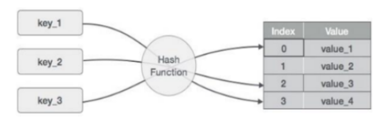

# <h1 align="center">Laporan Praktikum ModuModul 5 - Hastable </h1>
<p align="center">Agnes Refilina Fiska - 2311102126 </p>

## Dasar Teori
1. Hashtable
   Hashtable adalah struktur data yang digunakan untuk menyimpan data dalam bentuk key-value pairs. Hash table menggunakan fungsi hash untuk mengonversi key menjadi indeks di dalam tabel, di mana nilai value disimpan. Fungsi hash ini harus menghasilkan nilai yang unik untuk setiap key yang dimasukkan ke dalam hash table. Jika dua key menghasilkan indeks yang sama, maka terjadi collision, dan hash table harus memiliki cara untuk menangani collision tersebut, seperti dengan teknik chaining atau probing.Keuntungan dari penggunaan hash table adalah kemampuannya untuk melakukan operasi pencarian, penyisipan, dan penghapusan data dalam waktu konstan (O(1)), asalkan tidak terjadi collision. Dengan demikian, hash table sangat efisien untuk digunakan dalam mengelola data yang membutuhkan operasi-operasi tersebut secara cepat.



- Operasi-operasi yang umum dilakukan pada hash table meliputi:

1. Insert: Menyisipkan pasangan key-value ke dalam hash table. Proses ini melibatkan penggunaan fungsi hash untuk   menentukan indeks di mana value akan disimpan. Jika terjadi collision, teknik penanganan collision seperti chaining atau linear probing dapat digunakan.
2. Search: Mencari nilai (value) dari hash table berdasarkan key yang diberikan. Fungsi hash digunakan untuk mengonversi key menjadi indeks, dan kemudian pencarian dilakukan di indeks tersebut. Jika collision terjadi, pencarian dilanjutkan sesuai dengan teknik penanganan collision yang digunakan.
3. Delete: Menghapus pasangan key-value dari hash table berdasarkan key yang diberikan. Fungsi hash digunakan untuk mengonversi key menjadi indeks, dan kemudian data pada indeks tersebut dihapus. Jika collision terjadi, teknik penanganan collision akan diterapkan.
4. Resize: Hash table perlu di-resize jika faktor beban (load factor) melebihi ambang tertentu. Proses resize melibatkan pembuatan tabel hash baru yang lebih besar atau lebih kecil, dan rehashing semua data ke dalam tabel baru dengan menggunakan fungsi hash yang diperbarui.
5. Iterasi: Melakukan iterasi (perulangan) melalui seluruh pasangan key-value yang ada di dalam hash table. Ini memungkinkan untuk melakukan operasi pada setiap elemen hash table.
6. Load Factor Management: Memantau faktor beban hash table untuk memastikan performa yang optimal. Jika load factor terlalu tinggi, hash table perlu di-resize untuk mencegah collision dan mempertahankan kompleksitas waktu operasi yang rendah.
7. Collision Handling: Hash table perlu memiliki strategi penanganan collision, seperti chaining (menggunakan linked list atau array di setiap bucket) atau linear probing (mencari slot kosong berikutnya jika terjadi collision), untuk menangani kasus ketika dua key di-hash ke indeks yang sama.

- Fungsi Hashtable
   Fungsi hash table adalah struktur data yang digunakan untuk menyimpan dan mengakses data dengan cepat berdasarkan kunci (key) yang di- hash. Fungsi hash table menggunakan fungsi hash untuk mengonversi kunci menjadi indeks dalam array atau tabel. Setiap elemen dalam hash table biasanya disebut sebagai bucket atau slot, dan setiap bucket dapat menampung satu atau lebih pasangan key-value.
   Keuntungan utama dari penggunaan hash table adalah kemampuannya untuk memberikan akses cepat ke data berdasarkan kunci. Dengan menggunakan fungsi hash yang efisien, pencarian, penyisipan, dan penghapusan data dalam hash table dapat dilakukan dalam waktu konstan (O(1)) dalam kondisi ideal.
   Beberapa kegunaan umum dari hash table termasuk implementasi struktur data seperti set, map, dictionary, cache, dan lainnya. Hash table sering digunakan dalam bahasa pemrograman seperti Python (dict), Java (HashMap), C++ (unordered_map), dan lainnya untuk menyimpan data dengan efisien dan memungkinkan pencarian yang cepat.
   Namun, penting untuk diperhatikan bahwa collision dapat terjadi dalam hash table, yang memerlukan teknik penanganan collision seperti chaining, open addressing, atau Robin Hood Hashing untuk menangani kasus di mana dua atau lebih key di-hash ke indeks yang sama. Dengan penggunaan yang tepat, hash table dapat menjadi struktur data yang sangat efisien dan berguna dalam berbagai aplikasi.

- Dalam praktiknya, ada dua teknik yang umum digunakan untuk mengatasi kolisi pada saat menggunakan tabel hash:

1. Open Hashing (Chaining) Metode chaining mengatasi tabrakan dengan menyimpan semua data item yang memiliki nilai  indeks yang sama dalam sebuah linked list. Ketika terjadi pencarian atau penambahan data, operasi dilakukan pada linked list yang sesuai dengan indeks yang dihasilkan dari fungsi hash. Meskipun pencarian atau penambahan bisa lambat ketika linked list memiliki banyak node, chaining efektif mengatasi jumlah data yang besar dengan menghindari keterbatasan array.

2. Hashing Tertutup

- Linear Probing: Pada tumbukan, pencarian dilakukan ke posisi berikutnya dalam hash tabel hingga menemukan posisi yang kosong. Jika tidak ada yang kosong, tabel dianggap penuh.
- Quadratic Probing: Mirip dengan linear probing, tetapi langkahnya bukan satu-satu, melainkan dengan penambahan   kuadrat (1^2, 2^2, 3^2, dst.).
- Double Hashing: Pada tabrakan, digunakan fungsi hash kedua untuk menentukan posisi alternatif.

## Guided 

### 1. [Guided I]

```C++
/*
oleh Agnes Refilina Fiska - 2311102126
*/
#include <iostream>
using namespace std;

const int MAX_SIZE = 10;

// Fungsi hash sederhana
int hash_func(int key) {
    return key % MAX_SIZE;
}

// Struktur data untuk setiap node
struct Node {
    int key;
    int value;
    Node* next;
    Node(int key, int value) : key(key), value(value), next(nullptr) {}
};

// Class hash table
class HashTable {
private:
    Node** table;

public:
    HashTable() {
        table = new Node*[MAX_SIZE]();
    }

    ~HashTable() {
        for (int i = 0; i < MAX_SIZE; i++) {
            Node* current = table[i];
            while (current != nullptr) {
                Node* temp = current;
                current = current->next;
                delete temp;
            }
        }
        delete[] table;
    }

    // Insertion
    void insert(int key, int value) {
        int index = hash_func(key);
        Node* current = table[index];
        while (current != nullptr) {
            if (current->key == key) {
                current->value = value;
                return;
            }
            current = current->next;
        }
        Node* node = new Node(key, value);
        node->next = table[index];
        table[index] = node;
    }

    // Searching
    int get(int key) {
        int index = hash_func(key);
        Node* current = table[index];
        while (current != nullptr) {
            if (current->key == key) {
                return current->value;
            }
            current = current->next;
        }
        return -1;
    }

    // Deletion
    void remove(int key) {
        int index = hash_func(key);
        Node* current = table[index];
        Node* prev = nullptr;
        while (current != nullptr) {
            if (current->key == key) {
                if (prev == nullptr) {
                    table[index] = current->next;
                } else {
                    prev->next = current->next;
                }
                delete current;
                return;
            }
            prev = current;
            current = current->next;
        }
    }

    // Traversal
    void traverse() {
        for (int i = 0; i < MAX_SIZE; i++) {
            Node* current = table[i];
            while (current != nullptr) {
                cout << current->key << ": " << current->value << endl;
                current = current->next;
            }
        }
    }
};

int main() {
    HashTable ht;

    // Insertion
    ht.insert(1, 10);
    ht.insert(2, 20);
    ht.insert(3, 30);

    // Searching
    cout << "Get key 1: " << ht.get(1) << endl;
    cout << "Get key 4: " << ht.get(4) << endl;
    cout << "Get key 2: " << ht.get(2) << endl;
    cout << "Get key 5: " << ht.get(5) << endl;

    // Deletion
    ht.remove(4);

    // Traversal
    ht.traverse();

    return 0;
}
```
Program ini adalah implementasi dari hash table dengan metode chaining untuk menangani tabrakan. Hash table digunakan untuk menyimpan pasangan kunci-nilai, di mana kunci adalah integer dan nilai adalah integer juga. Program ini menyediakan operasi-operasi dasar seperti penambahan, pencarian, dan penghapusan, serta penelusuran seluruh isi dari hash table. Setiap entri dalam hash table direpresentasikan oleh struktur data node yang terdiri dari kunci (key) dan nilai (value).


### 2. [Guided II]

```C++
/*
oleh Agnes Refilina Fiska - 2311102126
*/
#include <iostream>
#include <string>
#include <vector>
using namespace std;

const int TABLE_SIZE = 11;

class HashNode {
public:
    string name;
    string phone_number;
    HashNode(string name, string phone_number) {
        this->name = name;
        this->phone_number = phone_number;
    }
};

class HashMap {
private:
    vector<HashNode*> table[TABLE_SIZE];

public:
    int hashFunc(string key) {
        int hash_val = 0;
        for (char c : key) {
            hash_val += c;
        }
        return hash_val % TABLE_SIZE;
    }

    void insert(string name, string phone_number) {
        int hash_val = hashFunc(name);
        for (auto node : table[hash_val]) {
            if (node->name == name) {
                node->phone_number = phone_number;
                return;
            }
        }
        table[hash_val].push_back(new HashNode(name, phone_number));
    }

    void remove(string name) {
        int hash_val = hashFunc(name);
        for (auto it = table[hash_val].begin(); it != table[hash_val].end(); it++) {
            if ((*it)->name == name) {
                table[hash_val].erase(it);
                return;
            }
        }
    }

    string searchByName(string name) {
        int hash_val = hashFunc(name);
        for (auto node : table[hash_val]) {
            if (node->name == name) {
                return node->phone_number;
            }
        }
        return "";
    }

    void print() {
        for (int i = 0; i < TABLE_SIZE; i++) {
            cout << i << ": ";
            for (auto pair : table[i]) {
                if(pair != nullptr) {
                    cout << "[" << pair->name << ", " << pair->phone_number << "]";
                }
            }
            cout << endl;
        }
    }
};

int main() {
    HashMap employee_map;
    employee_map.insert("Mistah", "1234");
    employee_map.insert("Pastah", "5678");
    employee_map.insert("Ghana", "91011");

    cout << "Nomer Hp Mistah : " << employee_map.searchByName("Mistah") << endl;
    cout << "Phone Hp Pastah : " << employee_map.searchByName("Pastah") << endl;

    employee_map.remove("Mistah");
    cout << "Nomer Hp Mistah setelah dihapus : " << employee_map.searchByName("Mistah") << endl << endl;

    cout << "Hash Table : " << endl;
    employee_map.print();

    return 0;
}
```
Program ini merupakan implementasi sederhana dari struktur data hash table menggunakan chaining untuk menangani tabrakan. Hash table digunakan untuk menyimpan informasi nama karyawan beserta nomor telepon mereka. Program ini memungkinkan pengguna untuk memasukkan entri baru, mencari nomor telepon berdasarkan nama karyawan, dan menghapus entri berdasarkan nama karyawan. Hasil pencarian dan isi dari hash table dicetak untuk ditampilkan kepada pengguna.

## Unguided 

### 1. [Implementasikan hash table untuk menyimpan data mahasiswa. Setiap mahasiswa memiliki NIM dan nilai. Implementasikan fungsi untuk menambahkan data baru, menghapus data, mencari data berdasarkan NIM, dan mencari data berdasarkan nilai. Dengan ketentuan : a. Setiap mahasiswa memiliki NIM dan nilai. b. Program memiliki tampilan pilihan menu berisi poin C. c. Implementasikan fungsi untuk menambahkan data baru, menghapus data, mencari data berdasarkan NIM, dan mencari data berdasarkan rentang nilai (80 – 90).]

```C++
/*
oleh Agnes Refilina Fiska - 2311102126
*/
#include <iostream>
#include <string>
#include <vector>
#include <iomanip>

using namespace std;

const int TABLE_SIZE = 101; // Ukuran tabel diubah menjadi bilangan prima untuk meningkatkan efisiensi hashing

// Struktur data mahasiswa
struct Mahasiswa {
    string nama;
    string nim;
    int nilai;
};

// Struktur data untuk setiap node
class HashNode {
public:
    string name;
    string nim;
    int nilai;

    HashNode(string name, string nim, int nilai) : name(name), nim(nim), nilai(nilai) {}
};

// Class HashMap
class HashMap {
private:
    vector<HashNode*> table[TABLE_SIZE];

public:
    int hashFunc(string key) {
        int hash_val = 0;
        for (char c : key) {
            hash_val += c;
        }
        return hash_val % TABLE_SIZE;
    }

    void insert(string name, string nim, int nilai) {
        int hash_val = hashFunc(name);
        for (auto node : table[hash_val]) {
            if (node->name == name) {
                node->nim = nim;
                node->nilai = nilai;
                cout << "Data Mahasiswa dengan Nama " << name << " berhasil ditambahkan." << endl;
                return;
            }
        }
        table[hash_val].push_back(new HashNode(name, nim, nilai));
    }

    void remove(string name) {
        int hash_val = hashFunc(name);
        for (auto it = table[hash_val].begin(); it != table[hash_val].end(); ++it) {
            if ((*it)->name == name) {
                delete *it;
                table[hash_val].erase(it);
                cout << "Data Mahasiswa dengan nama " << name << " berhasil dihapus." << endl;
                return;
            }
        }
    }

    void searchByNIM(string nim) {
        bool found = false;
        for (int i = 0; i < TABLE_SIZE; ++i) {
            for (auto node : table[i]) {
                if (node->nim == nim) {
                    cout << "\n ============ CARI DATA MAHASISWA (NIM) ============" << endl;
                    cout << " ---------------------------------------------------" << endl;
                    cout << left << "| " << setw(15) << "Nama"
                         << "| " << setw(20) << "NIM"
                         << "| " << setw(10) << "Nilai"
                         << " |" << endl;
                    cout << " ---------------------------------------------------" << endl;
                    cout << "| " << left << setw(15) << node->name
                         << "| " << left << setw(20) << node->nim
                         << "| " << left << setw(10) << node->nilai << " |" << endl;
                    cout << " ---------------------------------------------------" << endl;
                    found = true;
                    return;
                }
            }
        }
        if (!found) {
            cout << "Mahasiswa dengan NIM " << nim << " tidak ditemukan." << endl;
        }
    }

    void CariRentangNilai(int NilaiMin, int NilaiMax) {
        bool found = false;
        cout << "\n ======= CARI DATA MAHASISWA (RENTANG NILAI) =======" << endl;
        cout << " ---------------------------------------------------" << endl;
        cout << left << "| " << setw(15) << "Nama"
             << "| " << setw(20) << "NIM"
             << "| " << setw(10) << "Nilai"
             << " |" << endl;
        cout << " ---------------------------------------------------" << endl;
        for (int i = 0; i < TABLE_SIZE; ++i) {
            for (auto node : table[i]) {
                if (node->nilai >= NilaiMin && node->nilai <= NilaiMax) {
                    cout << "| " << left << setw(15) << node->name
                         << "| " << left << setw(20) << node->nim
                         << "| " << left << setw(10) << node->nilai << " |" << endl;
                    found = true;
                }
            }
        }
        if (!found) {
            cout << "Tidak ada data Mahasiswa dengan nilai antara " << NilaiMin << " dan " << NilaiMax << "." << endl;
        }
        cout << " ---------------------------------------------------" << endl;
    }

    void print() {
        cout << "\n ================== DATA MAHASISWA =================" << endl;
        cout << " ---------------------------------------------------" << endl;
        cout << left << "| " << setw(15) << "Nama"
             << "| " << setw(20) << "NIM"
             << "| " << setw(10) << "Nilai"
             << " |" << endl;
        cout << " ---------------------------------------------------" << endl;
        for (int i = 0; i < TABLE_SIZE; ++i) {
            for (auto pair : table[i]) {
                cout << "| " << left << setw(15) << pair->name
                     << "| " << left << setw(20) << pair->nim
                     << "| " << left << setw(10) << pair->nilai << " |" << endl;
            }
        }
        cout << " ---------------------------------------------------" << endl;
    }

    ~HashMap() {
        for (int i = 0; i < TABLE_SIZE; ++i) {
            for (auto node : table[i]) {
                delete node;
            }
        }
    }
};

int main() {
    HashMap map;
    int choice;
    string name;
    string nim;
    int nilai;
    int search1, search2;
    do {
        cout << "\n ============ MENU LIST NILAI MAHASISWA ============" << endl;
        cout << "1. Tambah data Mahasiswa" << endl;
        cout << "2. Hapus data Mahasiswa" << endl;
        cout << "3. Cari data Mahasiswa (NIM)" << endl;
        cout << "4. Cari data Mahasiswa (Rentang Nilai)" << endl;
        cout << "5. Tampilkan" << endl;
        cout << "6. Keluar" << endl;
        cout << "Masukkan pilihan: ";
        cin >> choice;
        switch (choice) {
            case 1:
                cout << "\n ============== TAMBAH DATA MAHASISWA ==============" << endl;
                cout << "Masukkan Nama: ";
                cin >> name;
                cout << "Masukkan NIM: ";
                cin >> nim;
                cout << "Masukkan Nilai: ";
                cin >> nilai;
                map.insert(name, nim, nilai);
                break;
            case 2:
                cout << "\n =========== HAPUS DATA MAHASISWA (Nama) ===========" << endl;
                cout << "Masukkan Nama: ";
                cin >> name;
                map.remove(name);
                break;
            case 3:
                cout << "\n ============ CARI DATA MAHASISWA (NIM) ============" << endl;
                cout << "Masukkan NIM: ";
                cin >> nim;
                map.searchByNIM(nim);
                break;
            case 4:
                cout << "\n ======= CARI DATA MAHASISWA (RENTANG NILAI) =======" << endl;
                cout << "Masukkan Nilai minimum: ";
                cin >> search1;
                cout << "Masukkan Nilai maksimum: ";
                cin >> search2;
                map.CariRentangNilai(search1, search2);
                break;
            case 5:
                map.print();
                break;
            case 6:
                break;
            default:
                cout << "Pilihan tidak tersedia!" << endl;
        }
    } while (choice != 6);
    cout << "==============================================================" << endl;
    cout << "                Made By: AgnesRefilinaFiska                   " << endl;
    cout << "==============================================================" << endl;
    return 0;
}
```
#### Output:
.png)
.png)
.png)
.png)
.png)

Program di atas adalah implementasi sederhana dari struktur data hashmap dalam bahasa C++. Program ini memungkinkan pengguna untuk melakukan operasi dasar terhadap data mahasiswa, seperti menambah, menghapus, mencari berdasarkan NIM, mencari dalam rentang nilai tertentu, dan menampilkan seluruh data mahasiswa yang tersimpan. Setiap entri data mahasiswa disimpan dalam tabel hash dengan ukuran yang telah ditentukan sebelumnya. Untuk meningkatkan efisiensi hashing, ukuran tabel diubah menjadi bilangan prima. Program juga mencakup beberapa fitur tambahan, seperti penggunaan struktur data Mahasiswa dan HashNode, serta penanganan input yang baik dengan menggunakan pesan yang jelas untuk memandu pengguna dalam penggunaan program. Pada akhirnya, program mencetak informasi pembuatnya, yaitu "Made By: AgnesRefilinaFiska".Program ini memiliki beberapa fitur, yaitu:

1. Tambah data Mahasiswa
2. Hapus data Mahasiswa
3. Cari data Mahasiswa berdasarkan NIM
4. Cari data Mahasiswa berdasarkan rentang nilai
5. Tampilkan data
6. Keluar

## Kesimpulan
Tabel hash adalah struktur data yang digunakan untuk menyimpan dan mengakses data dengan cepat. Hash table menggunakan fungsi hash untuk mengubah nilai unik dari setiap data menjadi nilai yang dapat digunakan untuk menentukan lokasi data dalam tabel. Jika terjadi kolisi (kondisi dimana nilai hash dari dua data berbeda sama), tabel hash menggunakan metode pengolahan kolisi untuk mengelola data tersebut. Tabel hash dapat digunakan untuk menyimpan dan mengakses data dengan cepat, tetapi perlu diingat bahwa kolisi dapat terjadi dan dapat mempengaruhi kinerja. Tabel hash dapat digunakan dalam berbagai bidang, seperti pencarian, pengolahan data, dan pengelolaan database.

## Referensi
[1] Mailund, T. (2019). Kegembiraan hashing: pemrograman tabel hash dengan C. Apress.
[2] Rahardja, U., Hidayanto, AN, Lutfiani, N., Febiani, DA, & Aini, Q. (2021). Kekekalan Model Hash Terdistribusi  pada Penyimpanan Node Blockchain. Sains. J.Informatika, 8(1), 137-143.