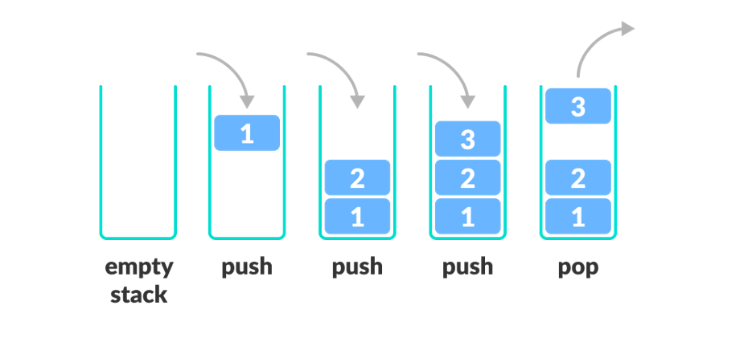
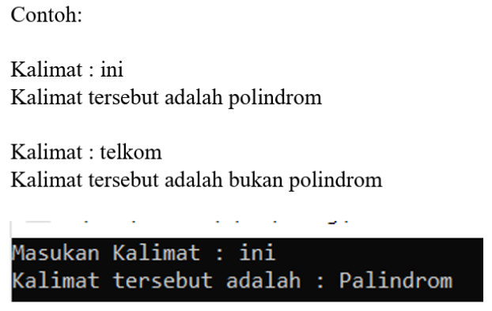
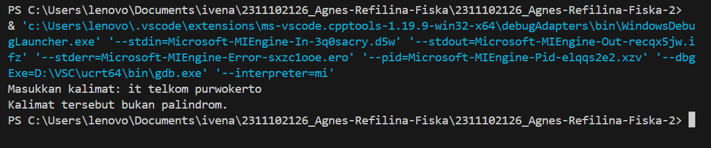
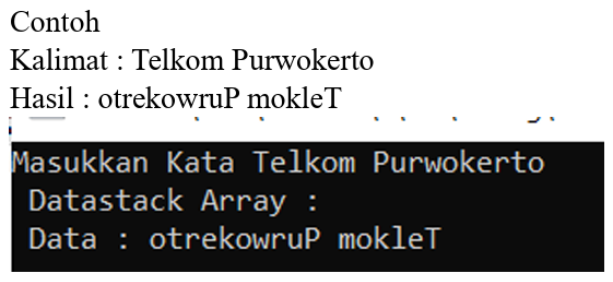
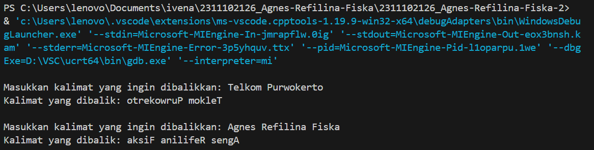

# <h1 align="center">Laporan Praktikum Modul VI “Stack"</h1>
<p align="center">Agnes Refilina Fiska - 2311102126 </p>

## Dasar Teori

## A. Struktur Data Stack
Dalam bahasa pemrograman C++, stack adalah salah satu struktur data yang berguna untuk menyimpan dan mengelola elemen-elemen data. Stack mengikuti konsep LIFO (Last In, First Out), yang berarti elemen yang terakhir dimasukkan ke dalam stack akan menjadi elemen pertama yang dikeluarkan.



   Pada dasarnya, stack terdiri dari ::
1.	Push: Digunakan untuk memasukkan elemen baru ke dalam stack. Elemen baru ini akan ditempatkan di atas elemen-elemen yang 
   sudah ada sebelumnya.   
2.	Pop: Digunakan untuk mengeluarkan elemen teratas (top) dari stack. Elemen ini dihapus dari stack, dan elemen yang berada di bawahnya menjadi elemen teratas baru.
3.	isFull: berguna untuk memeriksa apakah ruang stack sudah penuh atau belum
4.	isEmpty: berguna untuk memeriksa apakah ruang stack kosong atau tidak.
5.	Peek: berguna untuk meninjau kembali data diposisi tertentu.
6.	Count: berguna untuk menghitung banyak data pada stack.
7.	Change: berguna untuk merubah posisi data ke posisi tertentu.
8.	Display: berguna untuk menampilkan semua data pada stack
9.	Destroy: menghapus atau membersihkan semua data pada stack.

   Selain itu, ada juga operasi lain yang sering digunakan pada stack, yaitu:
    - Top: Mengembalikan nilai dari elemen teratas (top) pada stack tanpa menghapusnya.
    - Empty: Memeriksa apakah stack kosong atau tidak.
    - Size: Mengembalikan jumlah elemen yang ada dalam stack.

## B. Implementasi Stack
   Dalam C++, stack dapat diimplementasikan menggunakan struktur data yang tersedia di library <stack>. 
   Terdapat dua jenis implementasi stack yang umum digunakan:
   - Stack menggunakan array: Stack diimplementasikan menggunakan array dengan ukuran tetap. Namun, penggunaan array ini 
     memiliki batasan pada ukuran maksimum stack.
   - Stack menggunakan linked list: Stack diimplementasikan menggunakan linked list, di mana setiap elemen stack (node) 
     memiliki pointer yang menunjuk ke elemen berikutnya. Implementasi ini tidak memiliki batasan pada ukuran stack.
## C. Jenis-Jenis Stack
   Terdapat beberapa jenis stack yang umum digunakan, di antaranya:
   1. Stack dengan tipe data dasar: Stack yang menyimpan elemen-elemen dengan tipe data dasar seperti integer, float, 
      karakter.
   2. Stack dengan tipe data objek: Stack yang menyimpan elemen-elemen dengan tipe data objek, seperti string, struktur, 
      atau kelas. Objek-objek ini dapat diubah menjadi elemen-elemen stack.
   3. Stack dengan alokasi dinamis: Stack yang menggunakan alokasi dinamis untuk menyesuaikan ukuran stack saat runtime. 
      Implementasinya dapat menggunakan linked list atau array dengan pengelolaan memori yang fleksibel.
   4. Stack dengan alokasi statis: Stack yang menggunakan alokasi statis dengan ukuran tetap yang ditentukan pada saat 
      kompilasi. Implementasinya menggunakan array dengan ukuran tetap.

Setiap jenis stack memiliki kegunaan yang berbeda tergantung pada kebutuhan aplikasi. Pemilihan jenis stack yang tepat penting untuk memastikan efisiensi dan keandalan program.

## Guided 

### 1. 

```C++
/*
oleh Agnes Refilina Fiska - 2311102126
*/
#include <iostream>
using namespace std;

string arrayBuku[5];
int maksimal = 5, top = 0;

bool isFull() {
    return (top == maksimal);
  }
bool isEmpty() {
    return (top == 0);
  }
void pushArrayBuku(string data) {
    if (isFull()) {
       cout << "Data telah penuh" << endl;
    } else {
       arrayBuku[top] = data;
       top++;
    }
}
void popArrayBuku() {
    if (isEmpty()) {
        cout << "Tidak ada data yang dihapus" << endl;
    } else {
        arrayBuku[top - 1] = "";
        top--;
    }
}
void peekArrayBuku(int posisi) {
    if (isEmpty()) {
        cout << "Tidak ada data yang bisa dilihat" << endl;
    } else {
int index = top;
for (int i = 1; i <= posisi; i++) {
index--;
}
cout << "Posisi ke " << posisi << " adalah " << arrayBuku[index] << endl;
}
}
int countStack() {
return top;
}
void changeArrayBuku(int posisi, string data) {
if (posisi > top) {
cout << "Posisi melebihi data yang ada" << endl;
} else {
int index = top;
for (int i = 1; i <= posisi; i++) {
index--;
}
arrayBuku[index] = data;
}
}
void destroyArraybuku() {
for (int i = top; i >= 0; i--) {
arrayBuku[i] = "";
}
top = 0;
}
void cetakArrayBuku() {
if (isEmpty()) {
cout << "Tidak ada data yang dicetak" << endl;
} else {
for (int i = top - 1; i >= 0; i--) {
cout << arrayBuku[i] << endl;
}
}
}
int main() {
pushArrayBuku("Kalkulus");
pushArrayBuku("Struktur Data");
pushArrayBuku("Matematika Diskrit");
pushArrayBuku("Dasar Multimedia");
pushArrayBuku("Inggris");
cetakArrayBuku();
cout << "\n";
cout << "Apakah data stack penuh? " << isFull() << endl;
cout << "Apakah data stack kosong? " << isEmpty() << endl;
peekArrayBuku(2);
popArrayBuku();
cout << "Banyaknya data = " << countStack() << endl;
changeArrayBuku(2, "Bahasa Jerman");
cetakArrayBuku();
cout << "\n";
destroyArraybuku();
cout << "Jumlah data setelah dihapus: " << top << endl;
cetakArrayBuku();
return 0;
}
```
Script di atas adalah implementasi dari struktur data stack dalam bahasa pemrograman C++. Stack merupakan struktur data yang mengikuti prinsip LIFO (Last In First Out), di mana elemen terakhir yang dimasukkan akan menjadi elemen pertama yang diambil. Pada implementasi ini, terdapat fungsi-fungsi dasar seperti push (untuk menambah data), pop (untuk menghapus data), peek (untuk melihat data pada posisi tertentu), serta fungsi-fungsi lainnya seperti isEmpty, isFull, countStack, changeArrayBuku, dan destroyArrayBuku. Program kemudian melakukan serangkaian operasi pada stack buku, seperti menambah, menghapus, mengubah, dan mencetak elemen-elemen yang ada dalam stack tersebut.

## Unguided 

### 1. [Buatlah program untuk menentukan apakah kalimat tersebut yang diinputkan dalam program stack adalah palindrom/tidak. Palindrom kalimat yang dibaca dari depan dan belakang sama. Jelaskan bagaimana cara kerja programnya.]


```C++
/*
oleh Agnes Refilina Fiska - 2311102126
*/
#include <iostream>
#include <stack>
#include <string>
#include <cctype>

using namespace std;
// Fungsi untuk membersihkan kalimat dari karakter non-alfabet dan mengonversi huruf ke huruf kecil
string cleanString(const string& str) {
    string cleaned;
    for(char c : str) {
        if(isalpha(c)) {
            cleaned += tolower(c);
        }
    }
    return cleaned;
}

// Fungsi untuk menentukan apakah sebuah kalimat adalah palindrom atau tidak
bool isPalindrome(const string& sentence) {
    stack<char> charStack;
    string cleanedSentence = cleanString(sentence);

    // Memasukkan karakter-karakter kalimat ke dalam stack
    for(char c : cleanedSentence) {
        charStack.push(c);
    }
    // Membandingkan karakter-karakter dari depan dengan karakter-karakter dari belakang
    for(char c : cleanedSentence) {
        if(c != charStack.top()) {
            return false;
        }
        charStack.pop();
    }

    return true;
}

int main() {
    string kalimat;
    cout << "Masukkan kalimat: ";
    getline(cin, kalimat);

    if(isPalindrome(kalimat)) {
        cout << "Kalimat tersebut adalah palindrom." << endl;
    } else {
        cout << "Kalimat tersebut bukan palindrom." << endl;
    }

    return 0;
}
```
#### Output:


Program di atas adalah sebuah program C++ sederhana yang bertujuan untuk menentukan apakah sebuah kalimat yang dimasukkan oleh pengguna merupakan palindrom atau tidak. Program ini terdiri dari dua fungsi utama: cleanString dan isPalindrome, serta fungsi main.

Fungsi cleanString bertugas untuk membersihkan kalimat dari karakter non-alfabet dan mengonversi semua huruf menjadi huruf kecil. Hal ini dilakukan dengan melakukan iterasi pada setiap karakter dalam string input, kemudian memeriksa apakah karakter tersebut merupakan huruf alfabet. Jika iya, karakter tersebut akan ditambahkan ke dalam string yang telah dibersihkan (variable cleaned). Setelah iterasi selesai, string yang telah dibersihkan akan dikembalikan.

Fungsi isPalindrome bertugas untuk memeriksa apakah sebuah kalimat adalah palindrom atau tidak. Pertama-tama, kalimat akan dibersihkan menggunakan fungsi cleanString. Kemudian, setiap karakter dari kalimat yang telah dibersihkan akan dimasukkan ke dalam sebuah stack. Setelah itu, karakter-karakter tersebut akan dibandingkan dengan karakter-karakter dari belakang (yang telah dimasukkan ke dalam stack). Jika terdapat perbedaan pada salah satu karakter, maka kalimat tersebut bukanlah palindrom dan fungsi akan mengembalikan nilai false. Namun, jika semua karakter berhasil dibandingkan tanpa perbedaan, maka kalimat tersebut merupakan palindrom dan fungsi akan mengembalikan nilai true.

### 2. [Buatlah program untuk melakukan pembalikan terhadap kalimat menggunakan stack dengan minimal 3 kata. Jelaskan output program dan source codenya beserta operasi/fungsi yang dibuat?]


```C++
/*
oleh Agnes Refilina Fiska - 2311102126
*/
#include <iostream>
#include <stack>

using namespace std;

string BeforeReverse_126(string sentence_126) {
  stack<char> s; // Buat stack untuk menyimpan karakter kalimat

  for (int i = 0; i < sentence_126.length(); i++) { // Masukkan karakter kalimat ke stack
    s.push(sentence_126[i]);
  }

  string AfterReverse_126; // Membalik kalimat dengan mengeluarkan karakter dari stack
  while (!s.empty()) {
    AfterReverse_126 += s.top();
    s.pop();
  }

  return AfterReverse_126;
}

int main() {
  string sentence_126;

  do {
  cout << "\nMasukkan kalimat yang ingin dibalikkan: ";  // Input kalimat dari pengguna
  getline(cin, sentence_126);

  string AfterReverse_126 = BeforeReverse_126(sentence_126);  // Membalik kalimat

  cout << "Kalimat yang dibalik: " << AfterReverse_126 << endl; // Menampilkan kalimat yang dibalik

  } while (sentence_126 != "exit");
  return 0;
}
```
#### Output:


Program ini meminta pengguna untuk memasukkan sebuah kalimat dan kemudian membalikkan kalimat tersebut. Untuk melakukan pembalikan, program menggunakan struktur data stack untuk menyimpan karakter-karakter kalimat secara terbalik. Pertama-tama, program mengambil setiap karakter dari kalimat yang dimasukkan oleh pengguna dan menyimpannya dalam stack. Setelah semua karakter dimasukkan ke dalam stack, program mengeluarkan karakter-karakter dari stack satu per satu untuk membentuk kalimat yang telah dibalik. Proses ini terjadi dalam fungsi BeforeReverse_126. Setelah kalimat dibalik, program menampilkan kalimat yang telah dibalik kepada pengguna. Program akan terus meminta pengguna untuk memasukkan kalimat hingga pengguna memasukkan kata "exit".

## Kesimpulan
Belajar tentang stack merupakan langkah penting dalam memahami dasar-dasar struktur data dan algoritma dalam pemrograman komputer. Stack adalah struktur data yang mendasar, memungkinkan penyimpanan dan pengambilan data dengan aturan Last In, First Out (LIFO). Dua operasi utamanya, yaitu push (penyisipan data) dan pop (pengambilan data), bersama-sama dengan operasi lain seperti peek dan isEmpty, membentuk fondasi untuk penggunaan stack dalam pemrograman. Implementasi stack dapat dilakukan menggunakan berbagai struktur data dasar seperti array atau linked list, masing-masing dengan kelebihan dan kelemahan tertentu. Pemahaman konsep LIFO yang mendasari stack tidak hanya penting untuk penggunaannya dalam pemrograman, tetapi juga membantu dalam merancang solusi yang efisien dan efektif dalam berbagai masalah komputasi. Dengan pemahaman tentang stack, seseorang dapat mengaplikasikan konsep tersebut dalam berbagai konteks pemrograman, mulai dari pengelolaan memori hingga manajemen tumpukan panggilan dalam aplikasi perangkat lunak.

## Referensi
[1] Stroustrup, B., Tur C++ Edisi Ketiga. Amerika Serikat: Pearson Education, Inc., 2023.
[2] Muhammad Nugraha, Pemrograman Dasar Dengan C++, Materi Paling Dasar untuk Menjadi Platform Programmer Berbagai. Yogyakarta: Deeppublish, 2021.
