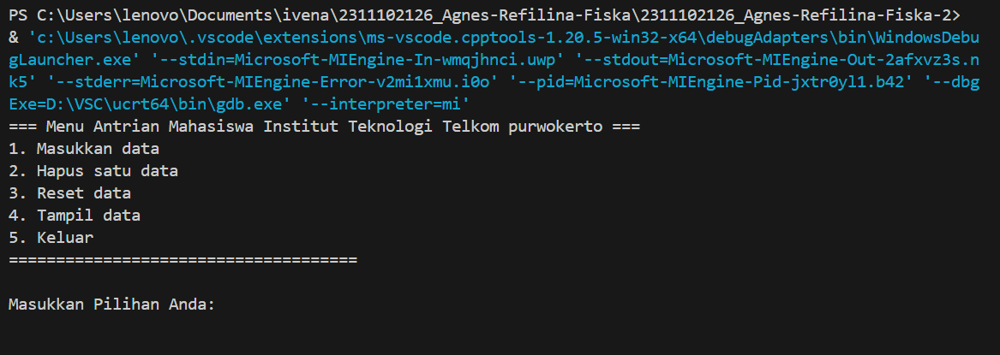

# <h1 align="center">Laporan Praktikum Modul “QUEUE"</h1>
<p align="center">Agnes Refilina Fiska - 2311102126</p>

## Dasar Teori

A. Struktur Data Stack
   Dalam bahasa pemrograman C++, stack adalah salah satu struktur data yang berguna untuk menyimpan dan mengelola elemen-elemen data. Stack mengikuti konsep LIFO (Last In, First Out), yang berarti elemen yang terakhir dimasukkan ke dalam stack akan menjadi elemen pertama yang dikeluarkan.


   Pada dasarnya, stack terdiri dari ::
1.	Push: Digunakan untuk memasukkan elemen baru ke dalam stack. Elemen baru ini akan ditempatkan di atas elemen-elemen yang sudah ada sebelumnya.   
2.	Pop: Digunakan untuk mengeluarkan elemen teratas (top) dari stack. Elemen ini dihapus dari stack, dan elemen yang berada di bawahnya menjadi elemen teratas baru.
3.	isFull: berguna untuk memeriksa apakah ruang stack sudah penuh atau belum
4.	isEmpty: berguna untuk memeriksa apakah ruang stack kosong atau tidak.
5.	Peek: berguna untuk meninjau kembali data diposisi tertentu.
6.	Count: berguna untuk menghitung banyak data pada stack.
7.	Change: berguna untuk merubah posisi data ke posisi tertentu.
8.	Display: berguna untuk menampilkan semua data pada stack
9.	Destroy: menghapus atau membersihkan semua data pada stack.

   Selain itu, ada juga operasi lain yang sering digunakan pada stack, yaitu:
    - Top: Mengembalikan nilai dari elemen teratas (top) pada stack tanpa menghapusnya.
    - Empty: Memeriksa apakah stack kosong atau tidak.
    - Size: Mengembalikan jumlah elemen yang ada dalam stack.

B. Implementasi Stack
   Dalam C++, stack dapat diimplementasikan menggunakan struktur data yang tersedia di library <stack>. Terdapat dua jenis implementasi stack yang umum digunakan:
   - Stack menggunakan array: Stack diimplementasikan menggunakan array dengan ukuran tetap. Namun, penggunaan array ini memiliki batasan pada ukuran maksimum stack.
   - Stack menggunakan linked list: Stack diimplementasikan menggunakan linked list, di mana setiap elemen stack (node) memiliki pointer yang menunjuk ke elemen berikutnya. Implementasi ini tidak memiliki batasan pada ukuran stack.
C. Jenis-Jenis Stack
   Terdapat beberapa jenis stack yang umum digunakan, di antaranya:
   1. Stack dengan tipe data dasar: Stack yang menyimpan elemen-elemen dengan tipe data dasar seperti integer, float, karakter, dll.
   2. Stack dengan tipe data objek: Stack yang menyimpan elemen-elemen dengan tipe data objek, seperti string, struktur, atau kelas. Objek-objek ini dapat diubah menjadi elemen-elemen stack.
   3. Stack dengan alokasi dinamis: Stack yang menggunakan alokasi dinamis untuk menyesuaikan ukuran stack saat runtime. Implementasinya dapat menggunakan linked list atau array dengan pengelolaan memori yang fleksibel.
   4. Stack dengan alokasi statis: Stack yang menggunakan alokasi statis dengan ukuran tetap yang ditentukan pada saat kompilasi. Implementasinya menggunakan array dengan ukuran tetap.

Setiap jenis stack memiliki kegunaan yang berbeda tergantung pada kebutuhan aplikasi. Pemilihan jenis stack yang tepat penting untuk memastikan efisiensi dan keandalan program.

## Guided 

### 1.

```C++
/*
oleh Agnes Refilina Fiska - 2311102126
*/
#include <iostream>
using namespace std;

//mengecek antrian apakah sudah penuh
const int maksimalAntrian = 5;
int front = 0;
int back = 0;
string queueTeller[5];

bool isFull(){
    if (back == maksimalAntrian){
        return true;
    } else {
        return false;
    }
}

//mengecek antrian apakah masih kosong
bool isEmpty(){
    if(back == 0){
        return true;
    } else {
        return false;
    }
}

//menambah antrian
void tambahData(string nama){
    if (isFull ()){
        cout<<"Antrian sudah penuh."<<endl;
    } else {
        if (isEmpty ()){
            queueTeller[0] = nama;
            front++;
            back++;
        } else{
            queueTeller[back] = nama;
            back++;
        }
    }
}

//mengurangi antrian
void kurangAntrian (){
    if (isEmpty ()){
        cout<<"Antrian kosong."<<endl;
    } else {
        for (int i = 0; i < back; i++)
        {
            queueTeller[i] = queueTeller[i + 1];
        }
        back --;
    }
}

//menghitung banyak antrian
int count () {
    return back;
}

//menghapus seluruh antrian
void clearQueue (){
    if (isEmpty ()){
        cout<<"Antrian kosong"<<endl;
    } else {
        for (int i = 0; i < back; i++){
            queueTeller[i] = "";
        }
        back = 0;
        front = 0;
    }
}

//melihat antrian
void viewQueue (){
    cout<<"Data antrian: "<<endl;
    for (int i = 0; i < maksimalAntrian; i++){
        if (queueTeller[i] !=""){
            cout<<i+1<<"."<<queueTeller[i]<<endl;
        }else {
            cout<<i+1<<"."<<"(kosong)"<<endl;
        }
    }
}

//main fungsi
int main (){
    tambahData("Alya");
    tambahData("Kiki");
    tambahData("Artika");
    viewQueue();

    //mengurangi antrian
    kurangAntrian();
    viewQueue();

    //menghapus seluruh antrian
    clearQueue();
    viewQueue();
}
```
Program C++ ini mensimulasikan sistem antrian sederhana untuk mengelola teller line di bank. Ini mencakup fungsi untuk menambah dan menghapus elemen dari antrian, menampilkan status antrian saat ini, dan menghapus antrian. Program mendemonstrasikan fungsi-fungsi ini dengan menambahkan dua elemen, menampilkan antrian, menghitung elemen, menghapus elemen pertama, menampilkan antrian yang diperbarui, menghitung elemen yang diperbarui, menghapus antrian, dan menampilkan antrian yang telah dibersihkan.

## Unguided 

### 1. [Ubahlah penerapan konsep queue pada bagian guided dari array menjadi linked list]

```C++
/*
oleh Agnes Refilina Fiska - 2311102126
*/
#include <iostream>
using namespace std;

// Struktur simpul untuk node dalam linked list
struct Mahasiswa {
    string nama;
    string nim;
    Mahasiswa* next;
};

// Kelas Queue yang menggunakan linked list
class Queue {
private:
    Mahasiswa* front; // Pointer ke depan antrian
    Mahasiswa* back;  // Pointer ke belakang antrian

public:
    Queue() {
        front = nullptr;
        back = nullptr;
    }

    // Fungsi untuk mengecek apakah antrian kosong
    bool isEmpty() {
        return front == nullptr;
    }

    // Fungsi untuk menambahkan data ke antrian
    void enqueue(string nama, string nim) {
        Mahasiswa* newNode = new Mahasiswa();
        newNode->nama = nama;
        newNode->nim = nim;
        newNode->next = nullptr;

        // Jika antrian kosong, node baru menjadi front dan back
        if (isEmpty()) {
            front = newNode;
            back = newNode;
        } else {
            // Jika antrian tidak kosong, tambahkan node baru ke belakang dan update back
            back->next = newNode;
            back = newNode;
        }
        cout << "Data berhasil dimasukkan ke dalam antrian" << endl;
    }

    // Fungsi untuk menghapus data dari antrian
    void dequeue() {
        if (isEmpty()) {
            cout << "Antrian kosong" << endl;
        } else {
            // Jika antrian tidak kosong, hapus node pertama dan update front
            Mahasiswa* temp = front;
            front = front->next;
            delete temp;
            cout << "Data berhasil dihapus dari antrian" << endl;
        }
    }

    // Fungsi untuk menghitung jumlah data dalam antrian
    int countQueue() {
        int count = 0;
        Mahasiswa* temp = front;
        while (temp != nullptr) {
            count++;
            temp = temp->next;
        }
        return count;
    }

    // Fungsi untuk menghapus semua data dari antrian
    void clearQueue() {
        while (!isEmpty()) {
            dequeue();
        }
        cout << "Data berhasil di-reset" << endl;
    }

    // Fungsi untuk menampilkan data dalam antrian
    void viewQueue() {
        if (isEmpty()) {
            cout << "Antrian kosong" << endl;
        } else {
            cout << "Data antrian Mahasiswa: " << endl;
            Mahasiswa* temp = front;
            int pos = 1;
            while (temp != nullptr) {
                cout << pos << ". Nama: " << temp->nama << " || NIM: " << temp->nim << endl;
                temp = temp->next;
                pos++;
            }
        }
    }
};

int main() {
    Queue queue;
    int choice;

    do {
        cout << "=== Menu Antrian Mahasiswa Institut Teknologi Telkom purwokerto ===" << endl;
        cout << "1. Masukkan data" << endl;
        cout << "2. Hapus satu data" << endl;
        cout << "3. Reset data" << endl;
        cout << "4. Tampil data" << endl;
        cout << "5. Keluar" << endl;
        cout << "=====================================\n" << endl;
        cout << "Masukkan Pilihan Anda: ";
        cin >> choice;

        switch (choice) {
            case 1: {
                string nama, nim;
                cout << "Masukkan Nama Mahasiswa : ";
                cin.ignore();
                getline(cin, nama);
                cout << "Masukkan NIM Mahasiswa  : ";
                cin >> nim;
                queue.enqueue(nama, nim);
                break;
            }
            case 2: {
                if (queue.isEmpty()) {
                    cout << "Antrian kosong" << endl;
                } else {
                    queue.dequeue ();
                }
                break;
            }
            case 3: {
                if (queue.isEmpty()) {
                    cout << "Antrian kosong" << endl;
                } else {
                    queue.clearQueue();
                }
                break;
            }
            case 4: {
                queue.viewQueue();
                break;
            }
            case 5: {
                cout << "Terima kasih telah menggunakan layanan kami ;)" << endl;
                break;
            }
            default: {
                cout << "Pilihan yang Anda masukkan tidak valid" << endl;
                break;
            }
        }

        cout << endl;

    } while (choice != 5);

    return 0;
}
```
#### Output:


Program di atas adalah implementasi dari struktur data antrian (queue) menggunakan linked list dalam bahasa pemrograman C++. Program ini memungkinkan pengguna untuk memasukkan data mahasiswa ke dalam antrian, menghapus data dari antrian, mereset seluruh data dalam antrian, menampilkan data dalam antrian, dan keluar dari program.

Struktur data antrian diimplementasikan menggunakan linked list, dengan setiap simpul (node) menyimpan informasi tentang nama dan NIM mahasiswa serta pointer ke simpul berikutnya dalam antrian. Kelas Queue memiliki dua pointer yaitu front yang menunjukkan ke simpul depan antrian, dan back yang menunjukkan ke simpul belakang antrian.

### 2. [Dari nomor 1 buatlah konsep antri dengan atribut Nama mahasiswa dan NIM Mahasiswa]

```C++
/*
oleh Agnes Refilina Fiska - 2311102126
*/
#include <iostream>
using namespace std;

// Struktur simpul untuk node dalam linked list
struct Mahasiswa {
    string nama;
    string nim;
    Mahasiswa* next;
};

// Kelas Queue yang menggunakan linked list
class Queue {
private:
    Mahasiswa* front; // Pointer ke depan antrian
    Mahasiswa* back;  // Pointer ke belakang antrian

public:
    Queue() {
        front = nullptr;
        back = nullptr;
    }

    // Fungsi untuk mengecek apakah antrian kosong
    bool isEmpty() {
        return front == nullptr;
    }

    // Fungsi untuk menambahkan data ke antrian
    void enqueue(string nama, string nim) {
        Mahasiswa* newNode = new Mahasiswa();
        newNode->nama = nama;
        newNode->nim = nim;
        newNode->next = nullptr;

        // Jika antrian kosong, node baru menjadi front dan back
        if (isEmpty()) {
            front = newNode;
            back = newNode;
        } else {
            // Jika antrian tidak kosong, tambahkan node baru ke belakang dan update back
            back->next = newNode;
            back = newNode;
        }
        cout << "Data berhasil dimasukkan ke dalam antrian" << endl;
    }

    // Fungsi untuk menghapus data dari antrian
    void dequeue() {
        if (isEmpty()) {
            cout << "Antrian kosong" << endl;
        } else {
            // Jika antrian tidak kosong, hapus node pertama dan update front
            Mahasiswa* temp = front;
            front = front->next;
            delete temp;
            cout << "Data berhasil dihapus dari antrian" << endl;
        }
    }

    // Fungsi untuk menghitung jumlah data dalam antrian
    int countQueue() {
        int count = 0;
        Mahasiswa* temp = front;
        while (temp != nullptr) {
            count++;
            temp = temp->next;
        }
        return count;
    }

    // Fungsi untuk menghapus semua data dari antrian
    void clearQueue() {
        while (!isEmpty()) {
            dequeue();
        }
        cout << "Data berhasil di-reset" << endl;
    }

    // Fungsi untuk menampilkan data dalam antrian
    void viewQueue() {
        if (isEmpty()) {
            cout << "Antrian kosong" << endl;
        } else {
            cout << "Data antrian Mahasiswa: " << endl;
            Mahasiswa* temp = front;
            int pos = 1;
            while (temp != nullptr) {
                cout << pos << ". Nama: " << temp->nama << " || NIM: " << temp->nim << endl;
                temp = temp->next;
                pos++;
            }
        }
    }
};

int main() {
    Queue queue;
    int choice;

    do {
        cout << "=== Menu Antrian Mahasiswa Institut Teknologi Telkom purwokerto ===" << endl;
        cout << "1. Masukkan data" << endl;
        cout << "2. Hapus satu data" << endl;
        cout << "3. Reset data" << endl;
        cout << "4. Tampil data" << endl;
        cout << "5. Keluar" << endl;
        cout << "=====================================\n" << endl;
        cout << "Masukkan Pilihan Anda: ";
        cin >> choice;

        switch (choice) {
            case 1: {
                string nama, nim;
                cout << "Masukkan Nama Mahasiswa : ";
                cin.ignore();
                getline(cin, nama);
                cout << "Masukkan NIM Mahasiswa  : ";
                cin >> nim;
                queue.enqueue(nama, nim);
                break;
            }
            case 2: {
                if (queue.isEmpty()) {
                    cout << "Antrian kosong" << endl;
                } else {
                    queue.dequeue ();
                }
                break;
            }
            case 3: {
                if (queue.isEmpty()) {
                    cout << "Antrian kosong" << endl;
                } else {
                    queue.clearQueue();
                }
                break;
            }
            case 4: {
                queue.viewQueue();
                break;
            }
            case 5: {
                cout << "Terima kasih telah menggunakan layanan kami ;)" << endl;
                break;
            }
            default: {
                cout << "Pilihan yang Anda masukkan tidak valid" << endl;
                break;
            }
        }

        cout << endl;

    } while (choice != 5);

    return 0;
}
```
#### Output:


Program di atas adalah implementasi struktur data antrian (queue) menggunakan linked list dalam bahasa pemrograman C++. Program ini memungkinkan pengguna untuk memasukkan data mahasiswa ke dalam antrian, menghapus data dari antrian, mereset seluruh data dalam antrian, menampilkan data dalam antrian, dan keluar dari program.

Pertama, program mendefinisikan struktur Mahasiswa yang memiliki dua atribut yaitu nama dan nim, serta pointer next untuk menunjukkan simpul berikutnya dalam linked list. Selanjutnya, program mendefinisikan kelas Queue yang memiliki dua pointer yaitu front dan back untuk menunjukkan elemen pertama dan terakhir dalam antrian.

Kelas Queue memiliki beberapa metode, antara lain:

isEmpty(): Untuk mengecek apakah antrian kosong.
enqueue(string nama, string nim): Untuk menambahkan data baru ke dalam antrian.
dequeue(): Untuk menghapus data dari depan antrian.
countQueue(): Untuk menghitung jumlah data dalam antrian.
clearQueue(): Untuk menghapus semua data dalam antrian.
viewQueue(): Untuk menampilkan data dalam antrian.
Di dalam fungsi main(), terdapat loop do-while yang menampilkan menu pilihan kepada pengguna. Pengguna dapat memilih untuk memasukkan data, menghapus data, mereset data, menampilkan data, atau keluar dari program. Setiap pilihan akan memanggil metode yang sesuai dari kelas Queue.

Program akan terus berjalan sampai pengguna memilih opsi untuk keluar (pilihan nomor 5). Setelah itu, program akan selesai dieksekusi.

## Kesimpulan
Setelah mempelajari konsep tentang Queue dan implementasinya baik menggunakan Linked List maupun Array, kita dapat menyimpulkan bahwa Queue merupakan struktur data yang mengikuti prinsip FIFO (First-In-First-Out), yang berarti elemen yang pertama kali masuk akan menjadi yang pertama kali keluar. Penerapan Queue dapat dilakukan menggunakan Linked List atau Array. Linked List memberikan fleksibilitas dalam penambahan dan penghapusan elemen, sedangkan Array memberikan akses langsung ke elemen-elemen dalam antrian. Implementasi Queue menggunakan Linked List memerlukan alokasi memori dinamis untuk setiap elemen yang ditambahkan atau dihapus, sehingga memungkinkan antrian untuk tumbuh atau menyusut sesuai kebutuhan. Di sisi lain, implementasi menggunakan Array memiliki batasan ukuran tetap, yang berarti antrian memiliki kapasitas maksimum yang sudah ditentukan sebelumnya. Jika antrian penuh, tidak mungkin menambahkan elemen baru ke dalamnya. Operasi dasar pada Queue meliputi enqueue (menambahkan elemen ke dalam antrian), dequeue (menghapus elemen dari antrian), isEmpty (memeriksa apakah antrian kosong), countQueue (menghitung jumlah elemen dalam antrian), dan viewQueue (menampilkan elemen-elemen dalam antrian). Penggunaan Queue sangat berguna dalam situasi di mana data perlu diproses secara berurutan sesuai dengan waktu kedatangannya, seperti dalam simulasi antrian pelanggan atau penjadwalan tugas. Pemilihan antara Linked List dan Array tergantung pada kebutuhan dan karakteristik spesifik dari masalah yang dihadapi. Linked List lebih fleksibel, sementara Array lebih efisien dalam hal akses elemen. Dengan pemahaman tentang konsep dasar Queue dan implementasinya menggunakan Linked List dan Array, kita dapat menggunakannya untuk memecahkan berbagai masalah yang melibatkan pengolahan data berdasarkan urutan waktu kedatangan.

## Referensi
[1] Stroustrup, B., Tur C++ Edisi Ketiga. Amerika Serikat: Pearson Education, Inc., 2023.
[2] Muhammad Nugraha, Pemrograman Dasar Dengan C++, Materi Paling Dasar untuk Menjadi Platform Programmer Berbagai. Yogyakarta: Deeppublish, 2021.