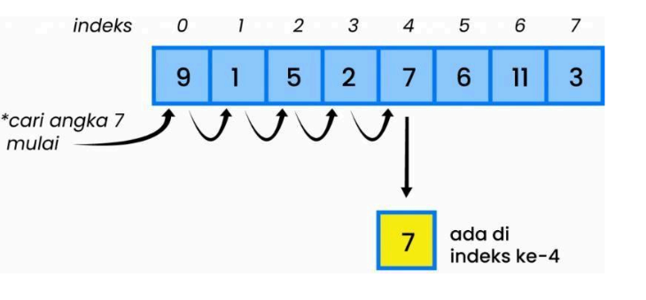
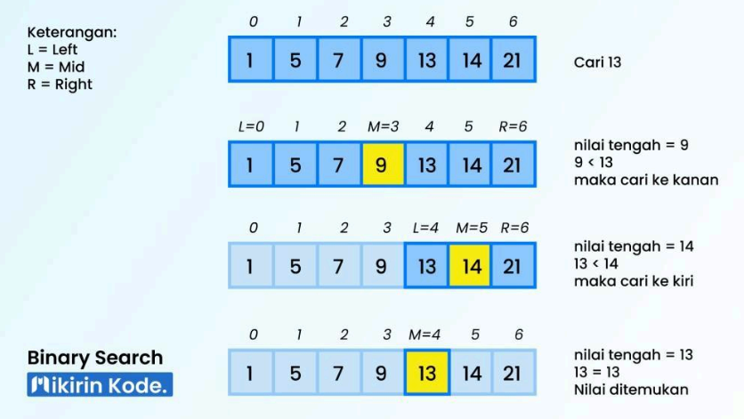
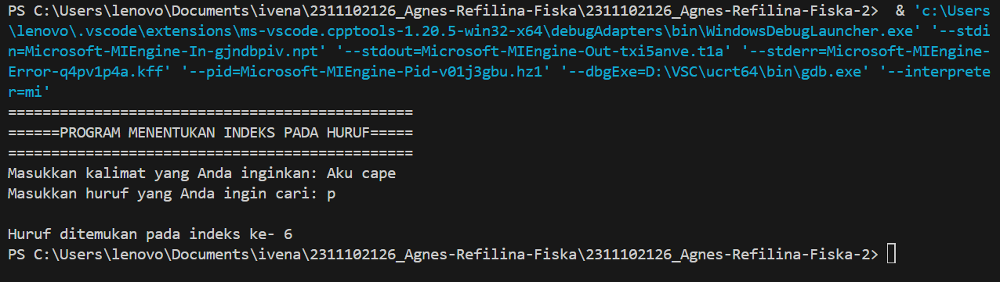
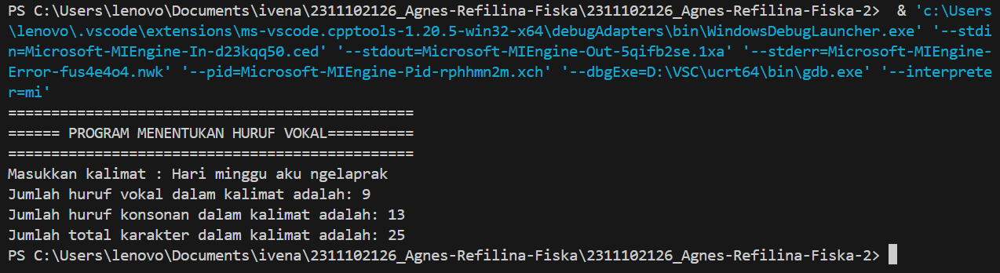
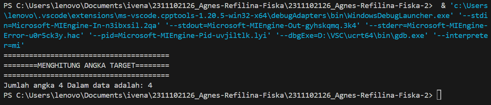

# <h1 align="center">Laporan Praktikum Modul ALGORITMA SEARCHING </h1>
<p align="center">Agnes Refilina Fiska - 2311102126 </p>

## Dasar Teori

Sequential search dan binary search adalah dua jenis algoritma pencarian yang sering digunakan pada program untuk menelusuri suatu data yang dicari.
     · Sequential Search
       1. Algoritma ini membandingkan setiap elemen array satu per satu secara berurutan, mulai dari elemen    pertama, 
          sampai elemen yang dicari ditemukan atau sampai semua elemen diperiksa.
       2. Jika elemen ditemukan, ia mengembalikan indeksnya, jika tidak -1.
       3. Contoh: Linear Search.
 

    · Binary Search
       1. Algoritma ini hanya dapat digunakan pada data yang sudah terurut.
       2. Algoritma ini membagi data menjadi dua bagian setiap kali, dan memeriksa apakah elemen yang dicari berada di 
          setengah kiri atau setengah kanan.
       3. Apabila ditemukan kecocokan nilai maka akan mengembalikan output, jika tidak pencarian akan terus berlanjut 
          hingga akhir dari pembagian jumlah elemen tersebut.
       4. Contoh: Binary Search.
 

Perbedaan antara sequential search dan binary search:

 1. Sequential search membandingkan setiap elemen array satu per satu secara berurutan, sedangkan binary search membagi 
    data menjadi dua bagian setiap kali dan memeriksa apakah elemen yang dicari berada di setengah kiri atau setengah kanan.
 2. Sequential search dapat digunakan pada data yang tidak terurut, sedangkan binary search hanya dapat digunakan pada data 
    yang sudah terurut.
 3. Binary search lebih efisien dari sisi waktu dibandingkan dengan sequential search karena binary search hanya memerlukan 
    logaritma basis 2 dari jumlah data yang dicari, sedangkan sequential search memerlukan waktu yang lebih lama karena 
    harus memeriksa setiap elemen satu per satu secara berurutan.
 4. Namun, binary search lebih rumit daripada sequential search dan memerlukan data yang sudah terurut.

Berikut adalah beberapa hal yang perlu dipertimbangkan saat menggunakan Algoritma Searching:

   · Kapan menggunakan sequential search: Data tidak terurut atau dalam keadaan acak, Jumlah data yang dicari relatif 
     kecil, Data yang dicari berada di awal atau tengah array
     
   · Kapan menggunakan binary search: Data sudah terurut, Jumlah data yang dicari relatif besar, Data yang dicari berada di 
     akhir array atau tidak ada dalam array.

Namun, perlu diingat bahwa binary search lebih efisien dari sisi waktu dibandingkan dengan sequential search karena binary search hanya memerlukan logaritma basis 2 dari jumlah data yang dicari, sedangkan sequential search memerlukan waktu yang lebih lama karena harus memeriksa setiap elemen satu per satu secara berurutan.

## Guided 

### 1. [Buatlah sebuah project dengan menggunakan sequential search sederhana untuk melakukan pencarian data.]

```C++
/*
oleh Agnes Refilina Fiska - 2311102126
*/
#include <iostream>
using namespace std;

int main() {
    int n = 10;
    int data[n] = {9, 4, 1, 7, 5, 12, 4, 13, 4, 10};
    int cari = 10;
    bool ketemu = false;
    int i;
    
    // Algoritma Sequential Search
    for (i = 0; i < n; i++) {
        if (data[i] == cari) {
            ketemu = true;
            break;
        }
    }
    
    cout << "\tProgram Sequential Search Sederhana\n" << endl;
    cout << "data: {9, 4, 1, 7, 5, 12, 4, 13, 4, 10}" << endl;
    
    if (ketemu) {
        cout << "\nAngka " << cari << " ditemukan pada indeks ke-" << i << endl;
    } else {
        cout << cari << " tidak dapat ditemukan pada data." << endl;
    }
    
    return 0;
}
```
Program di atas merupakan contoh program sequential search sederhana di C++ yang digunakan untuk mencari suatu nilai tertentu dalam array. Program menggunakan array dengan ukuran 10 dan nilai-nilai tertentu di dalamnya. Program mencari nilai tertentu (cari) dalam array menggunakan algoritma sequential search. Jika nilai ditemukan, program akan menampilkan indeks dari nilai tersebut dalam array. Jika nilai tidak ditemukan, program akan menampilkan pesan bahwa nilai tidak dapat ditemukan dalam array.

### 2. [Buatlah sebuah project untuk melakukan pencarian data dengan menggunakan Binary Search.]

```C++
/*
oleh Agnes Refilina Fiska - 2311102126
*/
#include <iostream>
#include <iomanip>
#include <conio.h>
using namespace std;

int dataArray[7] = {1, 8, 2, 5, 4, 9, 7};
int cari;

void selection_sort() {
    int temp, min, i, j;
    for (i = 0; i < 7; i++) {
        min = i;
        for (j = i + 1; j < 7; j++) {
            if (dataArray[j] < dataArray[min]) {
                min = j;
            }
        }
        temp = dataArray[i];
        dataArray[i] = dataArray[min];
        dataArray[min] = temp;
    }
}

void binarysearch() {
    int awal, akhir, tengah;
    bool b_flag = false;
    awal = 0;
    akhir = 6;
    while (!b_flag && awal <= akhir) {
        tengah = (awal + akhir) / 2;
        if (dataArray[tengah] == cari) {
            b_flag = true;
        } else if (dataArray[tengah] < cari) {
            awal = tengah + 1;
        } else {
            akhir = tengah - 1;
        }
    }
    if (b_flag) {
        cout << "\nData ditemukan pada index ke- " << tengah << endl;
    } else {
        cout << "\nData tidak ditemukan\n";
    }
}

int main() {
    cout << "\tBINARY SEARCH" << endl;
    cout << "\nData: ";
    // Tampilkan data awal
    for (int x = 0; x < 7; x++) {
        cout << setw(3) << dataArray[x];
    }
    cout << endl;
    
    cout << "\nMasukkan data yang ingin Anda cari: ";
    cin >> cari;
    
    cout << "\nData diurutkan: ";
    // Urutkan data dengan selection sort
    selection_sort();
    // Tampilkan data setelah diurutkan
    for (int x = 0; x < 7; x++) {
        cout << setw(3) << dataArray[x];
    }
    cout << endl;
    
    binarysearch();
    _getche();
    return 0;
}
```
Program di atas merupakan contoh program binary search di C++ yang digunakan untuk mencari suatu nilai tertentu dalam array yang sudah diurutkan terlebih dahulu dengan menggunakan algoritma binary search. Program menggunakan array dengan ukuran 7 dan nilai-nilai tertentu di dalamnya. Program meminta input dari user untuk nilai yang ingin dicari (cari). Program mengurutkan nilai dalam array menggunakan algoritma selection sort. Program mencari nilai tertentu (cari) dalam array menggunakan algoritma binary search. Jika nilai ditemukan, program akan menampilkan indeks dari nilai tersebut dalam array. Jika nilai tidak ditemukan, program akan menampilkan pesan bahwa nilai tidak dapat ditemukan dalam array. Program diakhiri dengan menunggu input dari user sebelum keluar. Algoritma binary search digunakan karena lebih efisien dibandingkan sequential search pada data yang sudah diurutkan.

## Unguided 

### 1. [Buatlah sebuah program untuk mencari sebuah huruf pada sebuah kalimat yang sudah di input dengan menggunakan Binary Search!]

```C++
/*
oleh Agnes Refilina Fiska - 2311102126
*/
#include <iostream>
using namespace std;

void selectionSort(string &huruf, int n) {
    for (int i = 0; i < n - 1; i++) {
        int min = i;
        for (int j = i + 1; j < n; j++)
            if (huruf[j] < huruf[min])
                min = j;
        char temp = huruf[i];
        huruf[i] = huruf[min];
        huruf[min] = temp;
    }
}

int binarySearch(string huruf, int kiri, int kanan, char target) {
    while (kiri <= kanan) {
        int mid = kiri + (kanan - kiri) / 2;
        if (huruf[mid] == target)
            return mid;
        if (huruf[mid] < target)
            kiri = mid + 1;
        else
            kanan = mid - 1;
    }
    return -1;
}

int main() {
    string kalimat;
    char input;

    cout << "===============================================" << endl;
    cout << "======PROGRAM MENENTUKAN INDEKS PADA HURUF=====" << endl;
    cout << "===============================================" << endl;

    cout << "Masukkan kalimat yang Anda inginkan: ";
    getline(cin, kalimat);

    cout << "Masukkan huruf yang Anda ingin cari: ";
    cin >> input;
    cout << endl;

    selectionSort(kalimat, kalimat.size());

    int result = binarySearch(kalimat, 0, kalimat.size() - 1, input);

    if (result == -1) {
        cout << "Huruf yang Anda cari tidak ditemukan!" << endl;
    } else {
        cout << "Huruf ditemukan pada indeks ke- " << result << endl;
    }

    return 0;
}
```
#### Output:


Program di atas adalah implementasi dari algoritma pencarian biner (binary search) dalam bahasa C++. Program ini bertujuan untuk mencari indeks dari suatu huruf yang dimasukkan pengguna dalam sebuah kalimat yang juga dimasukkan oleh pengguna.

Algoritma dalam program ini terdiri dari dua tahap utama:

  - Pengurutan Huruf: Sebelum melakukan pencarian biner, huruf-huruf dalam kalimat diurutkan secara alfabetis menggunakan 
    algoritma selection sort. Hal ini diperlukan karena pencarian biner hanya dapat dilakukan pada data yang sudah 
    diurutkan.

  - Pencarian Biner: Setelah pengurutan selesai, program akan mencari huruf yang dimasukkan pengguna dalam kalimat yang 
    sudah diurutkan. Pencarian dilakukan dengan menggunakan algoritma pencarian biner (binary search). Jika huruf 
    ditemukan, program akan mengembalikan indeks pertama di mana huruf tersebut ditemukan. Jika tidak ditemukan, program 
    akan memberikan pesan bahwa huruf tidak ditemukan dalam kalimat.

Program ini memberikan pengguna kemampuan untuk menemukan indeks dari suatu huruf dalam kalimat dengan cepat dan efisien, berkat penggunaan algoritma pencarian biner dan pengurutan selection sort.

### 2. [Buatlah sebuah program yang dapat menghitung banyaknya huruf vocal dalam sebuah kalimat!]

```C++
/*
oleh Agnes Refilina Fiska - 2311102126
*/
#include <iostream>
#include <cctype>
using namespace std;

int countVowels(const string &sentence) {
    int count = 0;
    for (char ch : sentence) {
        char lowercase_ch = tolower(ch);
        if (tolower(lowercase_ch) == 'a' || lowercase_ch == 'e' || lowercase_ch == 'i' ||
            lowercase_ch == 'o' || lowercase_ch == 'u') {
            count++;
        }
    }
    return count;
}

int countConsonants(const string &sentence) {
    int count = 0;
    for (char ch : sentence) {
        char lowercase_ch = tolower(ch);
        if (isalpha(lowercase_ch) && !(
            lowercase_ch == 'a' || lowercase_ch == 'e' || lowercase_ch == 'i' ||
            lowercase_ch == 'o' || lowercase_ch == 'u')) {
            count++;
        }
    }
    return count;
}

int main() {
    string kalimat;
    cout << "===============================================" << endl;
    cout << "====== PROGRAM MENENTUKAN HURUF VOKAL==========" << endl;
    cout << "===============================================" << endl;
    cout << "Masukkan kalimat : ";
    getline(cin, kalimat);

    int jumlah_vokal = countVowels(kalimat);
    int jumlah_konsonan = countConsonants(kalimat);
    int jumlah_karakter = kalimat.length();

    cout << "Jumlah huruf vokal dalam kalimat adalah: " << jumlah_vokal << endl;
    cout << "Jumlah huruf konsonan dalam kalimat adalah: " << jumlah_konsonan << endl;
    cout << "Jumlah total karakter dalam kalimat adalah: " << jumlah_karakter << endl;

    return 0;
}
```
#### Output:


Program di atas adalah program sederhana yang digunakan untuk menghitung jumlah huruf vokal, huruf konsonan, dan total karakter dalam sebuah kalimat yang dimasukkan oleh pengguna. Program ini menggunakan fungsi-fungsi bawaan dari C++ untuk mengidentifikasi huruf vokal dan huruf konsonan dalam kalimat.

Langkah-langkah utama dalam program ini adalah sebagai berikut:

  1. Input Kalimat: Program meminta pengguna untuk memasukkan sebuah kalimat.
  2. Penghitungan Huruf Vokal: Program menggunakan fungsi countVowels untuk menghitung jumlah huruf vokal dalam kalimat 
     yang dimasukkan pengguna. Fungsi ini melakukan iterasi melalui setiap karakter dalam kalimat dan memeriksa apakah 
     karakter tersebut adalah huruf vokal. Jika ya, maka jumlah huruf vokal akan ditambah.
  3. Penghitungan Huruf Konsonan: Program menggunakan fungsi countConsonants untuk menghitung jumlah huruf konsonan dalam 
     kalimat yang dimasukkan pengguna. Fungsi ini juga melakukan iterasi melalui setiap karakter dalam kalimat, namun kali 
     ini memeriksa apakah karakter tersebut adalah huruf konsonan. Jika ya, maka jumlah huruf konsonan akan ditambah.
  4. Penghitungan Total Karakter: Program juga menghitung jumlah total karakter dalam kalimat yang dimasukkan pengguna 
     menggunakan fungsi length() dari objek string.

Setelah proses penghitungan selesai, program akan mencetak jumlah huruf vokal, huruf konsonan, dan total karakter dalam kalimat tersebut. Program ini memberikan pengguna informasi tentang struktur dan komposisi dari kalimat yang dimasukkan.

### 3. [Diketahui data = 9, 4, 1, 4, 7, 10, 5, 4, 12, 4. Hitunglah berapa banyak angka 4 dengan menggunakan algoritma Sequential Search!]

```C++
/*
oleh Agnes Refilina Fiska - 2311102126
*/
#include <iostream>
using namespace std;

// Fungsi untuk menghitung berapa kali target muncul dalam array
int hitungAngka(const int array[], int size, int target) {
    int count = 0; // Inisialisasi counter untuk menyimpan jumlah kemunculan target
    for (int i = 0; i < size; i++) { // Iterasi melalui setiap elemen array
        if (array[i] == target) { // Jika elemen saat ini sama dengan target
            count++;
        }
    }
    return count; // Mengembalikan jumlah kemunculan target dalam array
}

int main() {
    const int size = 10; 
    int array[size] = {9, 4, 1, 4, 7, 10, 5, 4, 12, 4}; 
    int target = 4; // Angka yang ingin dicari

    // Memanggil fungsi untuk menghitung jumlah kemunculan angka target dalam array
    int count = hitungAngka(array, size, target);

    // Menampilkan hasil jumlah kemunculan angka target
    cout << "=======================================" << endl;
    cout << "========MENGHITUNG ANGKA TARGET========" << endl;
    cout << "=======================================" << endl;
    cout << "Jumlah angka " << target << " Dalam data adalah: " << count << endl;

    return 0; 
}
```
#### Output:


Program di atas adalah implementasi sederhana dari fungsi untuk menghitung berapa kali suatu angka muncul dalam sebuah array. Program ini menggunakan fungsi hitungAngka yang melakukan iterasi melalui setiap elemen array untuk mencari kemunculan angka target.

Langkah-langkah utama dalam program ini adalah sebagai berikut:

  - Deklarasi Variabel: Program mendeklarasikan beberapa variabel yang diperlukan, termasuk size untuk menyimpan ukuran 
    array, array yang merupakan array yang berisi sekumpulan angka, dan target yang merupakan angka yang ingin dicari dalam 
    array.

  - Penghitungan Kemunculan Angka: Program memanggil fungsi hitungAngka untuk menghitung berapa kali angka target muncul 
    dalam array. Fungsi ini melakukan iterasi melalui setiap elemen array dan membandingkan dengan angka target. Setiap 
    kali angka target ditemukan, counter akan ditambah.

  - Output: Setelah proses penghitungan selesai, program mencetak jumlah kemunculan angka target dalam array. Pesan ini 
    disertai dengan judul yang jelas dan pemformatan yang rapi.

Program ini memberikan pengguna kemampuan untuk dengan cepat dan mudah menghitung jumlah kemunculan suatu angka dalam sebuah array. Ini dapat berguna dalam berbagai aplikasi yang memerlukan analisis atau pengolahan data.

## Kesimpulan
Setelah mempelajari algoritma pencarian sequential search dan binary search, kami dapat menyimpulkan bahwa sequential search adalah metode pencarian yang melakukan perbandingan elemen secara berurutan dari awal hingga elemen yang dicari ditemukan. Metode ini direkomendasikan untuk digunakan pada data yang relatif sedikit. Di sisi lain, binary search adalah metode pencarian yang dapat digunakan pada data yang terurut secara teratur. Binary search bekerja pada asumsi bahwa data dalam array telah diurutkan sebelumnya. Algoritma ini memiliki kompleksitas waktu Ο(log n), di mana n adalah jumlah elemen.

Meskipun binary search bisa lebih efisien dari segi waktu dibandingkan dengan sequential search, namun membutuhkan data yang telah diurutkan terlebih dahulu. Binary search juga cenderung lebih rumit dalam implementasinya daripada sequential search. Saat menggunakan binary search, langkah awal yang penting adalah mengurutkan data dalam array menggunakan teknik pengurutan seperti bubble sort.

## Referensi
[1] Wafiqah Setyawati Wahyuni, Septi Andryana, Ben Rahman. “PENGGUNAAN ALGORITMA SEQUENTIAL SEARCHING PADA APLIKASI PERPUSTAKAAN BERBASIS WEB”, JIPI (Jurnal Ilmiah Penelitian dan Pembelajaran Informatika) Volume 07, Nomor 02, Juni 2022.
[2] Meidyan Permata Putri, dkk., Algoritma dan Struktur Data. Bandung: Widina Bhakti Persada Bandung, 2022.
