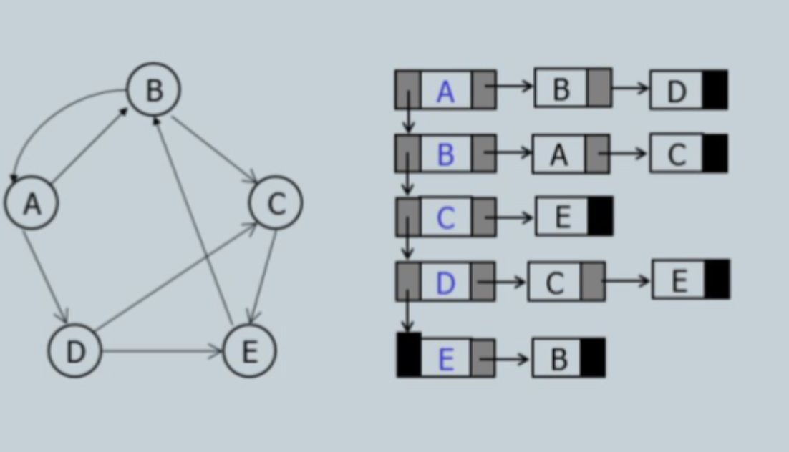
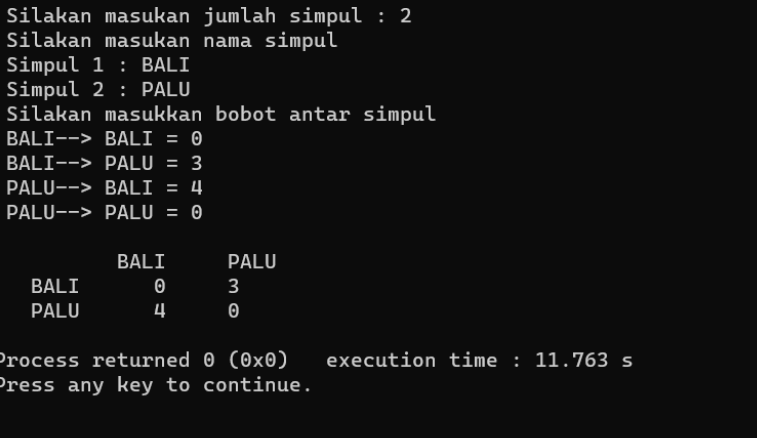

# <h1 align="center">Laporan Praktikum Modul Tipe Data</h1>
<p align="center">Arvinanto Bahtiar</p>

## Dasar Teori

Berikan penjelasan teori terkait materi modul ini dengan bahasa anda sendiri serta susunan yang terstruktur per topiknya.

## Guided 

### 1. [Nama Topik]

```C++
#include <iostream>
using namespace std;

int main() {
    cout << "ini adalah file code guided praktikan" << endl;
    return 0;
}# <h1 align="center">Laporan Praktikum Modul Graph and Tree</h1>
<p align="center">Agnes Refilina Fiska - 2311102126 </p>

## Dasar Teori

Graph dan tree adalah dua konsep yang berbeda dalam ilmu komputer. Berikut adalah penjelasan singkat mengenai keduanya:
## Graph
 Graph adalah struktur data yang terdiri dari simpul (node) dan busur (edge) yang menghubungkan simpul-simpul tersebut. Graph digunakan untuk merepresentasikan hubungan antara objek atau entitas dalam suatu sistem. Graph dapat digunakan untuk memodelkan berbagai macam masalah, seperti jaringan sosial, rute perjalanan, dan sebagainya

 Representasi graph dengan linked list adalah salah satu cara merepresentasikan graf dalam bentuk struktur data linked list. Pada representasi ini, setiap simpul pada graf direpresentasikan sebagai node pada linked list, dan setiap busur pada graf direpresentasikan sebagai elemen pada linked list tersebut. Dalam representasi ini, setiap node pada linked list memiliki dua bagian, yaitu data dan pointer ke node berikutnya pada linked list. Data pada setiap node merepresentasikan simpul pada graf, sedangkan pointer pada setiap node merepresentasikan busur pada graf yang terhubung dengan simpul tersebut. Representasi graph dengan linked list dapat digunakan untuk merepresentasikan graf berarah maupun tidak berarah, serta graf berbobot maupun tidak berbobot. Representasi ini memiliki keuntungan dalam penggunaan memori, karena hanya menyimpan busur yang ada pada graf, sehingga lebih efisien untuk graf yang sangat besar. Namun, representasi ini memiliki kelemahan dalam akses data, karena pencarian data pada linked list membutuhkan waktu yang lebih lama dibandingkan dengan representasi graph lainnya seperti adjacency matrix.


## Tree
 Tree adalah struktur data khusus dari graph yang tidak memiliki siklus (cycle). Tree terdiri dari simpul-simpul yang terhubung dengan busur-busur, namun tidak ada dua simpul yang terhubung dengan lebih dari satu busur. Tree digunakan untuk merepresentasikan hierarki, seperti struktur direktori pada sistem operasi, atau hubungan antara kelas dalam suatu program.

Operasi pemrograman pada tree meliputi beberapa hal, antara lain:

 1. Traverse: operasi kunjungan terhadap node-node dalam pohon. Terdapat beberapa jenis traverse, seperti in-order, pre-order, dan post-order traverse. In-order traverse dilakukan dengan cara mengunjungi simpul kiri, mencetak simpul yang dikunjungi, dan mengunjungi simpul kanan. Pre-order traverse dilakukan dengan cara mencetak simpul yang dikunjungi, mengunjungi simpul kiri, dan mengunjungi simpul kanan. Post-order traverse dilakukan dengan cara mengunjungi simpul kiri, mengunjungi simpul kanan, dan mencetak simpul yang dikunjungi.

 2. Insert: operasi untuk menambahkan simpul baru ke dalam tree. Pada operasi ini, simpul baru ditempatkan pada posisi yang tepat sesuai dengan aturan tree.

 3. Delete: operasi untuk menghapus simpul dari tree. Pada operasi ini, simpul yang dihapus harus diganti dengan simpul lain yang sesuai dengan aturan tree.

 4. Search: operasi untuk mencari simpul pada tree. Pada operasi ini, simpul dicari dengan cara menelusuri tree dari simpul root hingga simpul yang dicari ditemukan.

 5. Balance: operasi untuk menjaga keseimbangan tree. Pada operasi ini, tree diubah sehingga memiliki ketinggian yang seimbang dan meminimalkan waktu akses data.


## Guided 

### 1. [Program Graph]

```C++
#include <iostream>
using namespace std;

int main() {
    cout << "ini adalah file code guided praktikan" << endl;
    return 0;
}
```
Program yang diberikan adalah program yang menampilkan graf berbentuk adjacency list. Graf ini menggunakan array simpul dan busur untuk merepresentasikan graf. Array simpul berisi nama simpul-simpul pada graf, sedangkan array busur berisi bobot dari setiap busur pada graf. Program ini memiliki satu fungsi, yaitu , yang digunakan untuk menampilkan grafik dalam bentuk adjacency list. Fungsi ini menggunakan dua perulangan untuk mengakses setiap elemen pada array simpul dan busur. Pada setiap iterasi, fungsi ini menampilkan nama simpul dan busur yang terhubung dengan simpul tersebut beserta bobotnya. Program ini kemudian memanggil fungsi pada fungsi untuk menampilkan grafik pada layartampilGraph()tampilGraph()main()

### 2. [Program Tree]

```C++
#include <iostream>
#include <iomanip>

using namespace std;

struct Pohon
{
    char data;
    Pohon *left, *right, *parent;
};

Pohon *root, *baru;

void init()
{
    root = NULL;
}

bool isEmpty()
{
    return root == NULL;
}

void buatNode(char data)
{
    if (isEmpty())
    {
        root = new Pohon();
        root->data = data;
        root->left = NULL;
        root->right = NULL;
        root->parent = NULL;
        cout << "\n Node " << data << " berhasil dibuat sebagai root."
             << endl;
    }
    else
    {
        cout << "\n Tree sudah ada!" << endl;
    }
}

Pohon *insertLeft(char data, Pohon *node)
{
    if (isEmpty())
    {
        cout << "\n Buat tree terlebih dahulu!" << endl;
        return NULL;
    }
    else
    {
        if (node->left != NULL)
        {
            cout << "\n Node " << node->data << " sudah ada child kiri !" << endl;
            return NULL;
        }
        else
        {
            Pohon *baru = new Pohon();
            baru->data = data;
            baru->left = NULL;
            baru->right = NULL;
            baru->parent = node;
            node->left = baru;
            cout << "\n Node " << data << " berhasil ditambahkan ke child kiri " << baru->parent->data << endl;
            return baru;
        }
    }
}

Pohon *insertRight(char data, Pohon *node)
{
    if (isEmpty())
    {
        cout << "\n Buat tree terlebih dahulu!" << endl;
        return NULL;
    }
    else
    {
        if (node->right != NULL)
        {
            cout << "\n Node " << node->data << " sudah ada child kanan !" << endl;
            return NULL;
        }
        else
        {
            Pohon *baru = new Pohon();
            baru->data = data;
            baru->left = NULL;
            baru->right = NULL;
            baru->parent = node;
            node->right = baru;
            cout << "\n Node " << data << " berhasil ditambahkan ke child kanan " << baru->parent->data << endl;
            return baru;
        }
    }
}

void update(char data, Pohon *node)
{
    if (isEmpty())
    {
        cout << "\n Buat tree terlebih dahulu!" << endl;
    }
    else
    {
        if (!node)
        {
            cout << "\n Node yang ingin diganti tidak ada!!" << endl;
        }
        else
        {
            char temp = node->data;
            node->data = data;
            cout << "\n Node " << temp << " berhasil diubah menjadi "
                 << data << endl;
        }
    }
}

void retrieve(Pohon *node)
{
    if (isEmpty())
    {
        cout << "\n Buat tree terlebih dahulu!" << endl;
    }
    else
    {
        if (!node)
        {
            cout << "\n Node yang ditunjuk tidak ada!" << endl;
        }
        else
        {
            cout << "\n Data node : " << node->data << endl;
        }
    }
}

void find(Pohon *node)
{
    if (isEmpty())
    {
        cout << "\n Buat tree terlebih dahulu!" << endl;
    }
    else
    {
        if (!node)
        {
            cout << "\n Node yang ditunjuk tidak ada!" << endl;
        }
        else
        {
            cout << "\n Data Node : " << node->data << endl;
            cout << " Root : " << root->data << endl;
            if (!node->parent)
                cout << " Parent : (tidak punya parent)" << endl;
            else
                cout << " Parent : " << node->parent->data << endl;
            if (node->parent != NULL && node->parent->left != node &&
                node->parent->right == node)
                cout << " Sibling : " << node->parent->left->data << endl;
            else if (node->parent != NULL && node->parent->right != node && node->parent->left == node)
                cout << " Sibling : " << node->parent->right->data << endl;
            else
                cout << " Sibling : (tidak punya sibling)" << endl;
            if (!node->left)
                cout << " Child Kiri : (tidak punya Child kiri)" << endl;
            else
                cout << " Child Kiri : " << node->left->data << endl;
            if (!node->right)
                cout << " Child Kanan : (tidak punya Child kanan)" << endl;
            else
                cout << " Child Kanan : " << node->right->data << endl;
        }
    }
}

// Penelusuran (Traversal)
// preOrder
void preOrder(Pohon *node = root)
{
    if (isEmpty())
    {
        cout << "\n Buat tree terlebih dahulu!" << endl;
    }
    else
    {
        if (node != NULL)
        {
            cout << " " << node->data << ", ";
            preOrder(node->left);
            preOrder(node->right);
        }
    }
}

// inOrder
void inOrder(Pohon *node = root)
{
    if (isEmpty())
    {
        cout << "\n Buat tree terlebih dahulu!" << endl;
    }
    else
    {
        if (node != NULL)
        {
            inOrder(node->left);
            cout << " " << node->data << ", ";
            inOrder(node->right);
        }
    }
}

// postOrder
void postOrder(Pohon *node = root)
{
    if (isEmpty())
    {
        cout << "\n Buat tree terlebih dahulu!" << endl;
    }
    else
    {
        if (node != NULL)
        {
            postOrder(node->left);
            postOrder(node->right);
            cout << " " << node->data << ", ";
        }
    }
}

// Hapus Node Tree
void deleteTree(Pohon *node)
{
    if (isEmpty())
    {
        cout << "\n Buat tree terlebih dahulu!" << endl;
    }
    else
    {
        if (node != NULL)
        {
            if (node != root)
            {
                node->parent->left = NULL;
                node->parent->right = NULL;
            }
            deleteTree(node->left);
            deleteTree(node->right);
            if (node == root)
            {
                delete root;
                root = NULL;
            }
            else
            {
                delete node;
            }
        }
    }
}

// Hapus SubTree
void deleteSub(Pohon *node)
{
    if (isEmpty())
    {
        cout << "\n Buat tree terlebih dahulu!" << endl;
    }
    else
    {
        deleteTree(node->left);
        deleteTree(node->right);
        cout << "\n Node subtree " << node->data << " berhasil dihapus." << endl;
    }
}

void clear()
{
    if (isEmpty())
    {
        cout << "\n Buat tree terlebih dahulu!!" << endl;
    }
    else
    {
        deleteTree(root);
        cout << "\n Pohon berhasil dihapus." << endl;
    }
}

// Cek Size Tree
int size(Pohon *node = root)
{
    if (isEmpty())
    {
        cout << "\n Buat tree terlebih dahulu!!" << endl;
        return 0;
    }
    else
    {
        if (!node)
        {
            return 0;
        }
        else
        {
            return 1 + size(node->left) + size(node->right);
        }
    }
}

// Cek Height Level Tree
int height(Pohon *node = root)
{
    if (isEmpty())
    {
        cout << "\n Buat tree terlebih dahulu!" << endl;
        return 0;
    }
    else
    {
        if (!node)
        {
            return 0;
        }
        else
        {
            int heightKiri = height(node->left);
            int heightKanan = height(node->right);
            if (heightKiri >= heightKanan)
            {
                return heightKiri + 1;
            }
            else
            {
                return heightKanan + 1;
            }
        }
    }
}

// Karakteristik Tree
void characteristic()
{
    cout << "\n Size Tree : " << size() << endl;
    cout << " Height Tree : " << height() << endl;
    cout << " Average Node of Tree : " << size() / height() << endl;
}

int main()
{
    buatNode('A');
    Pohon *nodeB, *nodeC, *nodeD, *nodeE, *nodeF, *nodeG, *nodeH, *nodeI, *nodeJ;
    nodeB = insertLeft('B', root);
    nodeC = insertRight('C', root);
    nodeD = insertLeft('D', nodeB);
    nodeE = insertRight('E', nodeB);
    nodeF = insertLeft('F', nodeC);
    nodeG = insertLeft('G', nodeE);
    nodeH = insertRight('H', nodeE);
    nodeI = insertLeft('I', nodeG);
    nodeJ = insertRight('J', nodeG);
    update('Z', nodeC);
    update('C', nodeC);
    retrieve(nodeC);
    find(nodeC);
    characteristic();

    cout << "\n PreOrder :" << endl;
    preOrder(root);
    cout << "\n"<< endl;

    cout << " InOrder :" << endl;
    inOrder(root);
    cout << "\n" << endl;

    cout << " PostOrder :" << endl;
    postOrder(root);
    cout << "\n" << endl;
}
```
Program di atas merupakan implementasi dari struktur data pohon biner dalam bahasa pemrograman C++. Program ini memungkinkan pembuatan, penambahan, penghapusan, dan penelusuran node pada pohon biner.Pertama-tama, program ini mendefinisikan sebuah struktur Pohon yang memiliki empat anggota: data yang merupakan karakter, left dan right yang merupakan pointer ke node anak kiri dan kanan, serta parent yang merupakan pointer ke node induk.Fungsi init() digunakan untuk menginisialisasi variabel root yang menunjukkan akar pohon. Fungsi isEmpty() memeriksa apakah pohon kosong atau tidak. Selanjutnya, terdapat fungsi-fungsi seperti buatNode(), insertLeft(), insertRight(), update(), dan retrieve() yang digunakan untuk membuat node baru, menambahkan node anak kiri atau kanan, mengupdate data pada suatu node, dan mengambil data dari suatu node.Fungsi find() digunakan untuk menemukan sebuah node dalam pohon dan menampilkan informasi mengenai node tersebut, seperti data, parent, sibling, serta child kiri dan kanan. Fungsi-fungsi preOrder(), inOrder(), dan postOrder() digunakan untuk melakukan penelusuran pre-order, in-order, dan post-order pada pohon. Selain itu, terdapat fungsi-fungsi deleteTree(), deleteSub(), dan clear() yang digunakan untuk menghapus pohon atau subpohon, serta fungsi size() dan height() yang digunakan untuk menghitung ukuran dan tinggi pohon. Fungsi characteristic() digunakan untuk menampilkan karakteristik pohon seperti ukuran, tinggi, dan rata-rata node.Dalam main(), terdapat contoh penggunaan fungsi-fungsi tersebut untuk membuat pohon, menambahkan node, mengupdate data, melakukan penelusuran, dan menampilkan karakteristik pohon. Hasil penelusuran pre-order, in-order, dan post-order juga ditampilkan pada akhir program.

## Unguided 

### 1. [Buatlah program graph dengan menggunakan inputan user untuk menghitung jarak dari sebuah kota ke kota lainnya.Output Program Modul 10 Graph dan Tree]


```C++
#include <iostream> 
#include <iomanip> 
#include <vector> 
#include <string> 
using namespace std; 

int main() 
{ 
    int Agnes_2311102126; 
    cout << "Silahkan masukkan jumlah simpul: "; 
    cin >> Agnes_2311102126; 
    vector<string> simpul(Agnes_2311102126); 
    vector<vector<int>> busur(Agnes_2311102126, 
    vector<int>(Agnes_2311102126, 0)); 
    
    cout << "Silahkan masukkan nama simpul " << endl; 
    
    for (int i = 0; i < Agnes_2311102126; i++) { 
        cout << "Simpul ke-" << (i + 1) << ": "; 
        cin >> simpul[i]; 
        } 
        cout << "Silahkan masukkan bobot antar simpul" << endl; 
    
    for (int i = 0; i < Agnes_2311102126; i++) { 
        
        for (int j = 0; j < Agnes_2311102126; j++) 
        { 
            cout << simpul[i] << " --> " << simpul[j] << " = "; 
            cin >> busur[i][j];
             }
        } 
             cout << endl; 
             cout << setw(7) << " "; 
             for (int i = 0; i < Agnes_2311102126; i++) {

                cout << setw(8) << simpul[i]; 
            } 
                cout << endl; 
                
                for (int i = 0; i < Agnes_2311102126; i++) 
                { 
                    cout << setw(7) << simpul[i]; 
                    
                    for (int j = 0; j < Agnes_2311102126; j++) 
                    
                {
                    cout << setw(8) << busur[i][j];
                } 
                cout << endl; 
            } 
        }
```
#### Output:


Program ini digunakan untuk menginput dan menampilkan graf berbentuk adjacency list. Graf ini terdiri dari simpul dan busur, serta bobot dari setiap busur. Program ini meminta pengguna untuk memasukkan jumlah simpul, nama simpul, dan bobot antar simpul.

1. Program pertama meminta pengguna untuk memasukkan jumlah simpul.
2. Kemudian, program meminta pengguna untuk memasukkan nama simpul.
3. Selanjutnya, program meminta pengguna untuk memasukkan bobot antar simpul.
4. Setelah pengguna memasukkan semua data, program menampilkan grafik dalam bentuk daftar kedekatan. Graf ini terdiri dari nama simpul dan bobot antar simpul.
5. Graf ditampilkan dalam format tabel, dengan nama simpul sebagai judul baris dan bobot antar simpul sebagai isi baris.

Dengan demikian, program ini dapat digunakan untuk menginput dan menampilkan graf berbentuk adjacency list.

### 2. [Modifikasi guided tree diatas dengan program menu menggunakan input data tree dari user dan berikan fungsi tambahan untuk menampilkan node child dan descendant dari node yang diinput kan!]

```C++
#include <iostream> 
using namespace std; 

class BinarySearchTree 
{ 
private: 
    struct nodeTree 
    { 
        nodeTree *left; 
        nodeTree *right; 
        int data; 
    }; 
        nodeTree *root; 
public: 
    BinarySearchTree() 
    { 
        root = NULL; 
    } 
    
    bool isEmpty() const { return root == NULL; } 
    void print_inorder(); 
    void inorder(nodeTree *); 
    void print_preorder(); 
    void preorder(nodeTree *); 
    void print_postorder(); 
    void postorder(nodeTree *); 
    void insert(int); 
    void remove(int); 
}; 
void BinarySearchTree::insert(int a) 
{ 
    nodeTree *t = new nodeTree; 
    nodeTree *parent; 
    t->data = a; 
    t->left = NULL; 
    t->right = NULL; 
    parent = NULL; 
    
    if (isEmpty()) 
        root = t; 
    else 
    { 
        nodeTree *current; 
        current = root;
        while (current) 
        { 
            parent = current; 
            if (t->data > current->data) 
                current = current->right; 
            else 
                current = current->left; 
        } 
        
        if (t->data < parent->data) 
            parent->left = t; 
        else 
            parent->right = t; 
    } 
} 
void BinarySearchTree::remove(int a) 
{ 
    // Mencari elemen yang akan dihapus 
    bool found = false; 
    if (isEmpty()) 
    { 
        cout << "Pohon ini kosong!" << endl; 
        return; 
    } 
    
    nodeTree *current; 
    nodeTree *parent; 
    current = root; 
    
    while (current != NULL) 
    { 
        if (current->data == a) 
        { 
            found = true; 
            break; 
    } else { 
        parent = current; 
        if (a > current->data) 
            current = current->right; 
        else
            current = current->left;

        } 
    } 
    if (!found) 
    { 
        cout << "Data tidak ditemukan!" << endl; 
        return; 
    } 
    
    // Node dengan satu anak 
    if ((current->left == NULL && current->right != NULL) || (current->left != NULL && current->right == NULL)) { 
        
        if (current->left == NULL && current->right != NULL) { 
            
            if (parent->left == current) 
            { 
                parent->left = current->right; 
                delete current; 
            } 
            else 
            { 
                parent->right = current->right; 
                delete current; 
            } 
        } 
        else 
        { 
            if (parent->left == current) 
            { 
                parent->left = current->left; 
                delete current; 
            } 
            else 
            { 
                parent->right = current->left; 
                delete current; 
            } 
        } 
        return;
    } 
    
    // Node tanpa anak
    if (current->left == NULL && current->right == NULL) 
    { 
        if (parent->left == current) 
            parent->left = NULL; 
        else 
            parent->right = NULL; 
        delete current; 
        return; 
    } 
    
    // Node dengan dua anak 
    // Ganti node dengan nilai terkecil pada subtree sebelah kanan 
    if (current->left != NULL && current->right != NULL) 
    { 
        nodeTree *temp; 
        temp = current->right; 
        if ((temp->left == NULL) && (temp->right == NULL)) 
        { 
            current = temp; 
            delete temp; 
            current->right = NULL; 
        } 
        else 
        { 
            if ((current->right)->left != NULL) 
            { 
                nodeTree *lcurrent; 
                nodeTree *lcurrp; 
                lcurrp = current->right; 
                lcurrent = (current->right)->left; 
                while (lcurrent->left != NULL) 
                { 
                    lcurrp = lcurrent; 
                    lcurrent = lcurrent->left; 
                } 
                current->data = lcurrent->data; 
                delete lcurrent; 
                lcurrp->left = NULL; 
                
            } 
            else
            { 
                nodeTree *tmp2; 
                tmp2 = current->right; 
                current->data = tmp2->data; 
                current->right = tmp2->right; 
                delete tmp2; 
            } 
        } 
        return; 
    } 
} 
void BinarySearchTree::print_inorder() 
{ 
    inorder(root); 
} 
void BinarySearchTree::inorder(nodeTree *b) 
{ 
    if (b != NULL) 
    { 
        if (b->left) 
            inorder(b->left); 
        cout << " " << b->data << " "; 
        if (b->right) 
            inorder(b->right); 
    } 
    else 
        return; 
} 
void BinarySearchTree::print_preorder() 
{ 
    preorder(root); 
} 
void BinarySearchTree::preorder(nodeTree *b) 
{ 
    if (b != NULL) 
    { 
        cout << " " << b->data << " "; 
        if (b->left) 
            preorder(b->left); 
        if (b->right) 
            preorder(b->right);

    } 
    else 
        return; 
} 
void BinarySearchTree::print_postorder() 
{ 
    postorder(root); 
} 
void BinarySearchTree::postorder(nodeTree *b) 
{ 
    if (b != NULL) 
    { 
        if (b->left) 
            postorder(b->left); 
        if (b->right) 
            postorder(b->right); 
        cout << " " << b->data << " "; 
    } 
    else 
        return; 
} 

int main() 
{ 
    BinarySearchTree b; 
    int ch, tmp, tmp1; 
    while (1) 
    { 
        cout << endl << endl; cout << "-------------------------------" << endl; 
        cout << "MENU OPERASI TREE BINARY SEARCH" << endl; 
        cout << "-------------------------------" << endl; 
        cout << "1. Penambahan/Pembuatan Pohon" << endl; 
        cout << "2. Traversal In-Order" << endl; 
        cout << "3. Traversal Pre-Order" << endl; 
        cout << "4. Traversal Post-Order" << endl; 
        cout << "5. Penghapusan" << endl; 
        cout << "6. Keluar" << endl;
        cout << "Masukkan pilihan Anda: "; 
        cin >> ch; 
        switch (ch) 
        { 
            case 1: cout << "Masukkan Angka yang akan ditambahkan: "; 
            cin >> tmp; 
            b.insert(tmp); 
            break; 
            
            case 2: 
            cout << endl; 
            cout << "Traversal In-Order" << endl; 
            cout << "-------------------" << endl; 
            b.print_inorder(); 
            break; 
            
            case 3: 
            cout << endl; 
            cout << "Traversal Pre-Order" << endl; 
            cout << "--------------------" << endl; 
            b.print_preorder(); 
            break; 
            
            case 4: 
            cout << endl; 
            cout << "Traversal Post-Order" << endl; 
            cout << "---------------------" << endl; 
            b.print_postorder(); 
            break; 
            
            case 5: 
            cout << "Masukkan angka yang akan dihapus: "; 
            cin >> tmp1; 
            b.remove(tmp1); 
            break; 
            
            case 6: 
            return 0; 
        } 
    } 
}
```
#### Output:


Program di atas adalah implementasi dari pohon pencarian biner (Binary Search Tree) dalam bahasa pemrograman C++. Program ini menyediakan beberapa operasi dasar yang dapat dilakukan pada pohon pencarian biner, seperti penambahan (insertion), penelusuran (traversal) in-order, pre-order, dan post-order, serta penghapusan (removal) node.

Kelas BinarySearchTree memiliki beberapa properti dan metode:

1. Properti root yang menunjukkan akar dari pohon pencarian biner.
2. Metode insert(int a) digunakan untuk menambahkan node baru ke pohon. Node baru akan ditempatkan sesuai aturan    pohon pencarian biner, yaitu nilai yang lebih kecil dari akar akan ditempatkan di sebelah kiri, dan nilai yang lebih besar akan ditempatkan di sebelah kanan.
3. Metode remove(int a) digunakan untuk menghapus node dari pohon. Operasi penghapusan dilakukan dengan mempertimbangkan beberapa kasus, seperti node yang memiliki satu anak atau dua anak.
4. Metode print_inorder(), print_preorder(), dan print_postorder() digunakan untuk melakukan penelusuran in-order, pre-order, dan post-order pada pohon.
5. Metode inorder(nodeTree *b), preorder(nodeTree *b), dan postorder(nodeTree *b) merupakan implementasi rekursif dari penelusuran in-order, pre-order, dan post-order pada pohon.

Fungsi main() merupakan interaksi dengan pengguna yang menampilkan menu operasi yang dapat dilakukan pada pohon pencarian biner. Pengguna dapat memilih untuk menambahkan node baru, melakukan penelusuran, atau menghapus node dari pohon.
Program ini memberikan pengguna fleksibilitas untuk memanipulasi pohon pencarian biner dan melakukan operasi dasar sesuai kebutuhan

## Kesimpulan
Graph dan pohon adalah struktur data yang penting dalam pemrograman. Grafik digunakan untuk menunjukkan hubungan antara objek atau entitas, sedangkan pohon adalah jenis diagram khusus dengan struktur hierarkis. Untuk mengimplementasikan grafik dan pohon di C++, konsep pointer dan struktur data rekursif digunakan. Pointer digunakan untuk menghubungkan titik-titik dalam diagram atau pohon, sementara struktur data rekursif memungkinkan operasi rekursif seperti traversal dan pencarian elemen. Binary Search Tree (BST) adalah implementasi khusus dari pohon yang efisien untuk mencari data. Dalam BST, ada aturan bahwa elemen di sebelah kiri harus lebih kecil dari elemen di sebelah kanan, memungkinkan pencarian data dengan kompleksitas O(log n), dimana n adalah jumlah elemen dalam BST. Implementasi grafik dan pohon dalam C++ dapat dilakukan dengan menggunakan struktur data dan operasi rekursif. Di dalam pohon, kita juga mempelajari bagaimana pengimplementasian traversal inorder, preorder, dan postorder pada pemrograman C++.

## Referensi
[1] Quinn, R., Advanced C++ Programming Cookbook. United Kingdoms: Packt Publishing Ltd., 2020.
[2] Zheng Li dkk, C++ Programming. Republic State of China: De Gruyter, 2019.
```
Kode di atas digunakan untuk mencetak teks "ini adalah file code guided praktikan" ke layar menggunakan function cout untuk mengeksekusi nya.

## Unguided 

### 1. [Soal]

```C++
#include <iostream>
using namespace std;

int main() {
    cout << "ini adalah file code unguided praktikan" << endl;
    return 0;
}
```
#### Output:


Kode di atas digunakan untuk mencetak teks "ini adalah file code guided praktikan" ke layar menggunakan function cout untuk mengeksekusi nya.

## Kesimpulan
Ringkasan dan interpretasi pandangan kalia dari hasil praktikum dan pembelajaran yang didapat[1].

## Referensi
[1] I. Holm, Narrator, and J. Fullerton-Smith, Producer, How to Build a Human [DVD]. London: BBC; 2002.
